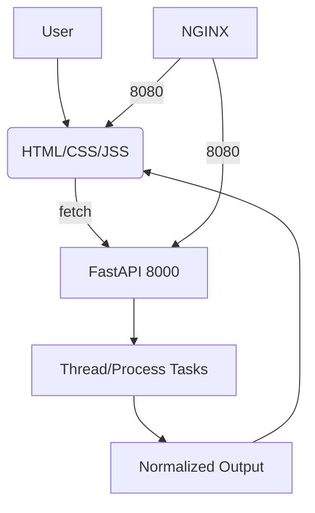

# my_master_project  

  
  
  
  

---

## 1. Project's Title  


**my_master_project — Parallel Processing Scenarios with FastAPI, Docker, and NGINX**  

---

## 2. Project Description  

This project demonstrates **thread-based** and **process-based parallelism** using Python’s concurrency primitives (Lock, RLock, Semaphore, Barrier, Multiprocessing, etc.).  

The backend is powered by **FastAPI** and exposes a single unified endpoint (`/run_scenarios`) that dynamically executes concurrency tasks and normalizes results for the frontend. The frontend is a lightweight **static HTML/JS page** that communicates with the backend via `fetch()`.  

The entire application is **dockerized** (with `docker-compose`) and can be served securely using **NGINX + Certbot** on a custom domain (`babakyousefian.ir`).  

**Why these technologies?**  
- **FastAPI** → asynchronous, fast, built-in data validation with Pydantic.  
- **Docker & Compose** → reproducible builds, containerized dev/prod environments.  
- **NGINX** → reverse proxy, TLS termination, production-grade serving.  
- **Threading/Processing** → educational demonstration of concurrency control.  

**Challenges solved**:  
- Normalizing inconsistent outputs across multiple concurrency tasks.  
- Handling multi-container deployment with health checks.  
- Configuring HTTPS with Let’s Encrypt under NGINX.  

**Future features**:  
- Add more advanced concurrency tasks (asyncio, distributed queues).  
- WebSocket support for real-time logs.  
- Comprehensive test suite.  

---

## 3. Table of Contents  

1. [Project's Title](#1-projects-title)  
2. [Project Description](#2-project-description)  
3. [Table of Contents](#3-table-of-contents)  
4. [How to Install and Run the Project](#4-how-to-install-and-run-the-project)  
5. [How to Use the Project](#5-how-to-use-the-project)  
6. [Include Credits](#6-include-credits)  
7. [Add a License](#7-add-a-license)  
8. [Badges](#8-badges)  
9. [How to Contribute to the Project](#9-how-to-contribute-to-the-project)  
10. [Include Tests](#10-include-tests)  

---

## 4. How to Install and Run the Project  

### Option A) Local Development  

```bash
# clone the repository
sudo git clone https://github.com/babakyousefian/my_master_project.git
sudo cd my_master_project

# install dependencies
sudo pip install -r requirements.txt

# run backend
sudo uvicorn main:app --host 0.0.0.0 --port 8000 --reload

# serve frontend
sudo cd static
sudo python3 -m http.server 5500
```
---


---

#### Open:

1. > Backend → http://127.0.0.1:8000/docs
2. > Frontend → http://127.0.0.1:5500/index.html

---


---

Or just use:

```bash
sudo bash run.sh
```

### Option B) Docker + Compose

```bash
sudo docker compose down
sudo docker compose build --no-cache
sudo docker compose up -d
sudo docker compose ps
```
---


---

#### ___Health-check API:___

```bash
curl http://127.0.0.1:8000/health
```

---


---

## 5. How to Use the Project


  1. Go to the frontend page (index.html) served at port 5500 or through domain (https://babakyousefian.ir).

  2. Select Thread-Based or Process-Based mode.

  3. Choose a Task (1–7 for Thread, 1–8 for Process).

  4. Pick a Scenario Number (1–3).

  5. Click Run Scenarios.

  6. The result shows both the raw result and the normalized result.

---


---

#### ___Example API request (cURL)🛺___

```bash
curl -X POST https://babakyousefian.ir/api/run_scenarios \
  -H "Content-Type: application/json" \
  -d '{
        "type": "process",
        "scenario_task": 8,
        "scenario_number": 2
      }'
```

---


## 6. Include Credits

### _@Author: Babak Yousefian_

Special thanks to:

FastAPI team

Docker & Docker Compose

NGINX + Let’s Encrypt community

---

## 7. Add a License

This project is licensed under the MIT License.
[See](https://github.com/babakyousefian/my_master_project/tree/main?tab=MIT-1-ov-file#)

---

## 8. Badges


  
  
  
  


---


## 9. How to Contribute to the Project


> We welcome contributions!

>> Fork the repo

>> Create a new branch (git checkout -b feature-branch)

>> Commit your changes (git commit -m "add feature")

>> Push to branch (git push origin feature-branch)

>> Open a Pull Request

[Please follow PEP8](https://peps.python.org/pep-0008/)


---

## 10. Include Tests

#### ___Currently minimal. Planned test suite with pytest🥇___

```bash
pip install pytest
pytest tests/
```

### *Future tests will cover:*

  1. > ___API response schema validation___

  2. > __Concurrency correctness__

  3. > _Docker health checks_


# ___Extra: Project Tree___

```bash
➜  my_master_project tree -a
.
├── certbot
│   └── certbot.txt
├── cloudflare
│   └── cloudflare.txt
├── docker
│   ├── Dockerfile.api
│   ├── Dockerfile.web
│   └── nginx.conf
├── docker-compose.yml
├── .dockerignore
├── .git
│   ├── branches
│   ├── COMMIT_EDITMSG
│   ├── config
│   ├── description
│   ├── FETCH_HEAD
│   ├── HEAD
│   ├── hooks
│   │   ├── applypatch-msg.sample
│   │   ├── commit-msg.sample
│   │   ├── fsmonitor-watchman.sample
│   │   ├── post-update.sample
│   │   ├── pre-applypatch.sample
│   │   ├── pre-commit.sample
│   │   ├── pre-merge-commit.sample
│   │   ├── prepare-commit-msg.sample
│   │   ├── pre-push.sample
│   │   ├── pre-rebase.sample
│   │   ├── pre-receive.sample
│   │   ├── push-to-checkout.sample
│   │   ├── sendemail-validate.sample
│   │   └── update.sample
│   ├── index
│   ├── info
│   │   └── exclude
│   ├── logs
│   │   ├── HEAD
│   │   └── refs
│   │       ├── heads
│   │       │   └── main
│   │       └── remotes
│   │           └── origin
│   │               └── main
│   ├── objects
│   │   ├── 00
│   │   │   └── 2b1e39bb07047d7e1b0f34daadca9e4cc550db
│   │   ├── 0e
│   │   │   └── a2208e19aaa6c49aef9382f91a7ebe41b67756
│   │   ├── 13
│   │   │   └── bb9714cd46c11fb2d375074cb681a9a32892b6
│   │   ├── 16
│   │   │   └── aedd9742895b0de195934b34c63b4053d801e4
│   │   ├── 1d
│   │   │   └── 511e4d2b79f44487c476ffe8469e46975f759a
│   │   ├── 1f
│   │   │   └── 098029378345263e14be8b9133a5d39ebb71f1
│   │   ├── 35
│   │   │   └── 75c25f7dfca577f7f15c7e4f9e197519000ea0
│   │   ├── 37
│   │   │   └── e2bb9a6ddca6ad578e02235d8e13c786767453
│   │   ├── 3c
│   │   │   └── 9c0229f8600a9b3bd07da75c57ee8a56a2d9a1
│   │   ├── 44
│   │   │   └── 6eda5cd85db24e3695a61d8263c7fe1116482b
│   │   ├── 45
│   │   │   └── dc8a20658bd09ecb8ca1c88f94fe80cc4ca286
│   │   ├── 46
│   │   │   └── f0a8fd47ae9a4ac8f8f0dff493e26f37fe2724
│   │   ├── 4b
│   │   │   └── 4e77aec1efe3915f689cb3aa88c4d8fc52af04
│   │   ├── 50
│   │   │   └── 90b029b146356e015d48da491da8d154b7470f
│   │   ├── 62
│   │   │   └── 76431e4663be572194dfb33107fa1e9dafe124
│   │   ├── 64
│   │   │   └── 264af782fb2fe5513c1df29c9ff1c302873c42
│   │   ├── 65
│   │   │   └── 5f8daa69c312dabfcea1639296a064b939413e
│   │   ├── 69
│   │   │   └── 19fab49b1182f44cdbd03fb0ae525841551033
│   │   ├── 6b
│   │   │   └── a0a25ada64039cff607988ae4b4138ae779ecc
│   │   ├── 72
│   │   │   └── 6d78f632055f245516f736c1951aca78bd3ba4
│   │   ├── 78
│   │   │   └── 694b886b54b640cdc132d70f865aa41857104b
│   │   ├── 79
│   │   │   └── 6fce3fd88c8d3c6620f048690272b5c6f650b1
│   │   ├── 7a
│   │   │   └── 84378206a4aece8791b453b380949d38731c4b
│   │   ├── 81
│   │   │   └── 3bde33dcad9e6a915c5360ce03476fa0c0c51b
│   │   ├── 82
│   │   │   ├── 073e0de62d0c7763985a90209db96e9eff3e79
│   │   │   └── ea62f35629efb6da09ca8122e2db18e30e24c3
│   │   ├── 88
│   │   │   └── fff58ec62dac8c7aef13155ccaf1dce4484d0c
│   │   ├── 97
│   │   │   └── de92008095827a4350221d1cecf2da356f7251
│   │   ├── 9c
│   │   │   ├── 9104f49baf1052447ffce542b4dc08502e991b
│   │   │   └── f3dd504b0a4ff85ece6bf935ce7028c391e338
│   │   ├── 9e
│   │   │   └── ce80cd721cc988e1059d99f0794d37036f1aff
│   │   ├── a7
│   │   │   └── 0c977b162dbb504a7483343c9865ff92bb3ab9
│   │   ├── a8
│   │   │   └── 852d39555defa8b7157d20d18f8b1839c5f2e5
│   │   ├── ad
│   │   │   └── 286abcd7c38c754d565ee55f6680a10c62c24d
│   │   ├── b0
│   │   │   └── c4d31ae5a8a97c0e27774490d851e34decf202
│   │   ├── b1
│   │   │   └── a3f08c1ceb3e1aa6809c8a6cfc0fd3b7e6fbd1
│   │   ├── b4
│   │   │   └── 10bc152bf2f641c412b7e2708dc0a112a4e4e3
│   │   ├── b7
│   │   │   └── faf403d915ca307532bb0eb9cceaf0214e8e5b
│   │   ├── bd
│   │   │   └── 896d2c1a639f645efcba34a219f1e2a71a5615
│   │   ├── be
│   │   │   └── 919e792f68b33b5b0cebe7035059d3d7ede12a
│   │   ├── c2
│   │   │   └── bde2c40f1a2324721a1238bc984770b16f96c6
│   │   ├── d0
│   │   │   └── 8e1e865652c36476dd8190bcf026dffe490651
│   │   ├── d4
│   │   │   └── 81d9929e8d48e16ee6f73060f135e63eef3d06
│   │   ├── d8
│   │   │   ├── 0b773d4a5336ec90a7e73e4a47986d5a65e0ab
│   │   │   └── 4cfc580c7c5f980b9e951e42f8c4c16da80f9d
│   │   ├── eb
│   │   │   └── 008859a667ec3cbcc67789c6bd4ccb4fd56946
│   │   ├── ed
│   │   │   └── 3db22e6d0fb819b9ff1cf86cb2dad9e3c3a436
│   │   ├── f6
│   │   │   └── 6b89638de4e2a8533fb2aaa1ddead3b3bc56f4
│   │   ├── f7
│   │   │   └── 870cf60b373cf6fa063f2dbee81315b6edf6b7
│   │   ├── f9
│   │   │   └── 718116594de415d2d3c079dbcd82f247bf0518
│   │   ├── info
│   │   └── pack
│   ├── ORIG_HEAD
│   ├── REBASE_HEAD
│   └── refs
│       ├── heads
│       │   └── main
│       ├── remotes
│       │   └── origin
│       │       └── main
│       └── tags
├── git_configuration.sh
├── .gitignore
├── irnic
│   ├── Andishe.txt
│   └── صورتحساب (_83707-0858-250519) – ایرنیک.pdf
├── LICENSE
├── main.py
├── main_runner.sh
├── __pycache__
│   └── main.cpython-313.pyc
├── README.md
├── requirements.txt
├── run.sh
├── ssh_key
│   └── ssh_key.txt
├── static
│   ├── favicon.ico
│   ├── favoriteICON
│   │   ├── favicon_io
│   │   │   ├── android-chrome-192x192.png
│   │   │   ├── android-chrome-512x512.png
│   │   │   ├── apple-touch-icon.png
│   │   │   ├── favicon-16x16.png
│   │   │   ├── favicon-32x32.png
│   │   │   ├── favicon.ico
│   │   │   └── site.webmanifest
│   │   └── favicon_io.zip
│   ├── index.html
│   ├── logo.png
│   └── song.mp3
├── venv
│   ├── bin
│   │   ├── activate
│   │   ├── activate.csh
│   │   ├── activate.fish
│   │   ├── Activate.ps1
│   │   ├── autopep8
│   │   ├── dotenv
│   │   ├── fastapi
│   │   ├── pip
│   │   ├── pip3
│   │   ├── pip3.13
│   │   ├── pycodestyle
│   │   ├── pyproject-build
│   │   ├── python
│   │   ├── python3
│   │   ├── python3.13
│   │   ├── uvicorn
│   │   ├── watchfiles
│   │   ├── websockets
│   │   └── wheel
│   ├── .gitignore
│   ├── include
│   │   └── python3.13
│   ├── lib
│   │   └── python3.13
│   │       └── site-packages
│   │           ├── annotated_types
│   │           │   ├── __init__.py
│   │           │   ├── __pycache__
│   │           │   │   ├── __init__.cpython-313.pyc
│   │           │   │   └── test_cases.cpython-313.pyc
│   │           │   ├── py.typed
│   │           │   └── test_cases.py
│   │           ├── annotated_types-0.7.0.dist-info
│   │           │   ├── INSTALLER
│   │           │   ├── licenses
│   │           │   │   └── LICENSE
│   │           │   ├── METADATA
│   │           │   ├── RECORD
│   │           │   └── WHEEL
│   │           ├── anyio
│   │           │   ├── abc
│   │           │   │   ├── _eventloop.py
│   │           │   │   ├── __init__.py
│   │           │   │   ├── __pycache__
│   │           │   │   │   ├── _eventloop.cpython-313.pyc
│   │           │   │   │   ├── __init__.cpython-313.pyc
│   │           │   │   │   ├── _resources.cpython-313.pyc
│   │           │   │   │   ├── _sockets.cpython-313.pyc
│   │           │   │   │   ├── _streams.cpython-313.pyc
│   │           │   │   │   ├── _subprocesses.cpython-313.pyc
│   │           │   │   │   ├── _tasks.cpython-313.pyc
│   │           │   │   │   └── _testing.cpython-313.pyc
│   │           │   │   ├── _resources.py
│   │           │   │   ├── _sockets.py
│   │           │   │   ├── _streams.py
│   │           │   │   ├── _subprocesses.py
│   │           │   │   ├── _tasks.py
│   │           │   │   └── _testing.py
│   │           │   ├── _backends
│   │           │   │   ├── _asyncio.py
│   │           │   │   ├── __init__.py
│   │           │   │   ├── __pycache__
│   │           │   │   │   ├── _asyncio.cpython-313.pyc
│   │           │   │   │   ├── __init__.cpython-313.pyc
│   │           │   │   │   └── _trio.cpython-313.pyc
│   │           │   │   └── _trio.py
│   │           │   ├── _core
│   │           │   │   ├── _asyncio_selector_thread.py
│   │           │   │   ├── _contextmanagers.py
│   │           │   │   ├── _eventloop.py
│   │           │   │   ├── _exceptions.py
│   │           │   │   ├── _fileio.py
│   │           │   │   ├── __init__.py
│   │           │   │   ├── __pycache__
│   │           │   │   │   ├── _asyncio_selector_thread.cpython-313.pyc
│   │           │   │   │   ├── _contextmanagers.cpython-313.pyc
│   │           │   │   │   ├── _eventloop.cpython-313.pyc
│   │           │   │   │   ├── _exceptions.cpython-313.pyc
│   │           │   │   │   ├── _fileio.cpython-313.pyc
│   │           │   │   │   ├── __init__.cpython-313.pyc
│   │           │   │   │   ├── _resources.cpython-313.pyc
│   │           │   │   │   ├── _signals.cpython-313.pyc
│   │           │   │   │   ├── _sockets.cpython-313.pyc
│   │           │   │   │   ├── _streams.cpython-313.pyc
│   │           │   │   │   ├── _subprocesses.cpython-313.pyc
│   │           │   │   │   ├── _synchronization.cpython-313.pyc
│   │           │   │   │   ├── _tasks.cpython-313.pyc
│   │           │   │   │   ├── _tempfile.cpython-313.pyc
│   │           │   │   │   ├── _testing.cpython-313.pyc
│   │           │   │   │   └── _typedattr.cpython-313.pyc
│   │           │   │   ├── _resources.py
│   │           │   │   ├── _signals.py
│   │           │   │   ├── _sockets.py
│   │           │   │   ├── _streams.py
│   │           │   │   ├── _subprocesses.py
│   │           │   │   ├── _synchronization.py
│   │           │   │   ├── _tasks.py
│   │           │   │   ├── _tempfile.py
│   │           │   │   ├── _testing.py
│   │           │   │   └── _typedattr.py
│   │           │   ├── from_thread.py
│   │           │   ├── __init__.py
│   │           │   ├── lowlevel.py
│   │           │   ├── __pycache__
│   │           │   │   ├── from_thread.cpython-313.pyc
│   │           │   │   ├── __init__.cpython-313.pyc
│   │           │   │   ├── lowlevel.cpython-313.pyc
│   │           │   │   ├── pytest_plugin.cpython-313.pyc
│   │           │   │   ├── to_interpreter.cpython-313.pyc
│   │           │   │   ├── to_process.cpython-313.pyc
│   │           │   │   └── to_thread.cpython-313.pyc
│   │           │   ├── pytest_plugin.py
│   │           │   ├── py.typed
│   │           │   ├── streams
│   │           │   │   ├── buffered.py
│   │           │   │   ├── file.py
│   │           │   │   ├── __init__.py
│   │           │   │   ├── memory.py
│   │           │   │   ├── __pycache__
│   │           │   │   │   ├── buffered.cpython-313.pyc
│   │           │   │   │   ├── file.cpython-313.pyc
│   │           │   │   │   ├── __init__.cpython-313.pyc
│   │           │   │   │   ├── memory.cpython-313.pyc
│   │           │   │   │   ├── stapled.cpython-313.pyc
│   │           │   │   │   ├── text.cpython-313.pyc
│   │           │   │   │   └── tls.cpython-313.pyc
│   │           │   │   ├── stapled.py
│   │           │   │   ├── text.py
│   │           │   │   └── tls.py
│   │           │   ├── to_interpreter.py
│   │           │   ├── to_process.py
│   │           │   └── to_thread.py
│   │           ├── anyio-4.10.0.dist-info
│   │           │   ├── entry_points.txt
│   │           │   ├── INSTALLER
│   │           │   ├── licenses
│   │           │   │   └── LICENSE
│   │           │   ├── METADATA
│   │           │   ├── RECORD
│   │           │   ├── top_level.txt
│   │           │   └── WHEEL
│   │           ├── autopep8-2.3.1.dist-info
│   │           │   ├── AUTHORS.rst
│   │           │   ├── entry_points.txt
│   │           │   ├── INSTALLER
│   │           │   ├── LICENSE
│   │           │   ├── METADATA
│   │           │   ├── RECORD
│   │           │   ├── REQUESTED
│   │           │   ├── top_level.txt
│   │           │   └── WHEEL
│   │           ├── autopep8.py
│   │           ├── build
│   │           │   ├── _builder.py
│   │           │   ├── _compat
│   │           │   │   ├── importlib.py
│   │           │   │   ├── __init__.py
│   │           │   │   ├── __pycache__
│   │           │   │   │   ├── importlib.cpython-313.pyc
│   │           │   │   │   ├── __init__.cpython-313.pyc
│   │           │   │   │   ├── tarfile.cpython-313.pyc
│   │           │   │   │   └── tomllib.cpython-313.pyc
│   │           │   │   ├── tarfile.py
│   │           │   │   └── tomllib.py
│   │           │   ├── _ctx.py
│   │           │   ├── env.py
│   │           │   ├── _exceptions.py
│   │           │   ├── __init__.py
│   │           │   ├── __main__.py
│   │           │   ├── __pycache__
│   │           │   │   ├── _builder.cpython-313.pyc
│   │           │   │   ├── _ctx.cpython-313.pyc
│   │           │   │   ├── env.cpython-313.pyc
│   │           │   │   ├── _exceptions.cpython-313.pyc
│   │           │   │   ├── __init__.cpython-313.pyc
│   │           │   │   ├── __main__.cpython-313.pyc
│   │           │   │   ├── _types.cpython-313.pyc
│   │           │   │   ├── _util.cpython-313.pyc
│   │           │   │   └── util.cpython-313.pyc
│   │           │   ├── py.typed
│   │           │   ├── _types.py
│   │           │   ├── _util.py
│   │           │   └── util.py
│   │           ├── build-1.2.1.dist-info
│   │           │   ├── entry_points.txt
│   │           │   ├── INSTALLER
│   │           │   ├── LICENSE
│   │           │   ├── METADATA
│   │           │   ├── RECORD
│   │           │   ├── REQUESTED
│   │           │   └── WHEEL
│   │           ├── click
│   │           │   ├── _compat.py
│   │           │   ├── core.py
│   │           │   ├── decorators.py
│   │           │   ├── exceptions.py
│   │           │   ├── formatting.py
│   │           │   ├── globals.py
│   │           │   ├── __init__.py
│   │           │   ├── parser.py
│   │           │   ├── __pycache__
│   │           │   │   ├── _compat.cpython-313.pyc
│   │           │   │   ├── core.cpython-313.pyc
│   │           │   │   ├── decorators.cpython-313.pyc
│   │           │   │   ├── exceptions.cpython-313.pyc
│   │           │   │   ├── formatting.cpython-313.pyc
│   │           │   │   ├── globals.cpython-313.pyc
│   │           │   │   ├── __init__.cpython-313.pyc
│   │           │   │   ├── parser.cpython-313.pyc
│   │           │   │   ├── shell_completion.cpython-313.pyc
│   │           │   │   ├── termui.cpython-313.pyc
│   │           │   │   ├── _termui_impl.cpython-313.pyc
│   │           │   │   ├── testing.cpython-313.pyc
│   │           │   │   ├── _textwrap.cpython-313.pyc
│   │           │   │   ├── types.cpython-313.pyc
│   │           │   │   ├── utils.cpython-313.pyc
│   │           │   │   └── _winconsole.cpython-313.pyc
│   │           │   ├── py.typed
│   │           │   ├── shell_completion.py
│   │           │   ├── _termui_impl.py
│   │           │   ├── termui.py
│   │           │   ├── testing.py
│   │           │   ├── _textwrap.py
│   │           │   ├── types.py
│   │           │   ├── utils.py
│   │           │   └── _winconsole.py
│   │           ├── click-8.2.1.dist-info
│   │           │   ├── INSTALLER
│   │           │   ├── licenses
│   │           │   │   └── LICENSE.txt
│   │           │   ├── METADATA
│   │           │   ├── RECORD
│   │           │   └── WHEEL
│   │           ├── _distutils_hack
│   │           │   ├── __init__.py
│   │           │   ├── override.py
│   │           │   └── __pycache__
│   │           │       ├── __init__.cpython-313.pyc
│   │           │       └── override.cpython-313.pyc
│   │           ├── distutils-precedence.pth
│   │           ├── dotenv
│   │           │   ├── cli.py
│   │           │   ├── __init__.py
│   │           │   ├── ipython.py
│   │           │   ├── __main__.py
│   │           │   ├── main.py
│   │           │   ├── parser.py
│   │           │   ├── __pycache__
│   │           │   │   ├── cli.cpython-313.pyc
│   │           │   │   ├── __init__.cpython-313.pyc
│   │           │   │   ├── ipython.cpython-313.pyc
│   │           │   │   ├── __main__.cpython-313.pyc
│   │           │   │   ├── main.cpython-313.pyc
│   │           │   │   ├── parser.cpython-313.pyc
│   │           │   │   ├── variables.cpython-313.pyc
│   │           │   │   └── version.cpython-313.pyc
│   │           │   ├── py.typed
│   │           │   ├── variables.py
│   │           │   └── version.py
│   │           ├── fastapi
│   │           │   ├── applications.py
│   │           │   ├── background.py
│   │           │   ├── cli.py
│   │           │   ├── _compat.py
│   │           │   ├── concurrency.py
│   │           │   ├── datastructures.py
│   │           │   ├── dependencies
│   │           │   │   ├── __init__.py
│   │           │   │   ├── models.py
│   │           │   │   ├── __pycache__
│   │           │   │   │   ├── __init__.cpython-313.pyc
│   │           │   │   │   ├── models.cpython-313.pyc
│   │           │   │   │   └── utils.cpython-313.pyc
│   │           │   │   └── utils.py
│   │           │   ├── encoders.py
│   │           │   ├── exception_handlers.py
│   │           │   ├── exceptions.py
│   │           │   ├── __init__.py
│   │           │   ├── logger.py
│   │           │   ├── __main__.py
│   │           │   ├── middleware
│   │           │   │   ├── cors.py
│   │           │   │   ├── gzip.py
│   │           │   │   ├── httpsredirect.py
│   │           │   │   ├── __init__.py
│   │           │   │   ├── __pycache__
│   │           │   │   │   ├── cors.cpython-313.pyc
│   │           │   │   │   ├── gzip.cpython-313.pyc
│   │           │   │   │   ├── httpsredirect.cpython-313.pyc
│   │           │   │   │   ├── __init__.cpython-313.pyc
│   │           │   │   │   ├── trustedhost.cpython-313.pyc
│   │           │   │   │   └── wsgi.cpython-313.pyc
│   │           │   │   ├── trustedhost.py
│   │           │   │   └── wsgi.py
│   │           │   ├── openapi
│   │           │   │   ├── constants.py
│   │           │   │   ├── docs.py
│   │           │   │   ├── __init__.py
│   │           │   │   ├── models.py
│   │           │   │   ├── __pycache__
│   │           │   │   │   ├── constants.cpython-313.pyc
│   │           │   │   │   ├── docs.cpython-313.pyc
│   │           │   │   │   ├── __init__.cpython-313.pyc
│   │           │   │   │   ├── models.cpython-313.pyc
│   │           │   │   │   └── utils.cpython-313.pyc
│   │           │   │   └── utils.py
│   │           │   ├── param_functions.py
│   │           │   ├── params.py
│   │           │   ├── __pycache__
│   │           │   │   ├── applications.cpython-313.pyc
│   │           │   │   ├── background.cpython-313.pyc
│   │           │   │   ├── cli.cpython-313.pyc
│   │           │   │   ├── _compat.cpython-313.pyc
│   │           │   │   ├── concurrency.cpython-313.pyc
│   │           │   │   ├── datastructures.cpython-313.pyc
│   │           │   │   ├── encoders.cpython-313.pyc
│   │           │   │   ├── exception_handlers.cpython-313.pyc
│   │           │   │   ├── exceptions.cpython-313.pyc
│   │           │   │   ├── __init__.cpython-313.pyc
│   │           │   │   ├── logger.cpython-313.pyc
│   │           │   │   ├── __main__.cpython-313.pyc
│   │           │   │   ├── param_functions.cpython-313.pyc
│   │           │   │   ├── params.cpython-313.pyc
│   │           │   │   ├── requests.cpython-313.pyc
│   │           │   │   ├── responses.cpython-313.pyc
│   │           │   │   ├── routing.cpython-313.pyc
│   │           │   │   ├── staticfiles.cpython-313.pyc
│   │           │   │   ├── templating.cpython-313.pyc
│   │           │   │   ├── testclient.cpython-313.pyc
│   │           │   │   ├── types.cpython-313.pyc
│   │           │   │   ├── utils.cpython-313.pyc
│   │           │   │   └── websockets.cpython-313.pyc
│   │           │   ├── py.typed
│   │           │   ├── requests.py
│   │           │   ├── responses.py
│   │           │   ├── routing.py
│   │           │   ├── security
│   │           │   │   ├── api_key.py
│   │           │   │   ├── base.py
│   │           │   │   ├── http.py
│   │           │   │   ├── __init__.py
│   │           │   │   ├── oauth2.py
│   │           │   │   ├── open_id_connect_url.py
│   │           │   │   ├── __pycache__
│   │           │   │   │   ├── api_key.cpython-313.pyc
│   │           │   │   │   ├── base.cpython-313.pyc
│   │           │   │   │   ├── http.cpython-313.pyc
│   │           │   │   │   ├── __init__.cpython-313.pyc
│   │           │   │   │   ├── oauth2.cpython-313.pyc
│   │           │   │   │   ├── open_id_connect_url.cpython-313.pyc
│   │           │   │   │   └── utils.cpython-313.pyc
│   │           │   │   └── utils.py
│   │           │   ├── staticfiles.py
│   │           │   ├── templating.py
│   │           │   ├── testclient.py
│   │           │   ├── types.py
│   │           │   ├── utils.py
│   │           │   └── websockets.py
│   │           ├── fastapi-0.115.0.dist-info
│   │           │   ├── entry_points.txt
│   │           │   ├── INSTALLER
│   │           │   ├── licenses
│   │           │   │   └── LICENSE
│   │           │   ├── METADATA
│   │           │   ├── RECORD
│   │           │   ├── REQUESTED
│   │           │   └── WHEEL
│   │           ├── h11
│   │           │   ├── _abnf.py
│   │           │   ├── _connection.py
│   │           │   ├── _events.py
│   │           │   ├── _headers.py
│   │           │   ├── __init__.py
│   │           │   ├── __pycache__
│   │           │   │   ├── _abnf.cpython-313.pyc
│   │           │   │   ├── _connection.cpython-313.pyc
│   │           │   │   ├── _events.cpython-313.pyc
│   │           │   │   ├── _headers.cpython-313.pyc
│   │           │   │   ├── __init__.cpython-313.pyc
│   │           │   │   ├── _readers.cpython-313.pyc
│   │           │   │   ├── _receivebuffer.cpython-313.pyc
│   │           │   │   ├── _state.cpython-313.pyc
│   │           │   │   ├── _util.cpython-313.pyc
│   │           │   │   ├── _version.cpython-313.pyc
│   │           │   │   └── _writers.cpython-313.pyc
│   │           │   ├── py.typed
│   │           │   ├── _readers.py
│   │           │   ├── _receivebuffer.py
│   │           │   ├── _state.py
│   │           │   ├── _util.py
│   │           │   ├── _version.py
│   │           │   └── _writers.py
│   │           ├── h11-0.16.0.dist-info
│   │           │   ├── INSTALLER
│   │           │   ├── licenses
│   │           │   │   └── LICENSE.txt
│   │           │   ├── METADATA
│   │           │   ├── RECORD
│   │           │   ├── top_level.txt
│   │           │   └── WHEEL
│   │           ├── httptools
│   │           │   ├── __init__.py
│   │           │   ├── parser
│   │           │   │   ├── cparser.pxd
│   │           │   │   ├── errors.py
│   │           │   │   ├── __init__.py
│   │           │   │   ├── parser.cpython-313-x86_64-linux-gnu.so
│   │           │   │   ├── parser.pyx
│   │           │   │   ├── __pycache__
│   │           │   │   │   ├── errors.cpython-313.pyc
│   │           │   │   │   └── __init__.cpython-313.pyc
│   │           │   │   ├── python.pxd
│   │           │   │   ├── url_cparser.pxd
│   │           │   │   ├── url_parser.cpython-313-x86_64-linux-gnu.so
│   │           │   │   └── url_parser.pyx
│   │           │   ├── __pycache__
│   │           │   │   ├── __init__.cpython-313.pyc
│   │           │   │   └── _version.cpython-313.pyc
│   │           │   └── _version.py
│   │           ├── httptools-0.6.4.dist-info
│   │           │   ├── INSTALLER
│   │           │   ├── LICENSE
│   │           │   ├── METADATA
│   │           │   ├── RECORD
│   │           │   ├── top_level.txt
│   │           │   └── WHEEL
│   │           ├── idna
│   │           │   ├── codec.py
│   │           │   ├── compat.py
│   │           │   ├── core.py
│   │           │   ├── idnadata.py
│   │           │   ├── __init__.py
│   │           │   ├── intranges.py
│   │           │   ├── package_data.py
│   │           │   ├── __pycache__
│   │           │   │   ├── codec.cpython-313.pyc
│   │           │   │   ├── compat.cpython-313.pyc
│   │           │   │   ├── core.cpython-313.pyc
│   │           │   │   ├── idnadata.cpython-313.pyc
│   │           │   │   ├── __init__.cpython-313.pyc
│   │           │   │   ├── intranges.cpython-313.pyc
│   │           │   │   ├── package_data.cpython-313.pyc
│   │           │   │   └── uts46data.cpython-313.pyc
│   │           │   ├── py.typed
│   │           │   └── uts46data.py
│   │           ├── idna-3.10.dist-info
│   │           │   ├── INSTALLER
│   │           │   ├── LICENSE.md
│   │           │   ├── METADATA
│   │           │   ├── RECORD
│   │           │   └── WHEEL
│   │           ├── packaging
│   │           │   ├── _elffile.py
│   │           │   ├── __init__.py
│   │           │   ├── licenses
│   │           │   │   ├── __init__.py
│   │           │   │   ├── __pycache__
│   │           │   │   │   ├── __init__.cpython-313.pyc
│   │           │   │   │   └── _spdx.cpython-313.pyc
│   │           │   │   └── _spdx.py
│   │           │   ├── _manylinux.py
│   │           │   ├── markers.py
│   │           │   ├── metadata.py
│   │           │   ├── _musllinux.py
│   │           │   ├── _parser.py
│   │           │   ├── __pycache__
│   │           │   │   ├── _elffile.cpython-313.pyc
│   │           │   │   ├── __init__.cpython-313.pyc
│   │           │   │   ├── _manylinux.cpython-313.pyc
│   │           │   │   ├── markers.cpython-313.pyc
│   │           │   │   ├── metadata.cpython-313.pyc
│   │           │   │   ├── _musllinux.cpython-313.pyc
│   │           │   │   ├── _parser.cpython-313.pyc
│   │           │   │   ├── requirements.cpython-313.pyc
│   │           │   │   ├── specifiers.cpython-313.pyc
│   │           │   │   ├── _structures.cpython-313.pyc
│   │           │   │   ├── tags.cpython-313.pyc
│   │           │   │   ├── _tokenizer.cpython-313.pyc
│   │           │   │   ├── utils.cpython-313.pyc
│   │           │   │   └── version.cpython-313.pyc
│   │           │   ├── py.typed
│   │           │   ├── requirements.py
│   │           │   ├── specifiers.py
│   │           │   ├── _structures.py
│   │           │   ├── tags.py
│   │           │   ├── _tokenizer.py
│   │           │   ├── utils.py
│   │           │   └── version.py
│   │           ├── packaging-25.0.dist-info
│   │           │   ├── INSTALLER
│   │           │   ├── licenses
│   │           │   │   ├── LICENSE
│   │           │   │   ├── LICENSE.APACHE
│   │           │   │   └── LICENSE.BSD
│   │           │   ├── METADATA
│   │           │   ├── RECORD
│   │           │   └── WHEEL
│   │           ├── pip
│   │           │   ├── __init__.py
│   │           │   ├── _internal
│   │           │   │   ├── build_env.py
│   │           │   │   ├── cache.py
│   │           │   │   ├── cli
│   │           │   │   │   ├── autocompletion.py
│   │           │   │   │   ├── base_command.py
│   │           │   │   │   ├── cmdoptions.py
│   │           │   │   │   ├── command_context.py
│   │           │   │   │   ├── index_command.py
│   │           │   │   │   ├── __init__.py
│   │           │   │   │   ├── main_parser.py
│   │           │   │   │   ├── main.py
│   │           │   │   │   ├── parser.py
│   │           │   │   │   ├── progress_bars.py
│   │           │   │   │   ├── __pycache__
│   │           │   │   │   │   ├── autocompletion.cpython-313.pyc
│   │           │   │   │   │   ├── base_command.cpython-313.pyc
│   │           │   │   │   │   ├── cmdoptions.cpython-313.pyc
│   │           │   │   │   │   ├── command_context.cpython-313.pyc
│   │           │   │   │   │   ├── index_command.cpython-313.pyc
│   │           │   │   │   │   ├── __init__.cpython-313.pyc
│   │           │   │   │   │   ├── main.cpython-313.pyc
│   │           │   │   │   │   ├── main_parser.cpython-313.pyc
│   │           │   │   │   │   ├── parser.cpython-313.pyc
│   │           │   │   │   │   ├── progress_bars.cpython-313.pyc
│   │           │   │   │   │   ├── req_command.cpython-313.pyc
│   │           │   │   │   │   ├── spinners.cpython-313.pyc
│   │           │   │   │   │   └── status_codes.cpython-313.pyc
│   │           │   │   │   ├── req_command.py
│   │           │   │   │   ├── spinners.py
│   │           │   │   │   └── status_codes.py
│   │           │   │   ├── commands
│   │           │   │   │   ├── cache.py
│   │           │   │   │   ├── check.py
│   │           │   │   │   ├── completion.py
│   │           │   │   │   ├── configuration.py
│   │           │   │   │   ├── debug.py
│   │           │   │   │   ├── download.py
│   │           │   │   │   ├── freeze.py
│   │           │   │   │   ├── hash.py
│   │           │   │   │   ├── help.py
│   │           │   │   │   ├── index.py
│   │           │   │   │   ├── __init__.py
│   │           │   │   │   ├── inspect.py
│   │           │   │   │   ├── install.py
│   │           │   │   │   ├── list.py
│   │           │   │   │   ├── lock.py
│   │           │   │   │   ├── __pycache__
│   │           │   │   │   │   ├── cache.cpython-313.pyc
│   │           │   │   │   │   ├── check.cpython-313.pyc
│   │           │   │   │   │   ├── completion.cpython-313.pyc
│   │           │   │   │   │   ├── configuration.cpython-313.pyc
│   │           │   │   │   │   ├── debug.cpython-313.pyc
│   │           │   │   │   │   ├── download.cpython-313.pyc
│   │           │   │   │   │   ├── freeze.cpython-313.pyc
│   │           │   │   │   │   ├── hash.cpython-313.pyc
│   │           │   │   │   │   ├── help.cpython-313.pyc
│   │           │   │   │   │   ├── index.cpython-313.pyc
│   │           │   │   │   │   ├── __init__.cpython-313.pyc
│   │           │   │   │   │   ├── inspect.cpython-313.pyc
│   │           │   │   │   │   ├── install.cpython-313.pyc
│   │           │   │   │   │   ├── list.cpython-313.pyc
│   │           │   │   │   │   ├── lock.cpython-313.pyc
│   │           │   │   │   │   ├── search.cpython-313.pyc
│   │           │   │   │   │   ├── show.cpython-313.pyc
│   │           │   │   │   │   ├── uninstall.cpython-313.pyc
│   │           │   │   │   │   └── wheel.cpython-313.pyc
│   │           │   │   │   ├── search.py
│   │           │   │   │   ├── show.py
│   │           │   │   │   ├── uninstall.py
│   │           │   │   │   └── wheel.py
│   │           │   │   ├── configuration.py
│   │           │   │   ├── distributions
│   │           │   │   │   ├── base.py
│   │           │   │   │   ├── __init__.py
│   │           │   │   │   ├── installed.py
│   │           │   │   │   ├── __pycache__
│   │           │   │   │   │   ├── base.cpython-313.pyc
│   │           │   │   │   │   ├── __init__.cpython-313.pyc
│   │           │   │   │   │   ├── installed.cpython-313.pyc
│   │           │   │   │   │   ├── sdist.cpython-313.pyc
│   │           │   │   │   │   └── wheel.cpython-313.pyc
│   │           │   │   │   ├── sdist.py
│   │           │   │   │   └── wheel.py
│   │           │   │   ├── exceptions.py
│   │           │   │   ├── index
│   │           │   │   │   ├── collector.py
│   │           │   │   │   ├── __init__.py
│   │           │   │   │   ├── package_finder.py
│   │           │   │   │   ├── __pycache__
│   │           │   │   │   │   ├── collector.cpython-313.pyc
│   │           │   │   │   │   ├── __init__.cpython-313.pyc
│   │           │   │   │   │   ├── package_finder.cpython-313.pyc
│   │           │   │   │   │   └── sources.cpython-313.pyc
│   │           │   │   │   └── sources.py
│   │           │   │   ├── __init__.py
│   │           │   │   ├── locations
│   │           │   │   │   ├── base.py
│   │           │   │   │   ├── _distutils.py
│   │           │   │   │   ├── __init__.py
│   │           │   │   │   ├── __pycache__
│   │           │   │   │   │   ├── base.cpython-313.pyc
│   │           │   │   │   │   ├── _distutils.cpython-313.pyc
│   │           │   │   │   │   ├── __init__.cpython-313.pyc
│   │           │   │   │   │   └── _sysconfig.cpython-313.pyc
│   │           │   │   │   └── _sysconfig.py
│   │           │   │   ├── main.py
│   │           │   │   ├── metadata
│   │           │   │   │   ├── base.py
│   │           │   │   │   ├── importlib
│   │           │   │   │   │   ├── _compat.py
│   │           │   │   │   │   ├── _dists.py
│   │           │   │   │   │   ├── _envs.py
│   │           │   │   │   │   ├── __init__.py
│   │           │   │   │   │   └── __pycache__
│   │           │   │   │   │       ├── _compat.cpython-313.pyc
│   │           │   │   │   │       ├── _dists.cpython-313.pyc
│   │           │   │   │   │       ├── _envs.cpython-313.pyc
│   │           │   │   │   │       └── __init__.cpython-313.pyc
│   │           │   │   │   ├── __init__.py
│   │           │   │   │   ├── _json.py
│   │           │   │   │   ├── pkg_resources.py
│   │           │   │   │   └── __pycache__
│   │           │   │   │       ├── base.cpython-313.pyc
│   │           │   │   │       ├── __init__.cpython-313.pyc
│   │           │   │   │       ├── _json.cpython-313.pyc
│   │           │   │   │       └── pkg_resources.cpython-313.pyc
│   │           │   │   ├── models
│   │           │   │   │   ├── candidate.py
│   │           │   │   │   ├── direct_url.py
│   │           │   │   │   ├── format_control.py
│   │           │   │   │   ├── index.py
│   │           │   │   │   ├── __init__.py
│   │           │   │   │   ├── installation_report.py
│   │           │   │   │   ├── link.py
│   │           │   │   │   ├── __pycache__
│   │           │   │   │   │   ├── candidate.cpython-313.pyc
│   │           │   │   │   │   ├── direct_url.cpython-313.pyc
│   │           │   │   │   │   ├── format_control.cpython-313.pyc
│   │           │   │   │   │   ├── index.cpython-313.pyc
│   │           │   │   │   │   ├── __init__.cpython-313.pyc
│   │           │   │   │   │   ├── installation_report.cpython-313.pyc
│   │           │   │   │   │   ├── link.cpython-313.pyc
│   │           │   │   │   │   ├── pylock.cpython-313.pyc
│   │           │   │   │   │   ├── scheme.cpython-313.pyc
│   │           │   │   │   │   ├── search_scope.cpython-313.pyc
│   │           │   │   │   │   ├── selection_prefs.cpython-313.pyc
│   │           │   │   │   │   ├── target_python.cpython-313.pyc
│   │           │   │   │   │   └── wheel.cpython-313.pyc
│   │           │   │   │   ├── pylock.py
│   │           │   │   │   ├── scheme.py
│   │           │   │   │   ├── search_scope.py
│   │           │   │   │   ├── selection_prefs.py
│   │           │   │   │   ├── target_python.py
│   │           │   │   │   └── wheel.py
│   │           │   │   ├── network
│   │           │   │   │   ├── auth.py
│   │           │   │   │   ├── cache.py
│   │           │   │   │   ├── download.py
│   │           │   │   │   ├── __init__.py
│   │           │   │   │   ├── lazy_wheel.py
│   │           │   │   │   ├── __pycache__
│   │           │   │   │   │   ├── auth.cpython-313.pyc
│   │           │   │   │   │   ├── cache.cpython-313.pyc
│   │           │   │   │   │   ├── download.cpython-313.pyc
│   │           │   │   │   │   ├── __init__.cpython-313.pyc
│   │           │   │   │   │   ├── lazy_wheel.cpython-313.pyc
│   │           │   │   │   │   ├── session.cpython-313.pyc
│   │           │   │   │   │   ├── utils.cpython-313.pyc
│   │           │   │   │   │   └── xmlrpc.cpython-313.pyc
│   │           │   │   │   ├── session.py
│   │           │   │   │   ├── utils.py
│   │           │   │   │   └── xmlrpc.py
│   │           │   │   ├── operations
│   │           │   │   │   ├── build
│   │           │   │   │   │   ├── build_tracker.py
│   │           │   │   │   │   ├── __init__.py
│   │           │   │   │   │   ├── metadata_editable.py
│   │           │   │   │   │   ├── metadata_legacy.py
│   │           │   │   │   │   ├── metadata.py
│   │           │   │   │   │   ├── __pycache__
│   │           │   │   │   │   │   ├── build_tracker.cpython-313.pyc
│   │           │   │   │   │   │   ├── __init__.cpython-313.pyc
│   │           │   │   │   │   │   ├── metadata.cpython-313.pyc
│   │           │   │   │   │   │   ├── metadata_editable.cpython-313.pyc
│   │           │   │   │   │   │   ├── metadata_legacy.cpython-313.pyc
│   │           │   │   │   │   │   ├── wheel.cpython-313.pyc
│   │           │   │   │   │   │   ├── wheel_editable.cpython-313.pyc
│   │           │   │   │   │   │   └── wheel_legacy.cpython-313.pyc
│   │           │   │   │   │   ├── wheel_editable.py
│   │           │   │   │   │   ├── wheel_legacy.py
│   │           │   │   │   │   └── wheel.py
│   │           │   │   │   ├── check.py
│   │           │   │   │   ├── freeze.py
│   │           │   │   │   ├── __init__.py
│   │           │   │   │   ├── install
│   │           │   │   │   │   ├── editable_legacy.py
│   │           │   │   │   │   ├── __init__.py
│   │           │   │   │   │   ├── __pycache__
│   │           │   │   │   │   │   ├── editable_legacy.cpython-313.pyc
│   │           │   │   │   │   │   ├── __init__.cpython-313.pyc
│   │           │   │   │   │   │   └── wheel.cpython-313.pyc
│   │           │   │   │   │   └── wheel.py
│   │           │   │   │   ├── prepare.py
│   │           │   │   │   └── __pycache__
│   │           │   │   │       ├── check.cpython-313.pyc
│   │           │   │   │       ├── freeze.cpython-313.pyc
│   │           │   │   │       ├── __init__.cpython-313.pyc
│   │           │   │   │       └── prepare.cpython-313.pyc
│   │           │   │   ├── __pycache__
│   │           │   │   │   ├── build_env.cpython-313.pyc
│   │           │   │   │   ├── cache.cpython-313.pyc
│   │           │   │   │   ├── configuration.cpython-313.pyc
│   │           │   │   │   ├── exceptions.cpython-313.pyc
│   │           │   │   │   ├── __init__.cpython-313.pyc
│   │           │   │   │   ├── main.cpython-313.pyc
│   │           │   │   │   ├── pyproject.cpython-313.pyc
│   │           │   │   │   ├── self_outdated_check.cpython-313.pyc
│   │           │   │   │   └── wheel_builder.cpython-313.pyc
│   │           │   │   ├── pyproject.py
│   │           │   │   ├── req
│   │           │   │   │   ├── constructors.py
│   │           │   │   │   ├── __init__.py
│   │           │   │   │   ├── __pycache__
│   │           │   │   │   │   ├── constructors.cpython-313.pyc
│   │           │   │   │   │   ├── __init__.cpython-313.pyc
│   │           │   │   │   │   ├── req_dependency_group.cpython-313.pyc
│   │           │   │   │   │   ├── req_file.cpython-313.pyc
│   │           │   │   │   │   ├── req_install.cpython-313.pyc
│   │           │   │   │   │   ├── req_set.cpython-313.pyc
│   │           │   │   │   │   └── req_uninstall.cpython-313.pyc
│   │           │   │   │   ├── req_dependency_group.py
│   │           │   │   │   ├── req_file.py
│   │           │   │   │   ├── req_install.py
│   │           │   │   │   ├── req_set.py
│   │           │   │   │   └── req_uninstall.py
│   │           │   │   ├── resolution
│   │           │   │   │   ├── base.py
│   │           │   │   │   ├── __init__.py
│   │           │   │   │   ├── legacy
│   │           │   │   │   │   ├── __init__.py
│   │           │   │   │   │   ├── __pycache__
│   │           │   │   │   │   │   ├── __init__.cpython-313.pyc
│   │           │   │   │   │   │   └── resolver.cpython-313.pyc
│   │           │   │   │   │   └── resolver.py
│   │           │   │   │   ├── __pycache__
│   │           │   │   │   │   ├── base.cpython-313.pyc
│   │           │   │   │   │   └── __init__.cpython-313.pyc
│   │           │   │   │   └── resolvelib
│   │           │   │   │       ├── base.py
│   │           │   │   │       ├── candidates.py
│   │           │   │   │       ├── factory.py
│   │           │   │   │       ├── found_candidates.py
│   │           │   │   │       ├── __init__.py
│   │           │   │   │       ├── provider.py
│   │           │   │   │       ├── __pycache__
│   │           │   │   │       │   ├── base.cpython-313.pyc
│   │           │   │   │       │   ├── candidates.cpython-313.pyc
│   │           │   │   │       │   ├── factory.cpython-313.pyc
│   │           │   │   │       │   ├── found_candidates.cpython-313.pyc
│   │           │   │   │       │   ├── __init__.cpython-313.pyc
│   │           │   │   │       │   ├── provider.cpython-313.pyc
│   │           │   │   │       │   ├── reporter.cpython-313.pyc
│   │           │   │   │       │   ├── requirements.cpython-313.pyc
│   │           │   │   │       │   └── resolver.cpython-313.pyc
│   │           │   │   │       ├── reporter.py
│   │           │   │   │       ├── requirements.py
│   │           │   │   │       └── resolver.py
│   │           │   │   ├── self_outdated_check.py
│   │           │   │   ├── utils
│   │           │   │   │   ├── appdirs.py
│   │           │   │   │   ├── compatibility_tags.py
│   │           │   │   │   ├── compat.py
│   │           │   │   │   ├── datetime.py
│   │           │   │   │   ├── deprecation.py
│   │           │   │   │   ├── direct_url_helpers.py
│   │           │   │   │   ├── egg_link.py
│   │           │   │   │   ├── entrypoints.py
│   │           │   │   │   ├── filesystem.py
│   │           │   │   │   ├── filetypes.py
│   │           │   │   │   ├── glibc.py
│   │           │   │   │   ├── hashes.py
│   │           │   │   │   ├── __init__.py
│   │           │   │   │   ├── _jaraco_text.py
│   │           │   │   │   ├── logging.py
│   │           │   │   │   ├── _log.py
│   │           │   │   │   ├── misc.py
│   │           │   │   │   ├── packaging.py
│   │           │   │   │   ├── __pycache__
│   │           │   │   │   │   ├── appdirs.cpython-313.pyc
│   │           │   │   │   │   ├── compat.cpython-313.pyc
│   │           │   │   │   │   ├── compatibility_tags.cpython-313.pyc
│   │           │   │   │   │   ├── datetime.cpython-313.pyc
│   │           │   │   │   │   ├── deprecation.cpython-313.pyc
│   │           │   │   │   │   ├── direct_url_helpers.cpython-313.pyc
│   │           │   │   │   │   ├── egg_link.cpython-313.pyc
│   │           │   │   │   │   ├── entrypoints.cpython-313.pyc
│   │           │   │   │   │   ├── filesystem.cpython-313.pyc
│   │           │   │   │   │   ├── filetypes.cpython-313.pyc
│   │           │   │   │   │   ├── glibc.cpython-313.pyc
│   │           │   │   │   │   ├── hashes.cpython-313.pyc
│   │           │   │   │   │   ├── __init__.cpython-313.pyc
│   │           │   │   │   │   ├── _jaraco_text.cpython-313.pyc
│   │           │   │   │   │   ├── _log.cpython-313.pyc
│   │           │   │   │   │   ├── logging.cpython-313.pyc
│   │           │   │   │   │   ├── misc.cpython-313.pyc
│   │           │   │   │   │   ├── packaging.cpython-313.pyc
│   │           │   │   │   │   ├── retry.cpython-313.pyc
│   │           │   │   │   │   ├── setuptools_build.cpython-313.pyc
│   │           │   │   │   │   ├── subprocess.cpython-313.pyc
│   │           │   │   │   │   ├── temp_dir.cpython-313.pyc
│   │           │   │   │   │   ├── unpacking.cpython-313.pyc
│   │           │   │   │   │   ├── urls.cpython-313.pyc
│   │           │   │   │   │   ├── virtualenv.cpython-313.pyc
│   │           │   │   │   │   └── wheel.cpython-313.pyc
│   │           │   │   │   ├── retry.py
│   │           │   │   │   ├── setuptools_build.py
│   │           │   │   │   ├── subprocess.py
│   │           │   │   │   ├── temp_dir.py
│   │           │   │   │   ├── unpacking.py
│   │           │   │   │   ├── urls.py
│   │           │   │   │   ├── virtualenv.py
│   │           │   │   │   └── wheel.py
│   │           │   │   ├── vcs
│   │           │   │   │   ├── bazaar.py
│   │           │   │   │   ├── git.py
│   │           │   │   │   ├── __init__.py
│   │           │   │   │   ├── mercurial.py
│   │           │   │   │   ├── __pycache__
│   │           │   │   │   │   ├── bazaar.cpython-313.pyc
│   │           │   │   │   │   ├── git.cpython-313.pyc
│   │           │   │   │   │   ├── __init__.cpython-313.pyc
│   │           │   │   │   │   ├── mercurial.cpython-313.pyc
│   │           │   │   │   │   ├── subversion.cpython-313.pyc
│   │           │   │   │   │   └── versioncontrol.cpython-313.pyc
│   │           │   │   │   ├── subversion.py
│   │           │   │   │   └── versioncontrol.py
│   │           │   │   └── wheel_builder.py
│   │           │   ├── __main__.py
│   │           │   ├── __pip-runner__.py
│   │           │   ├── __pycache__
│   │           │   │   ├── __init__.cpython-313.pyc
│   │           │   │   ├── __main__.cpython-313.pyc
│   │           │   │   └── __pip-runner__.cpython-313.pyc
│   │           │   ├── py.typed
│   │           │   └── _vendor
│   │           │       ├── cachecontrol
│   │           │       │   ├── adapter.py
│   │           │       │   ├── cache.py
│   │           │       │   ├── caches
│   │           │       │   │   ├── file_cache.py
│   │           │       │   │   ├── __init__.py
│   │           │       │   │   ├── __pycache__
│   │           │       │   │   │   ├── file_cache.cpython-313.pyc
│   │           │       │   │   │   ├── __init__.cpython-313.pyc
│   │           │       │   │   │   └── redis_cache.cpython-313.pyc
│   │           │       │   │   └── redis_cache.py
│   │           │       │   ├── _cmd.py
│   │           │       │   ├── controller.py
│   │           │       │   ├── filewrapper.py
│   │           │       │   ├── heuristics.py
│   │           │       │   ├── __init__.py
│   │           │       │   ├── __pycache__
│   │           │       │   │   ├── adapter.cpython-313.pyc
│   │           │       │   │   ├── cache.cpython-313.pyc
│   │           │       │   │   ├── _cmd.cpython-313.pyc
│   │           │       │   │   ├── controller.cpython-313.pyc
│   │           │       │   │   ├── filewrapper.cpython-313.pyc
│   │           │       │   │   ├── heuristics.cpython-313.pyc
│   │           │       │   │   ├── __init__.cpython-313.pyc
│   │           │       │   │   ├── serialize.cpython-313.pyc
│   │           │       │   │   └── wrapper.cpython-313.pyc
│   │           │       │   ├── py.typed
│   │           │       │   ├── serialize.py
│   │           │       │   └── wrapper.py
│   │           │       ├── certifi
│   │           │       │   ├── cacert.pem
│   │           │       │   ├── core.py
│   │           │       │   ├── __init__.py
│   │           │       │   ├── __main__.py
│   │           │       │   ├── __pycache__
│   │           │       │   │   ├── core.cpython-313.pyc
│   │           │       │   │   ├── __init__.cpython-313.pyc
│   │           │       │   │   └── __main__.cpython-313.pyc
│   │           │       │   └── py.typed
│   │           │       ├── dependency_groups
│   │           │       │   ├── _implementation.py
│   │           │       │   ├── __init__.py
│   │           │       │   ├── _lint_dependency_groups.py
│   │           │       │   ├── __main__.py
│   │           │       │   ├── _pip_wrapper.py
│   │           │       │   ├── __pycache__
│   │           │       │   │   ├── _implementation.cpython-313.pyc
│   │           │       │   │   ├── __init__.cpython-313.pyc
│   │           │       │   │   ├── _lint_dependency_groups.cpython-313.pyc
│   │           │       │   │   ├── __main__.cpython-313.pyc
│   │           │       │   │   ├── _pip_wrapper.cpython-313.pyc
│   │           │       │   │   └── _toml_compat.cpython-313.pyc
│   │           │       │   ├── py.typed
│   │           │       │   └── _toml_compat.py
│   │           │       ├── distlib
│   │           │       │   ├── compat.py
│   │           │       │   ├── __init__.py
│   │           │       │   ├── __pycache__
│   │           │       │   │   ├── compat.cpython-313.pyc
│   │           │       │   │   ├── __init__.cpython-313.pyc
│   │           │       │   │   ├── resources.cpython-313.pyc
│   │           │       │   │   ├── scripts.cpython-313.pyc
│   │           │       │   │   └── util.cpython-313.pyc
│   │           │       │   ├── resources.py
│   │           │       │   ├── scripts.py
│   │           │       │   ├── t32.exe
│   │           │       │   ├── t64-arm.exe
│   │           │       │   ├── t64.exe
│   │           │       │   ├── util.py
│   │           │       │   ├── w32.exe
│   │           │       │   ├── w64-arm.exe
│   │           │       │   └── w64.exe
│   │           │       ├── distro
│   │           │       │   ├── distro.py
│   │           │       │   ├── __init__.py
│   │           │       │   ├── __main__.py
│   │           │       │   ├── __pycache__
│   │           │       │   │   ├── distro.cpython-313.pyc
│   │           │       │   │   ├── __init__.cpython-313.pyc
│   │           │       │   │   └── __main__.cpython-313.pyc
│   │           │       │   └── py.typed
│   │           │       ├── idna
│   │           │       │   ├── codec.py
│   │           │       │   ├── compat.py
│   │           │       │   ├── core.py
│   │           │       │   ├── idnadata.py
│   │           │       │   ├── __init__.py
│   │           │       │   ├── intranges.py
│   │           │       │   ├── package_data.py
│   │           │       │   ├── __pycache__
│   │           │       │   │   ├── codec.cpython-313.pyc
│   │           │       │   │   ├── compat.cpython-313.pyc
│   │           │       │   │   ├── core.cpython-313.pyc
│   │           │       │   │   ├── idnadata.cpython-313.pyc
│   │           │       │   │   ├── __init__.cpython-313.pyc
│   │           │       │   │   ├── intranges.cpython-313.pyc
│   │           │       │   │   ├── package_data.cpython-313.pyc
│   │           │       │   │   └── uts46data.cpython-313.pyc
│   │           │       │   ├── py.typed
│   │           │       │   └── uts46data.py
│   │           │       ├── __init__.py
│   │           │       ├── msgpack
│   │           │       │   ├── exceptions.py
│   │           │       │   ├── ext.py
│   │           │       │   ├── fallback.py
│   │           │       │   ├── __init__.py
│   │           │       │   └── __pycache__
│   │           │       │       ├── exceptions.cpython-313.pyc
│   │           │       │       ├── ext.cpython-313.pyc
│   │           │       │       ├── fallback.cpython-313.pyc
│   │           │       │       └── __init__.cpython-313.pyc
│   │           │       ├── packaging
│   │           │       │   ├── _elffile.py
│   │           │       │   ├── __init__.py
│   │           │       │   ├── licenses
│   │           │       │   │   ├── __init__.py
│   │           │       │   │   ├── __pycache__
│   │           │       │   │   │   ├── __init__.cpython-313.pyc
│   │           │       │   │   │   └── _spdx.cpython-313.pyc
│   │           │       │   │   └── _spdx.py
│   │           │       │   ├── _manylinux.py
│   │           │       │   ├── markers.py
│   │           │       │   ├── metadata.py
│   │           │       │   ├── _musllinux.py
│   │           │       │   ├── _parser.py
│   │           │       │   ├── __pycache__
│   │           │       │   │   ├── _elffile.cpython-313.pyc
│   │           │       │   │   ├── __init__.cpython-313.pyc
│   │           │       │   │   ├── _manylinux.cpython-313.pyc
│   │           │       │   │   ├── markers.cpython-313.pyc
│   │           │       │   │   ├── metadata.cpython-313.pyc
│   │           │       │   │   ├── _musllinux.cpython-313.pyc
│   │           │       │   │   ├── _parser.cpython-313.pyc
│   │           │       │   │   ├── requirements.cpython-313.pyc
│   │           │       │   │   ├── specifiers.cpython-313.pyc
│   │           │       │   │   ├── _structures.cpython-313.pyc
│   │           │       │   │   ├── tags.cpython-313.pyc
│   │           │       │   │   ├── _tokenizer.cpython-313.pyc
│   │           │       │   │   ├── utils.cpython-313.pyc
│   │           │       │   │   └── version.cpython-313.pyc
│   │           │       │   ├── py.typed
│   │           │       │   ├── requirements.py
│   │           │       │   ├── specifiers.py
│   │           │       │   ├── _structures.py
│   │           │       │   ├── tags.py
│   │           │       │   ├── _tokenizer.py
│   │           │       │   ├── utils.py
│   │           │       │   └── version.py
│   │           │       ├── pkg_resources
│   │           │       │   ├── __init__.py
│   │           │       │   └── __pycache__
│   │           │       │       └── __init__.cpython-313.pyc
│   │           │       ├── platformdirs
│   │           │       │   ├── android.py
│   │           │       │   ├── api.py
│   │           │       │   ├── __init__.py
│   │           │       │   ├── macos.py
│   │           │       │   ├── __main__.py
│   │           │       │   ├── __pycache__
│   │           │       │   │   ├── android.cpython-313.pyc
│   │           │       │   │   ├── api.cpython-313.pyc
│   │           │       │   │   ├── __init__.cpython-313.pyc
│   │           │       │   │   ├── macos.cpython-313.pyc
│   │           │       │   │   ├── __main__.cpython-313.pyc
│   │           │       │   │   ├── unix.cpython-313.pyc
│   │           │       │   │   ├── version.cpython-313.pyc
│   │           │       │   │   └── windows.cpython-313.pyc
│   │           │       │   ├── py.typed
│   │           │       │   ├── unix.py
│   │           │       │   ├── version.py
│   │           │       │   └── windows.py
│   │           │       ├── __pycache__
│   │           │       │   └── __init__.cpython-313.pyc
│   │           │       ├── pygments
│   │           │       │   ├── console.py
│   │           │       │   ├── filter.py
│   │           │       │   ├── filters
│   │           │       │   │   ├── __init__.py
│   │           │       │   │   └── __pycache__
│   │           │       │   │       └── __init__.cpython-313.pyc
│   │           │       │   ├── formatter.py
│   │           │       │   ├── formatters
│   │           │       │   │   ├── __init__.py
│   │           │       │   │   ├── _mapping.py
│   │           │       │   │   └── __pycache__
│   │           │       │   │       ├── __init__.cpython-313.pyc
│   │           │       │   │       └── _mapping.cpython-313.pyc
│   │           │       │   ├── __init__.py
│   │           │       │   ├── lexer.py
│   │           │       │   ├── lexers
│   │           │       │   │   ├── __init__.py
│   │           │       │   │   ├── _mapping.py
│   │           │       │   │   ├── __pycache__
│   │           │       │   │   │   ├── __init__.cpython-313.pyc
│   │           │       │   │   │   ├── _mapping.cpython-313.pyc
│   │           │       │   │   │   └── python.cpython-313.pyc
│   │           │       │   │   └── python.py
│   │           │       │   ├── __main__.py
│   │           │       │   ├── modeline.py
│   │           │       │   ├── plugin.py
│   │           │       │   ├── __pycache__
│   │           │       │   │   ├── console.cpython-313.pyc
│   │           │       │   │   ├── filter.cpython-313.pyc
│   │           │       │   │   ├── formatter.cpython-313.pyc
│   │           │       │   │   ├── __init__.cpython-313.pyc
│   │           │       │   │   ├── lexer.cpython-313.pyc
│   │           │       │   │   ├── __main__.cpython-313.pyc
│   │           │       │   │   ├── modeline.cpython-313.pyc
│   │           │       │   │   ├── plugin.cpython-313.pyc
│   │           │       │   │   ├── regexopt.cpython-313.pyc
│   │           │       │   │   ├── scanner.cpython-313.pyc
│   │           │       │   │   ├── sphinxext.cpython-313.pyc
│   │           │       │   │   ├── style.cpython-313.pyc
│   │           │       │   │   ├── token.cpython-313.pyc
│   │           │       │   │   ├── unistring.cpython-313.pyc
│   │           │       │   │   └── util.cpython-313.pyc
│   │           │       │   ├── regexopt.py
│   │           │       │   ├── scanner.py
│   │           │       │   ├── sphinxext.py
│   │           │       │   ├── style.py
│   │           │       │   ├── styles
│   │           │       │   │   ├── __init__.py
│   │           │       │   │   ├── _mapping.py
│   │           │       │   │   └── __pycache__
│   │           │       │   │       ├── __init__.cpython-313.pyc
│   │           │       │   │       └── _mapping.cpython-313.pyc
│   │           │       │   ├── token.py
│   │           │       │   ├── unistring.py
│   │           │       │   └── util.py
│   │           │       ├── pyproject_hooks
│   │           │       │   ├── _impl.py
│   │           │       │   ├── __init__.py
│   │           │       │   ├── _in_process
│   │           │       │   │   ├── __init__.py
│   │           │       │   │   ├── _in_process.py
│   │           │       │   │   └── __pycache__
│   │           │       │   │       ├── __init__.cpython-313.pyc
│   │           │       │   │       └── _in_process.cpython-313.pyc
│   │           │       │   ├── __pycache__
│   │           │       │   │   ├── _impl.cpython-313.pyc
│   │           │       │   │   └── __init__.cpython-313.pyc
│   │           │       │   └── py.typed
│   │           │       ├── requests
│   │           │       │   ├── adapters.py
│   │           │       │   ├── api.py
│   │           │       │   ├── auth.py
│   │           │       │   ├── certs.py
│   │           │       │   ├── compat.py
│   │           │       │   ├── cookies.py
│   │           │       │   ├── exceptions.py
│   │           │       │   ├── help.py
│   │           │       │   ├── hooks.py
│   │           │       │   ├── __init__.py
│   │           │       │   ├── _internal_utils.py
│   │           │       │   ├── models.py
│   │           │       │   ├── packages.py
│   │           │       │   ├── __pycache__
│   │           │       │   │   ├── adapters.cpython-313.pyc
│   │           │       │   │   ├── api.cpython-313.pyc
│   │           │       │   │   ├── auth.cpython-313.pyc
│   │           │       │   │   ├── certs.cpython-313.pyc
│   │           │       │   │   ├── compat.cpython-313.pyc
│   │           │       │   │   ├── cookies.cpython-313.pyc
│   │           │       │   │   ├── exceptions.cpython-313.pyc
│   │           │       │   │   ├── help.cpython-313.pyc
│   │           │       │   │   ├── hooks.cpython-313.pyc
│   │           │       │   │   ├── __init__.cpython-313.pyc
│   │           │       │   │   ├── _internal_utils.cpython-313.pyc
│   │           │       │   │   ├── models.cpython-313.pyc
│   │           │       │   │   ├── packages.cpython-313.pyc
│   │           │       │   │   ├── sessions.cpython-313.pyc
│   │           │       │   │   ├── status_codes.cpython-313.pyc
│   │           │       │   │   ├── structures.cpython-313.pyc
│   │           │       │   │   ├── utils.cpython-313.pyc
│   │           │       │   │   └── __version__.cpython-313.pyc
│   │           │       │   ├── sessions.py
│   │           │       │   ├── status_codes.py
│   │           │       │   ├── structures.py
│   │           │       │   ├── utils.py
│   │           │       │   └── __version__.py
│   │           │       ├── resolvelib
│   │           │       │   ├── __init__.py
│   │           │       │   ├── providers.py
│   │           │       │   ├── __pycache__
│   │           │       │   │   ├── __init__.cpython-313.pyc
│   │           │       │   │   ├── providers.cpython-313.pyc
│   │           │       │   │   ├── reporters.cpython-313.pyc
│   │           │       │   │   └── structs.cpython-313.pyc
│   │           │       │   ├── py.typed
│   │           │       │   ├── reporters.py
│   │           │       │   ├── resolvers
│   │           │       │   │   ├── abstract.py
│   │           │       │   │   ├── criterion.py
│   │           │       │   │   ├── exceptions.py
│   │           │       │   │   ├── __init__.py
│   │           │       │   │   ├── __pycache__
│   │           │       │   │   │   ├── abstract.cpython-313.pyc
│   │           │       │   │   │   ├── criterion.cpython-313.pyc
│   │           │       │   │   │   ├── exceptions.cpython-313.pyc
│   │           │       │   │   │   ├── __init__.cpython-313.pyc
│   │           │       │   │   │   └── resolution.cpython-313.pyc
│   │           │       │   │   └── resolution.py
│   │           │       │   └── structs.py
│   │           │       ├── rich
│   │           │       │   ├── abc.py
│   │           │       │   ├── align.py
│   │           │       │   ├── ansi.py
│   │           │       │   ├── bar.py
│   │           │       │   ├── box.py
│   │           │       │   ├── cells.py
│   │           │       │   ├── _cell_widths.py
│   │           │       │   ├── color.py
│   │           │       │   ├── color_triplet.py
│   │           │       │   ├── columns.py
│   │           │       │   ├── console.py
│   │           │       │   ├── constrain.py
│   │           │       │   ├── containers.py
│   │           │       │   ├── control.py
│   │           │       │   ├── default_styles.py
│   │           │       │   ├── diagnose.py
│   │           │       │   ├── _emoji_codes.py
│   │           │       │   ├── emoji.py
│   │           │       │   ├── _emoji_replace.py
│   │           │       │   ├── errors.py
│   │           │       │   ├── _export_format.py
│   │           │       │   ├── _extension.py
│   │           │       │   ├── _fileno.py
│   │           │       │   ├── file_proxy.py
│   │           │       │   ├── filesize.py
│   │           │       │   ├── highlighter.py
│   │           │       │   ├── __init__.py
│   │           │       │   ├── _inspect.py
│   │           │       │   ├── json.py
│   │           │       │   ├── jupyter.py
│   │           │       │   ├── layout.py
│   │           │       │   ├── live.py
│   │           │       │   ├── live_render.py
│   │           │       │   ├── logging.py
│   │           │       │   ├── _log_render.py
│   │           │       │   ├── _loop.py
│   │           │       │   ├── __main__.py
│   │           │       │   ├── markup.py
│   │           │       │   ├── measure.py
│   │           │       │   ├── _null_file.py
│   │           │       │   ├── padding.py
│   │           │       │   ├── pager.py
│   │           │       │   ├── palette.py
│   │           │       │   ├── _palettes.py
│   │           │       │   ├── panel.py
│   │           │       │   ├── _pick.py
│   │           │       │   ├── pretty.py
│   │           │       │   ├── progress_bar.py
│   │           │       │   ├── progress.py
│   │           │       │   ├── prompt.py
│   │           │       │   ├── protocol.py
│   │           │       │   ├── __pycache__
│   │           │       │   │   ├── abc.cpython-313.pyc
│   │           │       │   │   ├── align.cpython-313.pyc
│   │           │       │   │   ├── ansi.cpython-313.pyc
│   │           │       │   │   ├── bar.cpython-313.pyc
│   │           │       │   │   ├── box.cpython-313.pyc
│   │           │       │   │   ├── cells.cpython-313.pyc
│   │           │       │   │   ├── _cell_widths.cpython-313.pyc
│   │           │       │   │   ├── color.cpython-313.pyc
│   │           │       │   │   ├── color_triplet.cpython-313.pyc
│   │           │       │   │   ├── columns.cpython-313.pyc
│   │           │       │   │   ├── console.cpython-313.pyc
│   │           │       │   │   ├── constrain.cpython-313.pyc
│   │           │       │   │   ├── containers.cpython-313.pyc
│   │           │       │   │   ├── control.cpython-313.pyc
│   │           │       │   │   ├── default_styles.cpython-313.pyc
│   │           │       │   │   ├── diagnose.cpython-313.pyc
│   │           │       │   │   ├── _emoji_codes.cpython-313.pyc
│   │           │       │   │   ├── emoji.cpython-313.pyc
│   │           │       │   │   ├── _emoji_replace.cpython-313.pyc
│   │           │       │   │   ├── errors.cpython-313.pyc
│   │           │       │   │   ├── _export_format.cpython-313.pyc
│   │           │       │   │   ├── _extension.cpython-313.pyc
│   │           │       │   │   ├── _fileno.cpython-313.pyc
│   │           │       │   │   ├── file_proxy.cpython-313.pyc
│   │           │       │   │   ├── filesize.cpython-313.pyc
│   │           │       │   │   ├── highlighter.cpython-313.pyc
│   │           │       │   │   ├── __init__.cpython-313.pyc
│   │           │       │   │   ├── _inspect.cpython-313.pyc
│   │           │       │   │   ├── json.cpython-313.pyc
│   │           │       │   │   ├── jupyter.cpython-313.pyc
│   │           │       │   │   ├── layout.cpython-313.pyc
│   │           │       │   │   ├── live.cpython-313.pyc
│   │           │       │   │   ├── live_render.cpython-313.pyc
│   │           │       │   │   ├── logging.cpython-313.pyc
│   │           │       │   │   ├── _log_render.cpython-313.pyc
│   │           │       │   │   ├── _loop.cpython-313.pyc
│   │           │       │   │   ├── __main__.cpython-313.pyc
│   │           │       │   │   ├── markup.cpython-313.pyc
│   │           │       │   │   ├── measure.cpython-313.pyc
│   │           │       │   │   ├── _null_file.cpython-313.pyc
│   │           │       │   │   ├── padding.cpython-313.pyc
│   │           │       │   │   ├── pager.cpython-313.pyc
│   │           │       │   │   ├── palette.cpython-313.pyc
│   │           │       │   │   ├── _palettes.cpython-313.pyc
│   │           │       │   │   ├── panel.cpython-313.pyc
│   │           │       │   │   ├── _pick.cpython-313.pyc
│   │           │       │   │   ├── pretty.cpython-313.pyc
│   │           │       │   │   ├── progress_bar.cpython-313.pyc
│   │           │       │   │   ├── progress.cpython-313.pyc
│   │           │       │   │   ├── prompt.cpython-313.pyc
│   │           │       │   │   ├── protocol.cpython-313.pyc
│   │           │       │   │   ├── _ratio.cpython-313.pyc
│   │           │       │   │   ├── region.cpython-313.pyc
│   │           │       │   │   ├── repr.cpython-313.pyc
│   │           │       │   │   ├── rule.cpython-313.pyc
│   │           │       │   │   ├── scope.cpython-313.pyc
│   │           │       │   │   ├── screen.cpython-313.pyc
│   │           │       │   │   ├── segment.cpython-313.pyc
│   │           │       │   │   ├── spinner.cpython-313.pyc
│   │           │       │   │   ├── _spinners.cpython-313.pyc
│   │           │       │   │   ├── _stack.cpython-313.pyc
│   │           │       │   │   ├── status.cpython-313.pyc
│   │           │       │   │   ├── style.cpython-313.pyc
│   │           │       │   │   ├── styled.cpython-313.pyc
│   │           │       │   │   ├── syntax.cpython-313.pyc
│   │           │       │   │   ├── table.cpython-313.pyc
│   │           │       │   │   ├── terminal_theme.cpython-313.pyc
│   │           │       │   │   ├── text.cpython-313.pyc
│   │           │       │   │   ├── theme.cpython-313.pyc
│   │           │       │   │   ├── themes.cpython-313.pyc
│   │           │       │   │   ├── _timer.cpython-313.pyc
│   │           │       │   │   ├── traceback.cpython-313.pyc
│   │           │       │   │   ├── tree.cpython-313.pyc
│   │           │       │   │   ├── _win32_console.cpython-313.pyc
│   │           │       │   │   ├── _windows.cpython-313.pyc
│   │           │       │   │   ├── _windows_renderer.cpython-313.pyc
│   │           │       │   │   └── _wrap.cpython-313.pyc
│   │           │       │   ├── py.typed
│   │           │       │   ├── _ratio.py
│   │           │       │   ├── region.py
│   │           │       │   ├── repr.py
│   │           │       │   ├── rule.py
│   │           │       │   ├── scope.py
│   │           │       │   ├── screen.py
│   │           │       │   ├── segment.py
│   │           │       │   ├── spinner.py
│   │           │       │   ├── _spinners.py
│   │           │       │   ├── _stack.py
│   │           │       │   ├── status.py
│   │           │       │   ├── styled.py
│   │           │       │   ├── style.py
│   │           │       │   ├── syntax.py
│   │           │       │   ├── table.py
│   │           │       │   ├── terminal_theme.py
│   │           │       │   ├── text.py
│   │           │       │   ├── theme.py
│   │           │       │   ├── themes.py
│   │           │       │   ├── _timer.py
│   │           │       │   ├── traceback.py
│   │           │       │   ├── tree.py
│   │           │       │   ├── _win32_console.py
│   │           │       │   ├── _windows.py
│   │           │       │   ├── _windows_renderer.py
│   │           │       │   └── _wrap.py
│   │           │       ├── tomli
│   │           │       │   ├── __init__.py
│   │           │       │   ├── _parser.py
│   │           │       │   ├── __pycache__
│   │           │       │   │   ├── __init__.cpython-313.pyc
│   │           │       │   │   ├── _parser.cpython-313.pyc
│   │           │       │   │   ├── _re.cpython-313.pyc
│   │           │       │   │   └── _types.cpython-313.pyc
│   │           │       │   ├── py.typed
│   │           │       │   ├── _re.py
│   │           │       │   └── _types.py
│   │           │       ├── tomli_w
│   │           │       │   ├── __init__.py
│   │           │       │   ├── __pycache__
│   │           │       │   │   ├── __init__.cpython-313.pyc
│   │           │       │   │   └── _writer.cpython-313.pyc
│   │           │       │   ├── py.typed
│   │           │       │   └── _writer.py
│   │           │       ├── truststore
│   │           │       │   ├── _api.py
│   │           │       │   ├── __init__.py
│   │           │       │   ├── _macos.py
│   │           │       │   ├── _openssl.py
│   │           │       │   ├── __pycache__
│   │           │       │   │   ├── _api.cpython-313.pyc
│   │           │       │   │   ├── __init__.cpython-313.pyc
│   │           │       │   │   ├── _macos.cpython-313.pyc
│   │           │       │   │   ├── _openssl.cpython-313.pyc
│   │           │       │   │   ├── _ssl_constants.cpython-313.pyc
│   │           │       │   │   └── _windows.cpython-313.pyc
│   │           │       │   ├── py.typed
│   │           │       │   ├── _ssl_constants.py
│   │           │       │   └── _windows.py
│   │           │       ├── urllib3
│   │           │       │   ├── _collections.py
│   │           │       │   ├── connectionpool.py
│   │           │       │   ├── connection.py
│   │           │       │   ├── contrib
│   │           │       │   │   ├── _appengine_environ.py
│   │           │       │   │   ├── appengine.py
│   │           │       │   │   ├── __init__.py
│   │           │       │   │   ├── ntlmpool.py
│   │           │       │   │   ├── __pycache__
│   │           │       │   │   │   ├── appengine.cpython-313.pyc
│   │           │       │   │   │   ├── _appengine_environ.cpython-313.pyc
│   │           │       │   │   │   ├── __init__.cpython-313.pyc
│   │           │       │   │   │   ├── ntlmpool.cpython-313.pyc
│   │           │       │   │   │   ├── pyopenssl.cpython-313.pyc
│   │           │       │   │   │   ├── securetransport.cpython-313.pyc
│   │           │       │   │   │   └── socks.cpython-313.pyc
│   │           │       │   │   ├── pyopenssl.py
│   │           │       │   │   ├── _securetransport
│   │           │       │   │   │   ├── bindings.py
│   │           │       │   │   │   ├── __init__.py
│   │           │       │   │   │   ├── low_level.py
│   │           │       │   │   │   └── __pycache__
│   │           │       │   │   │       ├── bindings.cpython-313.pyc
│   │           │       │   │   │       ├── __init__.cpython-313.pyc
│   │           │       │   │   │       └── low_level.cpython-313.pyc
│   │           │       │   │   ├── securetransport.py
│   │           │       │   │   └── socks.py
│   │           │       │   ├── exceptions.py
│   │           │       │   ├── fields.py
│   │           │       │   ├── filepost.py
│   │           │       │   ├── __init__.py
│   │           │       │   ├── packages
│   │           │       │   │   ├── backports
│   │           │       │   │   │   ├── __init__.py
│   │           │       │   │   │   ├── makefile.py
│   │           │       │   │   │   ├── __pycache__
│   │           │       │   │   │   │   ├── __init__.cpython-313.pyc
│   │           │       │   │   │   │   ├── makefile.cpython-313.pyc
│   │           │       │   │   │   │   └── weakref_finalize.cpython-313.pyc
│   │           │       │   │   │   └── weakref_finalize.py
│   │           │       │   │   ├── __init__.py
│   │           │       │   │   ├── __pycache__
│   │           │       │   │   │   ├── __init__.cpython-313.pyc
│   │           │       │   │   │   └── six.cpython-313.pyc
│   │           │       │   │   └── six.py
│   │           │       │   ├── poolmanager.py
│   │           │       │   ├── __pycache__
│   │           │       │   │   ├── _collections.cpython-313.pyc
│   │           │       │   │   ├── connection.cpython-313.pyc
│   │           │       │   │   ├── connectionpool.cpython-313.pyc
│   │           │       │   │   ├── exceptions.cpython-313.pyc
│   │           │       │   │   ├── fields.cpython-313.pyc
│   │           │       │   │   ├── filepost.cpython-313.pyc
│   │           │       │   │   ├── __init__.cpython-313.pyc
│   │           │       │   │   ├── poolmanager.cpython-313.pyc
│   │           │       │   │   ├── request.cpython-313.pyc
│   │           │       │   │   ├── response.cpython-313.pyc
│   │           │       │   │   └── _version.cpython-313.pyc
│   │           │       │   ├── request.py
│   │           │       │   ├── response.py
│   │           │       │   ├── util
│   │           │       │   │   ├── connection.py
│   │           │       │   │   ├── __init__.py
│   │           │       │   │   ├── proxy.py
│   │           │       │   │   ├── __pycache__
│   │           │       │   │   │   ├── connection.cpython-313.pyc
│   │           │       │   │   │   ├── __init__.cpython-313.pyc
│   │           │       │   │   │   ├── proxy.cpython-313.pyc
│   │           │       │   │   │   ├── queue.cpython-313.pyc
│   │           │       │   │   │   ├── request.cpython-313.pyc
│   │           │       │   │   │   ├── response.cpython-313.pyc
│   │           │       │   │   │   ├── retry.cpython-313.pyc
│   │           │       │   │   │   ├── ssl_.cpython-313.pyc
│   │           │       │   │   │   ├── ssl_match_hostname.cpython-313.pyc
│   │           │       │   │   │   ├── ssltransport.cpython-313.pyc
│   │           │       │   │   │   ├── timeout.cpython-313.pyc
│   │           │       │   │   │   ├── url.cpython-313.pyc
│   │           │       │   │   │   └── wait.cpython-313.pyc
│   │           │       │   │   ├── queue.py
│   │           │       │   │   ├── request.py
│   │           │       │   │   ├── response.py
│   │           │       │   │   ├── retry.py
│   │           │       │   │   ├── ssl_match_hostname.py
│   │           │       │   │   ├── ssl_.py
│   │           │       │   │   ├── ssltransport.py
│   │           │       │   │   ├── timeout.py
│   │           │       │   │   ├── url.py
│   │           │       │   │   └── wait.py
│   │           │       │   └── _version.py
│   │           │       └── vendor.txt
│   │           ├── pip-25.2.dist-info
│   │           │   ├── entry_points.txt
│   │           │   ├── INSTALLER
│   │           │   ├── licenses
│   │           │   │   ├── AUTHORS.txt
│   │           │   │   ├── LICENSE.txt
│   │           │   │   └── src
│   │           │   │       └── pip
│   │           │   │           └── _vendor
│   │           │   │               ├── cachecontrol
│   │           │   │               │   └── LICENSE.txt
│   │           │   │               ├── certifi
│   │           │   │               │   └── LICENSE
│   │           │   │               ├── dependency_groups
│   │           │   │               │   └── LICENSE.txt
│   │           │   │               ├── distlib
│   │           │   │               │   └── LICENSE.txt
│   │           │   │               ├── distro
│   │           │   │               │   └── LICENSE
│   │           │   │               ├── idna
│   │           │   │               │   └── LICENSE.md
│   │           │   │               ├── msgpack
│   │           │   │               │   └── COPYING
│   │           │   │               ├── packaging
│   │           │   │               │   ├── LICENSE
│   │           │   │               │   ├── LICENSE.APACHE
│   │           │   │               │   └── LICENSE.BSD
│   │           │   │               ├── pkg_resources
│   │           │   │               │   └── LICENSE
│   │           │   │               ├── platformdirs
│   │           │   │               │   └── LICENSE
│   │           │   │               ├── pygments
│   │           │   │               │   └── LICENSE
│   │           │   │               ├── pyproject_hooks
│   │           │   │               │   └── LICENSE
│   │           │   │               ├── requests
│   │           │   │               │   └── LICENSE
│   │           │   │               ├── resolvelib
│   │           │   │               │   └── LICENSE
│   │           │   │               ├── rich
│   │           │   │               │   └── LICENSE
│   │           │   │               ├── tomli
│   │           │   │               │   ├── LICENSE
│   │           │   │               │   └── LICENSE-HEADER
│   │           │   │               ├── tomli_w
│   │           │   │               │   └── LICENSE
│   │           │   │               ├── truststore
│   │           │   │               │   └── LICENSE
│   │           │   │               └── urllib3
│   │           │   │                   └── LICENSE.txt
│   │           │   ├── METADATA
│   │           │   ├── RECORD
│   │           │   ├── REQUESTED
│   │           │   ├── top_level.txt
│   │           │   └── WHEEL
│   │           ├── pkg_resources
│   │           │   ├── api_tests.txt
│   │           │   ├── __init__.py
│   │           │   ├── __pycache__
│   │           │   │   └── __init__.cpython-313.pyc
│   │           │   ├── py.typed
│   │           │   └── tests
│   │           │       ├── data
│   │           │       │   ├── my-test-package-source
│   │           │       │   │   ├── __pycache__
│   │           │       │   │   │   └── setup.cpython-313.pyc
│   │           │       │   │   ├── setup.cfg
│   │           │       │   │   └── setup.py
│   │           │       │   ├── my-test-package_unpacked-egg
│   │           │       │   │   └── my_test_package-1.0-py3.7.egg
│   │           │       │   │       └── EGG-INFO
│   │           │       │   │           ├── dependency_links.txt
│   │           │       │   │           ├── PKG-INFO
│   │           │       │   │           ├── SOURCES.txt
│   │           │       │   │           ├── top_level.txt
│   │           │       │   │           └── zip-safe
│   │           │       │   ├── my-test-package-zip
│   │           │       │   │   └── my-test-package.zip
│   │           │       │   └── my-test-package_zipped-egg
│   │           │       │       └── my_test_package-1.0-py3.7.egg
│   │           │       ├── __init__.py
│   │           │       ├── __pycache__
│   │           │       │   ├── __init__.cpython-313.pyc
│   │           │       │   ├── test_find_distributions.cpython-313.pyc
│   │           │       │   ├── test_integration_zope_interface.cpython-313.pyc
│   │           │       │   ├── test_markers.cpython-313.pyc
│   │           │       │   ├── test_pkg_resources.cpython-313.pyc
│   │           │       │   ├── test_resources.cpython-313.pyc
│   │           │       │   └── test_working_set.cpython-313.pyc
│   │           │       ├── test_find_distributions.py
│   │           │       ├── test_integration_zope_interface.py
│   │           │       ├── test_markers.py
│   │           │       ├── test_pkg_resources.py
│   │           │       ├── test_resources.py
│   │           │       └── test_working_set.py
│   │           ├── __pycache__
│   │           │   ├── autopep8.cpython-313.pyc
│   │           │   ├── pycodestyle.cpython-313.pyc
│   │           │   └── typing_extensions.cpython-313.pyc
│   │           ├── pycodestyle-2.14.0.dist-info
│   │           │   ├── entry_points.txt
│   │           │   ├── INSTALLER
│   │           │   ├── LICENSE
│   │           │   ├── METADATA
│   │           │   ├── RECORD
│   │           │   ├── top_level.txt
│   │           │   └── WHEEL
│   │           ├── pycodestyle.py
│   │           ├── pydantic
│   │           │   ├── aliases.py
│   │           │   ├── alias_generators.py
│   │           │   ├── annotated_handlers.py
│   │           │   ├── class_validators.py
│   │           │   ├── color.py
│   │           │   ├── config.py
│   │           │   ├── dataclasses.py
│   │           │   ├── datetime_parse.py
│   │           │   ├── decorator.py
│   │           │   ├── deprecated
│   │           │   │   ├── class_validators.py
│   │           │   │   ├── config.py
│   │           │   │   ├── copy_internals.py
│   │           │   │   ├── decorator.py
│   │           │   │   ├── __init__.py
│   │           │   │   ├── json.py
│   │           │   │   ├── parse.py
│   │           │   │   ├── __pycache__
│   │           │   │   │   ├── class_validators.cpython-313.pyc
│   │           │   │   │   ├── config.cpython-313.pyc
│   │           │   │   │   ├── copy_internals.cpython-313.pyc
│   │           │   │   │   ├── decorator.cpython-313.pyc
│   │           │   │   │   ├── __init__.cpython-313.pyc
│   │           │   │   │   ├── json.cpython-313.pyc
│   │           │   │   │   ├── parse.cpython-313.pyc
│   │           │   │   │   └── tools.cpython-313.pyc
│   │           │   │   └── tools.py
│   │           │   ├── env_settings.py
│   │           │   ├── errors.py
│   │           │   ├── error_wrappers.py
│   │           │   ├── experimental
│   │           │   │   ├── __init__.py
│   │           │   │   ├── pipeline.py
│   │           │   │   └── __pycache__
│   │           │   │       ├── __init__.cpython-313.pyc
│   │           │   │       └── pipeline.cpython-313.pyc
│   │           │   ├── fields.py
│   │           │   ├── functional_serializers.py
│   │           │   ├── functional_validators.py
│   │           │   ├── generics.py
│   │           │   ├── __init__.py
│   │           │   ├── _internal
│   │           │   │   ├── _config.py
│   │           │   │   ├── _core_metadata.py
│   │           │   │   ├── _core_utils.py
│   │           │   │   ├── _dataclasses.py
│   │           │   │   ├── _decorators.py
│   │           │   │   ├── _decorators_v1.py
│   │           │   │   ├── _discriminated_union.py
│   │           │   │   ├── _docs_extraction.py
│   │           │   │   ├── _fields.py
│   │           │   │   ├── _forward_ref.py
│   │           │   │   ├── _generate_schema.py
│   │           │   │   ├── _generics.py
│   │           │   │   ├── _git.py
│   │           │   │   ├── _import_utils.py
│   │           │   │   ├── __init__.py
│   │           │   │   ├── _internal_dataclass.py
│   │           │   │   ├── _known_annotated_metadata.py
│   │           │   │   ├── _mock_val_ser.py
│   │           │   │   ├── _model_construction.py
│   │           │   │   ├── __pycache__
│   │           │   │   │   ├── _config.cpython-313.pyc
│   │           │   │   │   ├── _core_metadata.cpython-313.pyc
│   │           │   │   │   ├── _core_utils.cpython-313.pyc
│   │           │   │   │   ├── _dataclasses.cpython-313.pyc
│   │           │   │   │   ├── _decorators.cpython-313.pyc
│   │           │   │   │   ├── _decorators_v1.cpython-313.pyc
│   │           │   │   │   ├── _discriminated_union.cpython-313.pyc
│   │           │   │   │   ├── _docs_extraction.cpython-313.pyc
│   │           │   │   │   ├── _fields.cpython-313.pyc
│   │           │   │   │   ├── _forward_ref.cpython-313.pyc
│   │           │   │   │   ├── _generate_schema.cpython-313.pyc
│   │           │   │   │   ├── _generics.cpython-313.pyc
│   │           │   │   │   ├── _git.cpython-313.pyc
│   │           │   │   │   ├── _import_utils.cpython-313.pyc
│   │           │   │   │   ├── __init__.cpython-313.pyc
│   │           │   │   │   ├── _internal_dataclass.cpython-313.pyc
│   │           │   │   │   ├── _known_annotated_metadata.cpython-313.pyc
│   │           │   │   │   ├── _mock_val_ser.cpython-313.pyc
│   │           │   │   │   ├── _model_construction.cpython-313.pyc
│   │           │   │   │   ├── _repr.cpython-313.pyc
│   │           │   │   │   ├── _schema_generation_shared.cpython-313.pyc
│   │           │   │   │   ├── _serializers.cpython-313.pyc
│   │           │   │   │   ├── _signature.cpython-313.pyc
│   │           │   │   │   ├── _std_types_schema.cpython-313.pyc
│   │           │   │   │   ├── _typing_extra.cpython-313.pyc
│   │           │   │   │   ├── _utils.cpython-313.pyc
│   │           │   │   │   ├── _validate_call.cpython-313.pyc
│   │           │   │   │   └── _validators.cpython-313.pyc
│   │           │   │   ├── _repr.py
│   │           │   │   ├── _schema_generation_shared.py
│   │           │   │   ├── _serializers.py
│   │           │   │   ├── _signature.py
│   │           │   │   ├── _std_types_schema.py
│   │           │   │   ├── _typing_extra.py
│   │           │   │   ├── _utils.py
│   │           │   │   ├── _validate_call.py
│   │           │   │   └── _validators.py
│   │           │   ├── json.py
│   │           │   ├── json_schema.py
│   │           │   ├── main.py
│   │           │   ├── _migration.py
│   │           │   ├── mypy.py
│   │           │   ├── networks.py
│   │           │   ├── parse.py
│   │           │   ├── plugin
│   │           │   │   ├── __init__.py
│   │           │   │   ├── _loader.py
│   │           │   │   ├── __pycache__
│   │           │   │   │   ├── __init__.cpython-313.pyc
│   │           │   │   │   ├── _loader.cpython-313.pyc
│   │           │   │   │   └── _schema_validator.cpython-313.pyc
│   │           │   │   └── _schema_validator.py
│   │           │   ├── __pycache__
│   │           │   │   ├── aliases.cpython-313.pyc
│   │           │   │   ├── alias_generators.cpython-313.pyc
│   │           │   │   ├── annotated_handlers.cpython-313.pyc
│   │           │   │   ├── class_validators.cpython-313.pyc
│   │           │   │   ├── color.cpython-313.pyc
│   │           │   │   ├── config.cpython-313.pyc
│   │           │   │   ├── dataclasses.cpython-313.pyc
│   │           │   │   ├── datetime_parse.cpython-313.pyc
│   │           │   │   ├── decorator.cpython-313.pyc
│   │           │   │   ├── env_settings.cpython-313.pyc
│   │           │   │   ├── errors.cpython-313.pyc
│   │           │   │   ├── error_wrappers.cpython-313.pyc
│   │           │   │   ├── fields.cpython-313.pyc
│   │           │   │   ├── functional_serializers.cpython-313.pyc
│   │           │   │   ├── functional_validators.cpython-313.pyc
│   │           │   │   ├── generics.cpython-313.pyc
│   │           │   │   ├── __init__.cpython-313.pyc
│   │           │   │   ├── json.cpython-313.pyc
│   │           │   │   ├── json_schema.cpython-313.pyc
│   │           │   │   ├── main.cpython-313.pyc
│   │           │   │   ├── _migration.cpython-313.pyc
│   │           │   │   ├── mypy.cpython-313.pyc
│   │           │   │   ├── networks.cpython-313.pyc
│   │           │   │   ├── parse.cpython-313.pyc
│   │           │   │   ├── root_model.cpython-313.pyc
│   │           │   │   ├── schema.cpython-313.pyc
│   │           │   │   ├── tools.cpython-313.pyc
│   │           │   │   ├── type_adapter.cpython-313.pyc
│   │           │   │   ├── types.cpython-313.pyc
│   │           │   │   ├── typing.cpython-313.pyc
│   │           │   │   ├── utils.cpython-313.pyc
│   │           │   │   ├── validate_call_decorator.cpython-313.pyc
│   │           │   │   ├── validators.cpython-313.pyc
│   │           │   │   ├── version.cpython-313.pyc
│   │           │   │   └── warnings.cpython-313.pyc
│   │           │   ├── py.typed
│   │           │   ├── root_model.py
│   │           │   ├── schema.py
│   │           │   ├── tools.py
│   │           │   ├── type_adapter.py
│   │           │   ├── types.py
│   │           │   ├── typing.py
│   │           │   ├── utils.py
│   │           │   ├── v1
│   │           │   │   ├── annotated_types.py
│   │           │   │   ├── class_validators.py
│   │           │   │   ├── color.py
│   │           │   │   ├── config.py
│   │           │   │   ├── dataclasses.py
│   │           │   │   ├── datetime_parse.py
│   │           │   │   ├── decorator.py
│   │           │   │   ├── env_settings.py
│   │           │   │   ├── errors.py
│   │           │   │   ├── error_wrappers.py
│   │           │   │   ├── fields.py
│   │           │   │   ├── generics.py
│   │           │   │   ├── _hypothesis_plugin.py
│   │           │   │   ├── __init__.py
│   │           │   │   ├── json.py
│   │           │   │   ├── main.py
│   │           │   │   ├── mypy.py
│   │           │   │   ├── networks.py
│   │           │   │   ├── parse.py
│   │           │   │   ├── __pycache__
│   │           │   │   │   ├── annotated_types.cpython-313.pyc
│   │           │   │   │   ├── class_validators.cpython-313.pyc
│   │           │   │   │   ├── color.cpython-313.pyc
│   │           │   │   │   ├── config.cpython-313.pyc
│   │           │   │   │   ├── dataclasses.cpython-313.pyc
│   │           │   │   │   ├── datetime_parse.cpython-313.pyc
│   │           │   │   │   ├── decorator.cpython-313.pyc
│   │           │   │   │   ├── env_settings.cpython-313.pyc
│   │           │   │   │   ├── errors.cpython-313.pyc
│   │           │   │   │   ├── error_wrappers.cpython-313.pyc
│   │           │   │   │   ├── fields.cpython-313.pyc
│   │           │   │   │   ├── generics.cpython-313.pyc
│   │           │   │   │   ├── _hypothesis_plugin.cpython-313.pyc
│   │           │   │   │   ├── __init__.cpython-313.pyc
│   │           │   │   │   ├── json.cpython-313.pyc
│   │           │   │   │   ├── main.cpython-313.pyc
│   │           │   │   │   ├── mypy.cpython-313.pyc
│   │           │   │   │   ├── networks.cpython-313.pyc
│   │           │   │   │   ├── parse.cpython-313.pyc
│   │           │   │   │   ├── schema.cpython-313.pyc
│   │           │   │   │   ├── tools.cpython-313.pyc
│   │           │   │   │   ├── types.cpython-313.pyc
│   │           │   │   │   ├── typing.cpython-313.pyc
│   │           │   │   │   ├── utils.cpython-313.pyc
│   │           │   │   │   ├── validators.cpython-313.pyc
│   │           │   │   │   └── version.cpython-313.pyc
│   │           │   │   ├── py.typed
│   │           │   │   ├── schema.py
│   │           │   │   ├── tools.py
│   │           │   │   ├── types.py
│   │           │   │   ├── typing.py
│   │           │   │   ├── utils.py
│   │           │   │   ├── validators.py
│   │           │   │   └── version.py
│   │           │   ├── validate_call_decorator.py
│   │           │   ├── validators.py
│   │           │   ├── version.py
│   │           │   └── warnings.py
│   │           ├── pydantic-2.9.2.dist-info
│   │           │   ├── INSTALLER
│   │           │   ├── licenses
│   │           │   │   └── LICENSE
│   │           │   ├── METADATA
│   │           │   ├── RECORD
│   │           │   ├── REQUESTED
│   │           │   └── WHEEL
│   │           ├── pydantic_core
│   │           │   ├── core_schema.py
│   │           │   ├── __init__.py
│   │           │   ├── __pycache__
│   │           │   │   ├── core_schema.cpython-313.pyc
│   │           │   │   └── __init__.cpython-313.pyc
│   │           │   ├── _pydantic_core.cpython-313-x86_64-linux-gnu.so
│   │           │   ├── _pydantic_core.pyi
│   │           │   └── py.typed
│   │           ├── pydantic_core-2.23.4.dist-info
│   │           │   ├── INSTALLER
│   │           │   ├── licenses
│   │           │   │   └── LICENSE
│   │           │   ├── METADATA
│   │           │   ├── RECORD
│   │           │   └── WHEEL
│   │           ├── pyproject_hooks
│   │           │   ├── _impl.py
│   │           │   ├── __init__.py
│   │           │   ├── _in_process
│   │           │   │   ├── __init__.py
│   │           │   │   ├── _in_process.py
│   │           │   │   └── __pycache__
│   │           │   │       ├── __init__.cpython-313.pyc
│   │           │   │       └── _in_process.cpython-313.pyc
│   │           │   ├── __pycache__
│   │           │   │   ├── _impl.cpython-313.pyc
│   │           │   │   └── __init__.cpython-313.pyc
│   │           │   └── py.typed
│   │           ├── pyproject_hooks-1.2.0.dist-info
│   │           │   ├── INSTALLER
│   │           │   ├── LICENSE
│   │           │   ├── METADATA
│   │           │   ├── RECORD
│   │           │   └── WHEEL
│   │           ├── python_dotenv-1.1.1.dist-info
│   │           │   ├── entry_points.txt
│   │           │   ├── INSTALLER
│   │           │   ├── licenses
│   │           │   │   └── LICENSE
│   │           │   ├── METADATA
│   │           │   ├── RECORD
│   │           │   ├── top_level.txt
│   │           │   └── WHEEL
│   │           ├── PyYAML-6.0.2.dist-info
│   │           │   ├── INSTALLER
│   │           │   ├── LICENSE
│   │           │   ├── METADATA
│   │           │   ├── RECORD
│   │           │   ├── top_level.txt
│   │           │   └── WHEEL
│   │           ├── setuptools
│   │           │   ├── archive_util.py
│   │           │   ├── build_meta.py
│   │           │   ├── cli-32.exe
│   │           │   ├── cli-64.exe
│   │           │   ├── cli-arm64.exe
│   │           │   ├── cli.exe
│   │           │   ├── command
│   │           │   │   ├── alias.py
│   │           │   │   ├── bdist_egg.py
│   │           │   │   ├── bdist_rpm.py
│   │           │   │   ├── bdist_wheel.py
│   │           │   │   ├── build_clib.py
│   │           │   │   ├── build_ext.py
│   │           │   │   ├── build.py
│   │           │   │   ├── build_py.py
│   │           │   │   ├── develop.py
│   │           │   │   ├── dist_info.py
│   │           │   │   ├── easy_install.py
│   │           │   │   ├── editable_wheel.py
│   │           │   │   ├── egg_info.py
│   │           │   │   ├── __init__.py
│   │           │   │   ├── install_egg_info.py
│   │           │   │   ├── install_lib.py
│   │           │   │   ├── install.py
│   │           │   │   ├── install_scripts.py
│   │           │   │   ├── launcher manifest.xml
│   │           │   │   ├── __pycache__
│   │           │   │   │   ├── alias.cpython-313.pyc
│   │           │   │   │   ├── bdist_egg.cpython-313.pyc
│   │           │   │   │   ├── bdist_rpm.cpython-313.pyc
│   │           │   │   │   ├── bdist_wheel.cpython-313.pyc
│   │           │   │   │   ├── build_clib.cpython-313.pyc
│   │           │   │   │   ├── build.cpython-313.pyc
│   │           │   │   │   ├── build_ext.cpython-313.pyc
│   │           │   │   │   ├── build_py.cpython-313.pyc
│   │           │   │   │   ├── develop.cpython-313.pyc
│   │           │   │   │   ├── dist_info.cpython-313.pyc
│   │           │   │   │   ├── easy_install.cpython-313.pyc
│   │           │   │   │   ├── editable_wheel.cpython-313.pyc
│   │           │   │   │   ├── egg_info.cpython-313.pyc
│   │           │   │   │   ├── __init__.cpython-313.pyc
│   │           │   │   │   ├── install.cpython-313.pyc
│   │           │   │   │   ├── install_egg_info.cpython-313.pyc
│   │           │   │   │   ├── install_lib.cpython-313.pyc
│   │           │   │   │   ├── install_scripts.cpython-313.pyc
│   │           │   │   │   ├── _requirestxt.cpython-313.pyc
│   │           │   │   │   ├── rotate.cpython-313.pyc
│   │           │   │   │   ├── saveopts.cpython-313.pyc
│   │           │   │   │   ├── sdist.cpython-313.pyc
│   │           │   │   │   ├── setopt.cpython-313.pyc
│   │           │   │   │   └── test.cpython-313.pyc
│   │           │   │   ├── _requirestxt.py
│   │           │   │   ├── rotate.py
│   │           │   │   ├── saveopts.py
│   │           │   │   ├── sdist.py
│   │           │   │   ├── setopt.py
│   │           │   │   └── test.py
│   │           │   ├── compat
│   │           │   │   ├── __init__.py
│   │           │   │   ├── py310.py
│   │           │   │   ├── py311.py
│   │           │   │   ├── py312.py
│   │           │   │   ├── py39.py
│   │           │   │   └── __pycache__
│   │           │   │       ├── __init__.cpython-313.pyc
│   │           │   │       ├── py310.cpython-313.pyc
│   │           │   │       ├── py311.cpython-313.pyc
│   │           │   │       ├── py312.cpython-313.pyc
│   │           │   │       └── py39.cpython-313.pyc
│   │           │   ├── config
│   │           │   │   ├── _apply_pyprojecttoml.py
│   │           │   │   ├── distutils.schema.json
│   │           │   │   ├── expand.py
│   │           │   │   ├── __init__.py
│   │           │   │   ├── NOTICE
│   │           │   │   ├── __pycache__
│   │           │   │   │   ├── _apply_pyprojecttoml.cpython-313.pyc
│   │           │   │   │   ├── expand.cpython-313.pyc
│   │           │   │   │   ├── __init__.cpython-313.pyc
│   │           │   │   │   ├── pyprojecttoml.cpython-313.pyc
│   │           │   │   │   └── setupcfg.cpython-313.pyc
│   │           │   │   ├── pyprojecttoml.py
│   │           │   │   ├── setupcfg.py
│   │           │   │   ├── setuptools.schema.json
│   │           │   │   └── _validate_pyproject
│   │           │   │       ├── error_reporting.py
│   │           │   │       ├── extra_validations.py
│   │           │   │       ├── fastjsonschema_exceptions.py
│   │           │   │       ├── fastjsonschema_validations.py
│   │           │   │       ├── formats.py
│   │           │   │       ├── __init__.py
│   │           │   │       ├── NOTICE
│   │           │   │       └── __pycache__
│   │           │   │           ├── error_reporting.cpython-313.pyc
│   │           │   │           ├── extra_validations.cpython-313.pyc
│   │           │   │           ├── fastjsonschema_exceptions.cpython-313.pyc
│   │           │   │           ├── fastjsonschema_validations.cpython-313.pyc
│   │           │   │           ├── formats.cpython-313.pyc
│   │           │   │           └── __init__.cpython-313.pyc
│   │           │   ├── _core_metadata.py
│   │           │   ├── depends.py
│   │           │   ├── discovery.py
│   │           │   ├── dist.py
│   │           │   ├── _distutils
│   │           │   │   ├── archive_util.py
│   │           │   │   ├── ccompiler.py
│   │           │   │   ├── cmd.py
│   │           │   │   ├── command
│   │           │   │   │   ├── bdist_dumb.py
│   │           │   │   │   ├── bdist.py
│   │           │   │   │   ├── bdist_rpm.py
│   │           │   │   │   ├── build_clib.py
│   │           │   │   │   ├── build_ext.py
│   │           │   │   │   ├── build.py
│   │           │   │   │   ├── build_py.py
│   │           │   │   │   ├── build_scripts.py
│   │           │   │   │   ├── check.py
│   │           │   │   │   ├── clean.py
│   │           │   │   │   ├── config.py
│   │           │   │   │   ├── _framework_compat.py
│   │           │   │   │   ├── __init__.py
│   │           │   │   │   ├── install_data.py
│   │           │   │   │   ├── install_egg_info.py
│   │           │   │   │   ├── install_headers.py
│   │           │   │   │   ├── install_lib.py
│   │           │   │   │   ├── install.py
│   │           │   │   │   ├── install_scripts.py
│   │           │   │   │   ├── __pycache__
│   │           │   │   │   │   ├── bdist.cpython-313.pyc
│   │           │   │   │   │   ├── bdist_dumb.cpython-313.pyc
│   │           │   │   │   │   ├── bdist_rpm.cpython-313.pyc
│   │           │   │   │   │   ├── build_clib.cpython-313.pyc
│   │           │   │   │   │   ├── build.cpython-313.pyc
│   │           │   │   │   │   ├── build_ext.cpython-313.pyc
│   │           │   │   │   │   ├── build_py.cpython-313.pyc
│   │           │   │   │   │   ├── build_scripts.cpython-313.pyc
│   │           │   │   │   │   ├── check.cpython-313.pyc
│   │           │   │   │   │   ├── clean.cpython-313.pyc
│   │           │   │   │   │   ├── config.cpython-313.pyc
│   │           │   │   │   │   ├── _framework_compat.cpython-313.pyc
│   │           │   │   │   │   ├── __init__.cpython-313.pyc
│   │           │   │   │   │   ├── install.cpython-313.pyc
│   │           │   │   │   │   ├── install_data.cpython-313.pyc
│   │           │   │   │   │   ├── install_egg_info.cpython-313.pyc
│   │           │   │   │   │   ├── install_headers.cpython-313.pyc
│   │           │   │   │   │   ├── install_lib.cpython-313.pyc
│   │           │   │   │   │   ├── install_scripts.cpython-313.pyc
│   │           │   │   │   │   └── sdist.cpython-313.pyc
│   │           │   │   │   └── sdist.py
│   │           │   │   ├── compat
│   │           │   │   │   ├── __init__.py
│   │           │   │   │   ├── py38.py
│   │           │   │   │   ├── py39.py
│   │           │   │   │   └── __pycache__
│   │           │   │   │       ├── __init__.cpython-313.pyc
│   │           │   │   │       ├── py38.cpython-313.pyc
│   │           │   │   │       └── py39.cpython-313.pyc
│   │           │   │   ├── core.py
│   │           │   │   ├── cygwinccompiler.py
│   │           │   │   ├── debug.py
│   │           │   │   ├── dep_util.py
│   │           │   │   ├── dir_util.py
│   │           │   │   ├── dist.py
│   │           │   │   ├── errors.py
│   │           │   │   ├── extension.py
│   │           │   │   ├── fancy_getopt.py
│   │           │   │   ├── filelist.py
│   │           │   │   ├── file_util.py
│   │           │   │   ├── __init__.py
│   │           │   │   ├── _log.py
│   │           │   │   ├── log.py
│   │           │   │   ├── _macos_compat.py
│   │           │   │   ├── _modified.py
│   │           │   │   ├── _msvccompiler.py
│   │           │   │   ├── __pycache__
│   │           │   │   │   ├── archive_util.cpython-313.pyc
│   │           │   │   │   ├── ccompiler.cpython-313.pyc
│   │           │   │   │   ├── cmd.cpython-313.pyc
│   │           │   │   │   ├── core.cpython-313.pyc
│   │           │   │   │   ├── cygwinccompiler.cpython-313.pyc
│   │           │   │   │   ├── debug.cpython-313.pyc
│   │           │   │   │   ├── dep_util.cpython-313.pyc
│   │           │   │   │   ├── dir_util.cpython-313.pyc
│   │           │   │   │   ├── dist.cpython-313.pyc
│   │           │   │   │   ├── errors.cpython-313.pyc
│   │           │   │   │   ├── extension.cpython-313.pyc
│   │           │   │   │   ├── fancy_getopt.cpython-313.pyc
│   │           │   │   │   ├── filelist.cpython-313.pyc
│   │           │   │   │   ├── file_util.cpython-313.pyc
│   │           │   │   │   ├── __init__.cpython-313.pyc
│   │           │   │   │   ├── _log.cpython-313.pyc
│   │           │   │   │   ├── log.cpython-313.pyc
│   │           │   │   │   ├── _macos_compat.cpython-313.pyc
│   │           │   │   │   ├── _modified.cpython-313.pyc
│   │           │   │   │   ├── _msvccompiler.cpython-313.pyc
│   │           │   │   │   ├── spawn.cpython-313.pyc
│   │           │   │   │   ├── sysconfig.cpython-313.pyc
│   │           │   │   │   ├── text_file.cpython-313.pyc
│   │           │   │   │   ├── unixccompiler.cpython-313.pyc
│   │           │   │   │   ├── util.cpython-313.pyc
│   │           │   │   │   ├── version.cpython-313.pyc
│   │           │   │   │   ├── versionpredicate.cpython-313.pyc
│   │           │   │   │   └── zosccompiler.cpython-313.pyc
│   │           │   │   ├── spawn.py
│   │           │   │   ├── sysconfig.py
│   │           │   │   ├── tests
│   │           │   │   │   ├── compat
│   │           │   │   │   │   ├── __init__.py
│   │           │   │   │   │   ├── py38.py
│   │           │   │   │   │   └── __pycache__
│   │           │   │   │   │       ├── __init__.cpython-313.pyc
│   │           │   │   │   │       └── py38.cpython-313.pyc
│   │           │   │   │   ├── __init__.py
│   │           │   │   │   ├── __pycache__
│   │           │   │   │   │   ├── __init__.cpython-313.pyc
│   │           │   │   │   │   ├── support.cpython-313.pyc
│   │           │   │   │   │   ├── test_archive_util.cpython-313.pyc
│   │           │   │   │   │   ├── test_bdist.cpython-313.pyc
│   │           │   │   │   │   ├── test_bdist_dumb.cpython-313.pyc
│   │           │   │   │   │   ├── test_bdist_rpm.cpython-313.pyc
│   │           │   │   │   │   ├── test_build_clib.cpython-313.pyc
│   │           │   │   │   │   ├── test_build.cpython-313.pyc
│   │           │   │   │   │   ├── test_build_ext.cpython-313.pyc
│   │           │   │   │   │   ├── test_build_py.cpython-313.pyc
│   │           │   │   │   │   ├── test_build_scripts.cpython-313.pyc
│   │           │   │   │   │   ├── test_ccompiler.cpython-313.pyc
│   │           │   │   │   │   ├── test_check.cpython-313.pyc
│   │           │   │   │   │   ├── test_clean.cpython-313.pyc
│   │           │   │   │   │   ├── test_cmd.cpython-313.pyc
│   │           │   │   │   │   ├── test_config_cmd.cpython-313.pyc
│   │           │   │   │   │   ├── test_core.cpython-313.pyc
│   │           │   │   │   │   ├── test_cygwinccompiler.cpython-313.pyc
│   │           │   │   │   │   ├── test_dir_util.cpython-313.pyc
│   │           │   │   │   │   ├── test_dist.cpython-313.pyc
│   │           │   │   │   │   ├── test_extension.cpython-313.pyc
│   │           │   │   │   │   ├── test_filelist.cpython-313.pyc
│   │           │   │   │   │   ├── test_file_util.cpython-313.pyc
│   │           │   │   │   │   ├── test_install.cpython-313.pyc
│   │           │   │   │   │   ├── test_install_data.cpython-313.pyc
│   │           │   │   │   │   ├── test_install_headers.cpython-313.pyc
│   │           │   │   │   │   ├── test_install_lib.cpython-313.pyc
│   │           │   │   │   │   ├── test_install_scripts.cpython-313.pyc
│   │           │   │   │   │   ├── test_log.cpython-313.pyc
│   │           │   │   │   │   ├── test_mingwccompiler.cpython-313.pyc
│   │           │   │   │   │   ├── test_modified.cpython-313.pyc
│   │           │   │   │   │   ├── test_msvccompiler.cpython-313.pyc
│   │           │   │   │   │   ├── test_sdist.cpython-313.pyc
│   │           │   │   │   │   ├── test_spawn.cpython-313.pyc
│   │           │   │   │   │   ├── test_sysconfig.cpython-313.pyc
│   │           │   │   │   │   ├── test_text_file.cpython-313.pyc
│   │           │   │   │   │   ├── test_unixccompiler.cpython-313.pyc
│   │           │   │   │   │   ├── test_util.cpython-313.pyc
│   │           │   │   │   │   ├── test_version.cpython-313.pyc
│   │           │   │   │   │   ├── test_versionpredicate.cpython-313.pyc
│   │           │   │   │   │   └── unix_compat.cpython-313.pyc
│   │           │   │   │   ├── support.py
│   │           │   │   │   ├── test_archive_util.py
│   │           │   │   │   ├── test_bdist_dumb.py
│   │           │   │   │   ├── test_bdist.py
│   │           │   │   │   ├── test_bdist_rpm.py
│   │           │   │   │   ├── test_build_clib.py
│   │           │   │   │   ├── test_build_ext.py
│   │           │   │   │   ├── test_build.py
│   │           │   │   │   ├── test_build_py.py
│   │           │   │   │   ├── test_build_scripts.py
│   │           │   │   │   ├── test_ccompiler.py
│   │           │   │   │   ├── test_check.py
│   │           │   │   │   ├── test_clean.py
│   │           │   │   │   ├── test_cmd.py
│   │           │   │   │   ├── test_config_cmd.py
│   │           │   │   │   ├── test_core.py
│   │           │   │   │   ├── test_cygwinccompiler.py
│   │           │   │   │   ├── test_dir_util.py
│   │           │   │   │   ├── test_dist.py
│   │           │   │   │   ├── test_extension.py
│   │           │   │   │   ├── test_filelist.py
│   │           │   │   │   ├── test_file_util.py
│   │           │   │   │   ├── test_install_data.py
│   │           │   │   │   ├── test_install_headers.py
│   │           │   │   │   ├── test_install_lib.py
│   │           │   │   │   ├── test_install.py
│   │           │   │   │   ├── test_install_scripts.py
│   │           │   │   │   ├── test_log.py
│   │           │   │   │   ├── test_mingwccompiler.py
│   │           │   │   │   ├── test_modified.py
│   │           │   │   │   ├── test_msvccompiler.py
│   │           │   │   │   ├── test_sdist.py
│   │           │   │   │   ├── test_spawn.py
│   │           │   │   │   ├── test_sysconfig.py
│   │           │   │   │   ├── test_text_file.py
│   │           │   │   │   ├── test_unixccompiler.py
│   │           │   │   │   ├── test_util.py
│   │           │   │   │   ├── test_versionpredicate.py
│   │           │   │   │   ├── test_version.py
│   │           │   │   │   └── unix_compat.py
│   │           │   │   ├── text_file.py
│   │           │   │   ├── unixccompiler.py
│   │           │   │   ├── util.py
│   │           │   │   ├── versionpredicate.py
│   │           │   │   ├── version.py
│   │           │   │   └── zosccompiler.py
│   │           │   ├── _entry_points.py
│   │           │   ├── errors.py
│   │           │   ├── extension.py
│   │           │   ├── glob.py
│   │           │   ├── gui-32.exe
│   │           │   ├── gui-64.exe
│   │           │   ├── gui-arm64.exe
│   │           │   ├── gui.exe
│   │           │   ├── _importlib.py
│   │           │   ├── _imp.py
│   │           │   ├── __init__.py
│   │           │   ├── installer.py
│   │           │   ├── _itertools.py
│   │           │   ├── launch.py
│   │           │   ├── logging.py
│   │           │   ├── modified.py
│   │           │   ├── monkey.py
│   │           │   ├── msvc.py
│   │           │   ├── namespaces.py
│   │           │   ├── _normalization.py
│   │           │   ├── package_index.py
│   │           │   ├── _path.py
│   │           │   ├── __pycache__
│   │           │   │   ├── archive_util.cpython-313.pyc
│   │           │   │   ├── build_meta.cpython-313.pyc
│   │           │   │   ├── _core_metadata.cpython-313.pyc
│   │           │   │   ├── depends.cpython-313.pyc
│   │           │   │   ├── discovery.cpython-313.pyc
│   │           │   │   ├── dist.cpython-313.pyc
│   │           │   │   ├── _entry_points.cpython-313.pyc
│   │           │   │   ├── errors.cpython-313.pyc
│   │           │   │   ├── extension.cpython-313.pyc
│   │           │   │   ├── glob.cpython-313.pyc
│   │           │   │   ├── _imp.cpython-313.pyc
│   │           │   │   ├── _importlib.cpython-313.pyc
│   │           │   │   ├── __init__.cpython-313.pyc
│   │           │   │   ├── installer.cpython-313.pyc
│   │           │   │   ├── _itertools.cpython-313.pyc
│   │           │   │   ├── launch.cpython-313.pyc
│   │           │   │   ├── logging.cpython-313.pyc
│   │           │   │   ├── modified.cpython-313.pyc
│   │           │   │   ├── monkey.cpython-313.pyc
│   │           │   │   ├── msvc.cpython-313.pyc
│   │           │   │   ├── namespaces.cpython-313.pyc
│   │           │   │   ├── _normalization.cpython-313.pyc
│   │           │   │   ├── package_index.cpython-313.pyc
│   │           │   │   ├── _path.cpython-313.pyc
│   │           │   │   ├── _reqs.cpython-313.pyc
│   │           │   │   ├── sandbox.cpython-313.pyc
│   │           │   │   ├── unicode_utils.cpython-313.pyc
│   │           │   │   ├── version.cpython-313.pyc
│   │           │   │   ├── warnings.cpython-313.pyc
│   │           │   │   ├── wheel.cpython-313.pyc
│   │           │   │   └── windows_support.cpython-313.pyc
│   │           │   ├── _reqs.py
│   │           │   ├── sandbox.py
│   │           │   ├── script (dev).tmpl
│   │           │   ├── script.tmpl
│   │           │   ├── tests
│   │           │   │   ├── compat
│   │           │   │   │   ├── __init__.py
│   │           │   │   │   ├── py39.py
│   │           │   │   │   └── __pycache__
│   │           │   │   │       ├── __init__.cpython-313.pyc
│   │           │   │   │       └── py39.cpython-313.pyc
│   │           │   │   ├── config
│   │           │   │   │   ├── downloads
│   │           │   │   │   │   ├── __init__.py
│   │           │   │   │   │   ├── preload.py
│   │           │   │   │   │   └── __pycache__
│   │           │   │   │   │       ├── __init__.cpython-313.pyc
│   │           │   │   │   │       └── preload.cpython-313.pyc
│   │           │   │   │   ├── __init__.py
│   │           │   │   │   ├── __pycache__
│   │           │   │   │   │   ├── __init__.cpython-313.pyc
│   │           │   │   │   │   ├── test_apply_pyprojecttoml.cpython-313.pyc
│   │           │   │   │   │   ├── test_expand.cpython-313.pyc
│   │           │   │   │   │   ├── test_pyprojecttoml.cpython-313.pyc
│   │           │   │   │   │   ├── test_pyprojecttoml_dynamic_deps.cpython-313.pyc
│   │           │   │   │   │   └── test_setupcfg.cpython-313.pyc
│   │           │   │   │   ├── setupcfg_examples.txt
│   │           │   │   │   ├── test_apply_pyprojecttoml.py
│   │           │   │   │   ├── test_expand.py
│   │           │   │   │   ├── test_pyprojecttoml_dynamic_deps.py
│   │           │   │   │   ├── test_pyprojecttoml.py
│   │           │   │   │   └── test_setupcfg.py
│   │           │   │   ├── contexts.py
│   │           │   │   ├── environment.py
│   │           │   │   ├── fixtures.py
│   │           │   │   ├── indexes
│   │           │   │   │   └── test_links_priority
│   │           │   │   │       ├── external.html
│   │           │   │   │       └── simple
│   │           │   │   │           └── foobar
│   │           │   │   │               └── index.html
│   │           │   │   ├── __init__.py
│   │           │   │   ├── integration
│   │           │   │   │   ├── helpers.py
│   │           │   │   │   ├── __init__.py
│   │           │   │   │   ├── __pycache__
│   │           │   │   │   │   ├── helpers.cpython-313.pyc
│   │           │   │   │   │   ├── __init__.cpython-313.pyc
│   │           │   │   │   │   └── test_pip_install_sdist.cpython-313.pyc
│   │           │   │   │   └── test_pip_install_sdist.py
│   │           │   │   ├── mod_with_constant.py
│   │           │   │   ├── namespaces.py
│   │           │   │   ├── __pycache__
│   │           │   │   │   ├── contexts.cpython-313.pyc
│   │           │   │   │   ├── environment.cpython-313.pyc
│   │           │   │   │   ├── fixtures.cpython-313.pyc
│   │           │   │   │   ├── __init__.cpython-313.pyc
│   │           │   │   │   ├── mod_with_constant.cpython-313.pyc
│   │           │   │   │   ├── namespaces.cpython-313.pyc
│   │           │   │   │   ├── script-with-bom.cpython-313.pyc
│   │           │   │   │   ├── server.cpython-313.pyc
│   │           │   │   │   ├── test_archive_util.cpython-313.pyc
│   │           │   │   │   ├── test_bdist_deprecations.cpython-313.pyc
│   │           │   │   │   ├── test_bdist_egg.cpython-313.pyc
│   │           │   │   │   ├── test_bdist_wheel.cpython-313.pyc
│   │           │   │   │   ├── test_build_clib.cpython-313.pyc
│   │           │   │   │   ├── test_build.cpython-313.pyc
│   │           │   │   │   ├── test_build_ext.cpython-313.pyc
│   │           │   │   │   ├── test_build_meta.cpython-313.pyc
│   │           │   │   │   ├── test_build_py.cpython-313.pyc
│   │           │   │   │   ├── test_config_discovery.cpython-313.pyc
│   │           │   │   │   ├── test_core_metadata.cpython-313.pyc
│   │           │   │   │   ├── test_depends.cpython-313.pyc
│   │           │   │   │   ├── test_develop.cpython-313.pyc
│   │           │   │   │   ├── test_dist.cpython-313.pyc
│   │           │   │   │   ├── test_dist_info.cpython-313.pyc
│   │           │   │   │   ├── test_distutils_adoption.cpython-313.pyc
│   │           │   │   │   ├── test_easy_install.cpython-313.pyc
│   │           │   │   │   ├── test_editable_install.cpython-313.pyc
│   │           │   │   │   ├── test_egg_info.cpython-313.pyc
│   │           │   │   │   ├── test_extern.cpython-313.pyc
│   │           │   │   │   ├── test_find_packages.cpython-313.pyc
│   │           │   │   │   ├── test_find_py_modules.cpython-313.pyc
│   │           │   │   │   ├── test_glob.cpython-313.pyc
│   │           │   │   │   ├── test_install_scripts.cpython-313.pyc
│   │           │   │   │   ├── test_logging.cpython-313.pyc
│   │           │   │   │   ├── test_manifest.cpython-313.pyc
│   │           │   │   │   ├── test_namespaces.cpython-313.pyc
│   │           │   │   │   ├── test_packageindex.cpython-313.pyc
│   │           │   │   │   ├── test_sandbox.cpython-313.pyc
│   │           │   │   │   ├── test_sdist.cpython-313.pyc
│   │           │   │   │   ├── test_setopt.cpython-313.pyc
│   │           │   │   │   ├── test_setuptools.cpython-313.pyc
│   │           │   │   │   ├── test_unicode_utils.cpython-313.pyc
│   │           │   │   │   ├── test_virtualenv.cpython-313.pyc
│   │           │   │   │   ├── test_warnings.cpython-313.pyc
│   │           │   │   │   ├── test_wheel.cpython-313.pyc
│   │           │   │   │   ├── test_windows_wrappers.cpython-313.pyc
│   │           │   │   │   ├── text.cpython-313.pyc
│   │           │   │   │   └── textwrap.cpython-313.pyc
│   │           │   │   ├── script-with-bom.py
│   │           │   │   ├── server.py
│   │           │   │   ├── test_archive_util.py
│   │           │   │   ├── test_bdist_deprecations.py
│   │           │   │   ├── test_bdist_egg.py
│   │           │   │   ├── test_bdist_wheel.py
│   │           │   │   ├── test_build_clib.py
│   │           │   │   ├── test_build_ext.py
│   │           │   │   ├── test_build_meta.py
│   │           │   │   ├── test_build.py
│   │           │   │   ├── test_build_py.py
│   │           │   │   ├── test_config_discovery.py
│   │           │   │   ├── test_core_metadata.py
│   │           │   │   ├── test_depends.py
│   │           │   │   ├── test_develop.py
│   │           │   │   ├── test_dist_info.py
│   │           │   │   ├── test_dist.py
│   │           │   │   ├── test_distutils_adoption.py
│   │           │   │   ├── test_easy_install.py
│   │           │   │   ├── test_editable_install.py
│   │           │   │   ├── test_egg_info.py
│   │           │   │   ├── test_extern.py
│   │           │   │   ├── test_find_packages.py
│   │           │   │   ├── test_find_py_modules.py
│   │           │   │   ├── test_glob.py
│   │           │   │   ├── test_install_scripts.py
│   │           │   │   ├── test_logging.py
│   │           │   │   ├── test_manifest.py
│   │           │   │   ├── test_namespaces.py
│   │           │   │   ├── test_packageindex.py
│   │           │   │   ├── test_sandbox.py
│   │           │   │   ├── test_sdist.py
│   │           │   │   ├── test_setopt.py
│   │           │   │   ├── test_setuptools.py
│   │           │   │   ├── test_unicode_utils.py
│   │           │   │   ├── test_virtualenv.py
│   │           │   │   ├── test_warnings.py
│   │           │   │   ├── test_wheel.py
│   │           │   │   ├── test_windows_wrappers.py
│   │           │   │   ├── text.py
│   │           │   │   └── textwrap.py
│   │           │   ├── unicode_utils.py
│   │           │   ├── _vendor
│   │           │   │   ├── autocommand
│   │           │   │   │   ├── autoasync.py
│   │           │   │   │   ├── autocommand.py
│   │           │   │   │   ├── automain.py
│   │           │   │   │   ├── autoparse.py
│   │           │   │   │   ├── errors.py
│   │           │   │   │   ├── __init__.py
│   │           │   │   │   └── __pycache__
│   │           │   │   │       ├── autoasync.cpython-313.pyc
│   │           │   │   │       ├── autocommand.cpython-313.pyc
│   │           │   │   │       ├── automain.cpython-313.pyc
│   │           │   │   │       ├── autoparse.cpython-313.pyc
│   │           │   │   │       ├── errors.cpython-313.pyc
│   │           │   │   │       └── __init__.cpython-313.pyc
│   │           │   │   ├── autocommand-2.2.2.dist-info
│   │           │   │   │   ├── INSTALLER
│   │           │   │   │   ├── LICENSE
│   │           │   │   │   ├── METADATA
│   │           │   │   │   ├── RECORD
│   │           │   │   │   ├── top_level.txt
│   │           │   │   │   └── WHEEL
│   │           │   │   ├── backports
│   │           │   │   │   ├── __init__.py
│   │           │   │   │   ├── __pycache__
│   │           │   │   │   │   └── __init__.cpython-313.pyc
│   │           │   │   │   └── tarfile
│   │           │   │   │       ├── compat
│   │           │   │   │       │   ├── __init__.py
│   │           │   │   │       │   ├── py38.py
│   │           │   │   │       │   └── __pycache__
│   │           │   │   │       │       ├── __init__.cpython-313.pyc
│   │           │   │   │       │       └── py38.cpython-313.pyc
│   │           │   │   │       ├── __init__.py
│   │           │   │   │       ├── __main__.py
│   │           │   │   │       └── __pycache__
│   │           │   │   │           ├── __init__.cpython-313.pyc
│   │           │   │   │           └── __main__.cpython-313.pyc
│   │           │   │   ├── backports.tarfile-1.2.0.dist-info
│   │           │   │   │   ├── INSTALLER
│   │           │   │   │   ├── LICENSE
│   │           │   │   │   ├── METADATA
│   │           │   │   │   ├── RECORD
│   │           │   │   │   ├── REQUESTED
│   │           │   │   │   ├── top_level.txt
│   │           │   │   │   └── WHEEL
│   │           │   │   ├── importlib_metadata
│   │           │   │   │   ├── _adapters.py
│   │           │   │   │   ├── _collections.py
│   │           │   │   │   ├── compat
│   │           │   │   │   │   ├── __init__.py
│   │           │   │   │   │   ├── py311.py
│   │           │   │   │   │   ├── py39.py
│   │           │   │   │   │   └── __pycache__
│   │           │   │   │   │       ├── __init__.cpython-313.pyc
│   │           │   │   │   │       ├── py311.cpython-313.pyc
│   │           │   │   │   │       └── py39.cpython-313.pyc
│   │           │   │   │   ├── _compat.py
│   │           │   │   │   ├── diagnose.py
│   │           │   │   │   ├── _functools.py
│   │           │   │   │   ├── __init__.py
│   │           │   │   │   ├── _itertools.py
│   │           │   │   │   ├── _meta.py
│   │           │   │   │   ├── __pycache__
│   │           │   │   │   │   ├── _adapters.cpython-313.pyc
│   │           │   │   │   │   ├── _collections.cpython-313.pyc
│   │           │   │   │   │   ├── _compat.cpython-313.pyc
│   │           │   │   │   │   ├── diagnose.cpython-313.pyc
│   │           │   │   │   │   ├── _functools.cpython-313.pyc
│   │           │   │   │   │   ├── __init__.cpython-313.pyc
│   │           │   │   │   │   ├── _itertools.cpython-313.pyc
│   │           │   │   │   │   ├── _meta.cpython-313.pyc
│   │           │   │   │   │   └── _text.cpython-313.pyc
│   │           │   │   │   ├── py.typed
│   │           │   │   │   └── _text.py
│   │           │   │   ├── importlib_metadata-8.0.0.dist-info
│   │           │   │   │   ├── INSTALLER
│   │           │   │   │   ├── LICENSE
│   │           │   │   │   ├── METADATA
│   │           │   │   │   ├── RECORD
│   │           │   │   │   ├── REQUESTED
│   │           │   │   │   ├── top_level.txt
│   │           │   │   │   └── WHEEL
│   │           │   │   ├── importlib_resources
│   │           │   │   │   ├── abc.py
│   │           │   │   │   ├── _adapters.py
│   │           │   │   │   ├── _common.py
│   │           │   │   │   ├── compat
│   │           │   │   │   │   ├── __init__.py
│   │           │   │   │   │   ├── py38.py
│   │           │   │   │   │   ├── py39.py
│   │           │   │   │   │   └── __pycache__
│   │           │   │   │   │       ├── __init__.cpython-313.pyc
│   │           │   │   │   │       ├── py38.cpython-313.pyc
│   │           │   │   │   │       └── py39.cpython-313.pyc
│   │           │   │   │   ├── functional.py
│   │           │   │   │   ├── future
│   │           │   │   │   │   ├── adapters.py
│   │           │   │   │   │   ├── __init__.py
│   │           │   │   │   │   └── __pycache__
│   │           │   │   │   │       ├── adapters.cpython-313.pyc
│   │           │   │   │   │       └── __init__.cpython-313.pyc
│   │           │   │   │   ├── __init__.py
│   │           │   │   │   ├── _itertools.py
│   │           │   │   │   ├── __pycache__
│   │           │   │   │   │   ├── abc.cpython-313.pyc
│   │           │   │   │   │   ├── _adapters.cpython-313.pyc
│   │           │   │   │   │   ├── _common.cpython-313.pyc
│   │           │   │   │   │   ├── functional.cpython-313.pyc
│   │           │   │   │   │   ├── __init__.cpython-313.pyc
│   │           │   │   │   │   ├── _itertools.cpython-313.pyc
│   │           │   │   │   │   ├── readers.cpython-313.pyc
│   │           │   │   │   │   └── simple.cpython-313.pyc
│   │           │   │   │   ├── py.typed
│   │           │   │   │   ├── readers.py
│   │           │   │   │   ├── simple.py
│   │           │   │   │   └── tests
│   │           │   │   │       ├── compat
│   │           │   │   │       │   ├── __init__.py
│   │           │   │   │       │   ├── py312.py
│   │           │   │   │       │   ├── py39.py
│   │           │   │   │       │   └── __pycache__
│   │           │   │   │       │       ├── __init__.cpython-313.pyc
│   │           │   │   │       │       ├── py312.cpython-313.pyc
│   │           │   │   │       │       └── py39.cpython-313.pyc
│   │           │   │   │       ├── data01
│   │           │   │   │       │   ├── binary.file
│   │           │   │   │       │   ├── __init__.py
│   │           │   │   │       │   ├── __pycache__
│   │           │   │   │       │   │   └── __init__.cpython-313.pyc
│   │           │   │   │       │   ├── subdirectory
│   │           │   │   │       │   │   ├── binary.file
│   │           │   │   │       │   │   ├── __init__.py
│   │           │   │   │       │   │   └── __pycache__
│   │           │   │   │       │   │       └── __init__.cpython-313.pyc
│   │           │   │   │       │   ├── utf-16.file
│   │           │   │   │       │   └── utf-8.file
│   │           │   │   │       ├── data02
│   │           │   │   │       │   ├── __init__.py
│   │           │   │   │       │   ├── one
│   │           │   │   │       │   │   ├── __init__.py
│   │           │   │   │       │   │   ├── __pycache__
│   │           │   │   │       │   │   │   └── __init__.cpython-313.pyc
│   │           │   │   │       │   │   └── resource1.txt
│   │           │   │   │       │   ├── __pycache__
│   │           │   │   │       │   │   └── __init__.cpython-313.pyc
│   │           │   │   │       │   ├── subdirectory
│   │           │   │   │       │   │   └── subsubdir
│   │           │   │   │       │   │       └── resource.txt
│   │           │   │   │       │   └── two
│   │           │   │   │       │       ├── __init__.py
│   │           │   │   │       │       ├── __pycache__
│   │           │   │   │       │       │   └── __init__.cpython-313.pyc
│   │           │   │   │       │       └── resource2.txt
│   │           │   │   │       ├── __init__.py
│   │           │   │   │       ├── namespacedata01
│   │           │   │   │       │   ├── binary.file
│   │           │   │   │       │   ├── subdirectory
│   │           │   │   │       │   │   └── binary.file
│   │           │   │   │       │   ├── utf-16.file
│   │           │   │   │       │   └── utf-8.file
│   │           │   │   │       ├── _path.py
│   │           │   │   │       ├── __pycache__
│   │           │   │   │       │   ├── __init__.cpython-313.pyc
│   │           │   │   │       │   ├── _path.cpython-313.pyc
│   │           │   │   │       │   ├── test_compatibilty_files.cpython-313.pyc
│   │           │   │   │       │   ├── test_contents.cpython-313.pyc
│   │           │   │   │       │   ├── test_custom.cpython-313.pyc
│   │           │   │   │       │   ├── test_files.cpython-313.pyc
│   │           │   │   │       │   ├── test_functional.cpython-313.pyc
│   │           │   │   │       │   ├── test_open.cpython-313.pyc
│   │           │   │   │       │   ├── test_path.cpython-313.pyc
│   │           │   │   │       │   ├── test_read.cpython-313.pyc
│   │           │   │   │       │   ├── test_reader.cpython-313.pyc
│   │           │   │   │       │   ├── test_resource.cpython-313.pyc
│   │           │   │   │       │   ├── util.cpython-313.pyc
│   │           │   │   │       │   └── zip.cpython-313.pyc
│   │           │   │   │       ├── test_compatibilty_files.py
│   │           │   │   │       ├── test_contents.py
│   │           │   │   │       ├── test_custom.py
│   │           │   │   │       ├── test_files.py
│   │           │   │   │       ├── test_functional.py
│   │           │   │   │       ├── test_open.py
│   │           │   │   │       ├── test_path.py
│   │           │   │   │       ├── test_reader.py
│   │           │   │   │       ├── test_read.py
│   │           │   │   │       ├── test_resource.py
│   │           │   │   │       ├── util.py
│   │           │   │   │       └── zip.py
│   │           │   │   ├── importlib_resources-6.4.0.dist-info
│   │           │   │   │   ├── INSTALLER
│   │           │   │   │   ├── LICENSE
│   │           │   │   │   ├── METADATA
│   │           │   │   │   ├── RECORD
│   │           │   │   │   ├── REQUESTED
│   │           │   │   │   ├── top_level.txt
│   │           │   │   │   └── WHEEL
│   │           │   │   ├── inflect
│   │           │   │   │   ├── compat
│   │           │   │   │   │   ├── __init__.py
│   │           │   │   │   │   ├── py38.py
│   │           │   │   │   │   └── __pycache__
│   │           │   │   │   │       ├── __init__.cpython-313.pyc
│   │           │   │   │   │       └── py38.cpython-313.pyc
│   │           │   │   │   ├── __init__.py
│   │           │   │   │   ├── __pycache__
│   │           │   │   │   │   └── __init__.cpython-313.pyc
│   │           │   │   │   └── py.typed
│   │           │   │   ├── inflect-7.3.1.dist-info
│   │           │   │   │   ├── INSTALLER
│   │           │   │   │   ├── LICENSE
│   │           │   │   │   ├── METADATA
│   │           │   │   │   ├── RECORD
│   │           │   │   │   ├── top_level.txt
│   │           │   │   │   └── WHEEL
│   │           │   │   ├── jaraco
│   │           │   │   │   ├── collections
│   │           │   │   │   │   ├── __init__.py
│   │           │   │   │   │   ├── __pycache__
│   │           │   │   │   │   │   └── __init__.cpython-313.pyc
│   │           │   │   │   │   └── py.typed
│   │           │   │   │   ├── context.py
│   │           │   │   │   ├── functools
│   │           │   │   │   │   ├── __init__.py
│   │           │   │   │   │   ├── __init__.pyi
│   │           │   │   │   │   ├── __pycache__
│   │           │   │   │   │   │   └── __init__.cpython-313.pyc
│   │           │   │   │   │   └── py.typed
│   │           │   │   │   ├── __pycache__
│   │           │   │   │   │   └── context.cpython-313.pyc
│   │           │   │   │   └── text
│   │           │   │   │       ├── __init__.py
│   │           │   │   │       ├── layouts.py
│   │           │   │   │       ├── Lorem ipsum.txt
│   │           │   │   │       ├── __pycache__
│   │           │   │   │       │   ├── __init__.cpython-313.pyc
│   │           │   │   │       │   ├── layouts.cpython-313.pyc
│   │           │   │   │       │   ├── show-newlines.cpython-313.pyc
│   │           │   │   │       │   ├── strip-prefix.cpython-313.pyc
│   │           │   │   │       │   ├── to-dvorak.cpython-313.pyc
│   │           │   │   │       │   └── to-qwerty.cpython-313.pyc
│   │           │   │   │       ├── show-newlines.py
│   │           │   │   │       ├── strip-prefix.py
│   │           │   │   │       ├── to-dvorak.py
│   │           │   │   │       └── to-qwerty.py
│   │           │   │   ├── jaraco.collections-5.1.0.dist-info
│   │           │   │   │   ├── INSTALLER
│   │           │   │   │   ├── LICENSE
│   │           │   │   │   ├── METADATA
│   │           │   │   │   ├── RECORD
│   │           │   │   │   ├── REQUESTED
│   │           │   │   │   ├── top_level.txt
│   │           │   │   │   └── WHEEL
│   │           │   │   ├── jaraco.context-5.3.0.dist-info
│   │           │   │   │   ├── INSTALLER
│   │           │   │   │   ├── LICENSE
│   │           │   │   │   ├── METADATA
│   │           │   │   │   ├── RECORD
│   │           │   │   │   ├── top_level.txt
│   │           │   │   │   └── WHEEL
│   │           │   │   ├── jaraco.functools-4.0.1.dist-info
│   │           │   │   │   ├── INSTALLER
│   │           │   │   │   ├── LICENSE
│   │           │   │   │   ├── METADATA
│   │           │   │   │   ├── RECORD
│   │           │   │   │   ├── top_level.txt
│   │           │   │   │   └── WHEEL
│   │           │   │   ├── jaraco.text-3.12.1.dist-info
│   │           │   │   │   ├── INSTALLER
│   │           │   │   │   ├── LICENSE
│   │           │   │   │   ├── METADATA
│   │           │   │   │   ├── RECORD
│   │           │   │   │   ├── REQUESTED
│   │           │   │   │   ├── top_level.txt
│   │           │   │   │   └── WHEEL
│   │           │   │   ├── more_itertools
│   │           │   │   │   ├── __init__.py
│   │           │   │   │   ├── __init__.pyi
│   │           │   │   │   ├── more.py
│   │           │   │   │   ├── more.pyi
│   │           │   │   │   ├── __pycache__
│   │           │   │   │   │   ├── __init__.cpython-313.pyc
│   │           │   │   │   │   ├── more.cpython-313.pyc
│   │           │   │   │   │   └── recipes.cpython-313.pyc
│   │           │   │   │   ├── py.typed
│   │           │   │   │   ├── recipes.py
│   │           │   │   │   └── recipes.pyi
│   │           │   │   ├── more_itertools-10.3.0.dist-info
│   │           │   │   │   ├── INSTALLER
│   │           │   │   │   ├── LICENSE
│   │           │   │   │   ├── METADATA
│   │           │   │   │   ├── RECORD
│   │           │   │   │   ├── REQUESTED
│   │           │   │   │   └── WHEEL
│   │           │   │   ├── packaging
│   │           │   │   │   ├── _elffile.py
│   │           │   │   │   ├── __init__.py
│   │           │   │   │   ├── _manylinux.py
│   │           │   │   │   ├── markers.py
│   │           │   │   │   ├── metadata.py
│   │           │   │   │   ├── _musllinux.py
│   │           │   │   │   ├── _parser.py
│   │           │   │   │   ├── __pycache__
│   │           │   │   │   │   ├── _elffile.cpython-313.pyc
│   │           │   │   │   │   ├── __init__.cpython-313.pyc
│   │           │   │   │   │   ├── _manylinux.cpython-313.pyc
│   │           │   │   │   │   ├── markers.cpython-313.pyc
│   │           │   │   │   │   ├── metadata.cpython-313.pyc
│   │           │   │   │   │   ├── _musllinux.cpython-313.pyc
│   │           │   │   │   │   ├── _parser.cpython-313.pyc
│   │           │   │   │   │   ├── requirements.cpython-313.pyc
│   │           │   │   │   │   ├── specifiers.cpython-313.pyc
│   │           │   │   │   │   ├── _structures.cpython-313.pyc
│   │           │   │   │   │   ├── tags.cpython-313.pyc
│   │           │   │   │   │   ├── _tokenizer.cpython-313.pyc
│   │           │   │   │   │   ├── utils.cpython-313.pyc
│   │           │   │   │   │   └── version.cpython-313.pyc
│   │           │   │   │   ├── py.typed
│   │           │   │   │   ├── requirements.py
│   │           │   │   │   ├── specifiers.py
│   │           │   │   │   ├── _structures.py
│   │           │   │   │   ├── tags.py
│   │           │   │   │   ├── _tokenizer.py
│   │           │   │   │   ├── utils.py
│   │           │   │   │   └── version.py
│   │           │   │   ├── packaging-24.1.dist-info
│   │           │   │   │   ├── INSTALLER
│   │           │   │   │   ├── LICENSE
│   │           │   │   │   ├── LICENSE.APACHE
│   │           │   │   │   ├── LICENSE.BSD
│   │           │   │   │   ├── METADATA
│   │           │   │   │   ├── RECORD
│   │           │   │   │   ├── REQUESTED
│   │           │   │   │   └── WHEEL
│   │           │   │   ├── platformdirs
│   │           │   │   │   ├── android.py
│   │           │   │   │   ├── api.py
│   │           │   │   │   ├── __init__.py
│   │           │   │   │   ├── macos.py
│   │           │   │   │   ├── __main__.py
│   │           │   │   │   ├── __pycache__
│   │           │   │   │   │   ├── android.cpython-313.pyc
│   │           │   │   │   │   ├── api.cpython-313.pyc
│   │           │   │   │   │   ├── __init__.cpython-313.pyc
│   │           │   │   │   │   ├── macos.cpython-313.pyc
│   │           │   │   │   │   ├── __main__.cpython-313.pyc
│   │           │   │   │   │   ├── unix.cpython-313.pyc
│   │           │   │   │   │   ├── version.cpython-313.pyc
│   │           │   │   │   │   └── windows.cpython-313.pyc
│   │           │   │   │   ├── py.typed
│   │           │   │   │   ├── unix.py
│   │           │   │   │   ├── version.py
│   │           │   │   │   └── windows.py
│   │           │   │   ├── platformdirs-4.2.2.dist-info
│   │           │   │   │   ├── INSTALLER
│   │           │   │   │   ├── licenses
│   │           │   │   │   │   └── LICENSE
│   │           │   │   │   ├── METADATA
│   │           │   │   │   ├── RECORD
│   │           │   │   │   ├── REQUESTED
│   │           │   │   │   └── WHEEL
│   │           │   │   ├── __pycache__
│   │           │   │   │   └── typing_extensions.cpython-313.pyc
│   │           │   │   ├── ruff.toml
│   │           │   │   ├── tomli
│   │           │   │   │   ├── __init__.py
│   │           │   │   │   ├── _parser.py
│   │           │   │   │   ├── __pycache__
│   │           │   │   │   │   ├── __init__.cpython-313.pyc
│   │           │   │   │   │   ├── _parser.cpython-313.pyc
│   │           │   │   │   │   ├── _re.cpython-313.pyc
│   │           │   │   │   │   └── _types.cpython-313.pyc
│   │           │   │   │   ├── py.typed
│   │           │   │   │   ├── _re.py
│   │           │   │   │   └── _types.py
│   │           │   │   ├── tomli-2.0.1.dist-info
│   │           │   │   │   ├── INSTALLER
│   │           │   │   │   ├── LICENSE
│   │           │   │   │   ├── METADATA
│   │           │   │   │   ├── RECORD
│   │           │   │   │   ├── REQUESTED
│   │           │   │   │   └── WHEEL
│   │           │   │   ├── typeguard
│   │           │   │   │   ├── _checkers.py
│   │           │   │   │   ├── _config.py
│   │           │   │   │   ├── _decorators.py
│   │           │   │   │   ├── _exceptions.py
│   │           │   │   │   ├── _functions.py
│   │           │   │   │   ├── _importhook.py
│   │           │   │   │   ├── __init__.py
│   │           │   │   │   ├── _memo.py
│   │           │   │   │   ├── __pycache__
│   │           │   │   │   │   ├── _checkers.cpython-313.pyc
│   │           │   │   │   │   ├── _config.cpython-313.pyc
│   │           │   │   │   │   ├── _decorators.cpython-313.pyc
│   │           │   │   │   │   ├── _exceptions.cpython-313.pyc
│   │           │   │   │   │   ├── _functions.cpython-313.pyc
│   │           │   │   │   │   ├── _importhook.cpython-313.pyc
│   │           │   │   │   │   ├── __init__.cpython-313.pyc
│   │           │   │   │   │   ├── _memo.cpython-313.pyc
│   │           │   │   │   │   ├── _pytest_plugin.cpython-313.pyc
│   │           │   │   │   │   ├── _suppression.cpython-313.pyc
│   │           │   │   │   │   ├── _transformer.cpython-313.pyc
│   │           │   │   │   │   ├── _union_transformer.cpython-313.pyc
│   │           │   │   │   │   └── _utils.cpython-313.pyc
│   │           │   │   │   ├── _pytest_plugin.py
│   │           │   │   │   ├── py.typed
│   │           │   │   │   ├── _suppression.py
│   │           │   │   │   ├── _transformer.py
│   │           │   │   │   ├── _union_transformer.py
│   │           │   │   │   └── _utils.py
│   │           │   │   ├── typeguard-4.3.0.dist-info
│   │           │   │   │   ├── entry_points.txt
│   │           │   │   │   ├── INSTALLER
│   │           │   │   │   ├── LICENSE
│   │           │   │   │   ├── METADATA
│   │           │   │   │   ├── RECORD
│   │           │   │   │   ├── top_level.txt
│   │           │   │   │   └── WHEEL
│   │           │   │   ├── typing_extensions-4.12.2.dist-info
│   │           │   │   │   ├── INSTALLER
│   │           │   │   │   ├── LICENSE
│   │           │   │   │   ├── METADATA
│   │           │   │   │   ├── RECORD
│   │           │   │   │   └── WHEEL
│   │           │   │   ├── typing_extensions.py
│   │           │   │   ├── wheel
│   │           │   │   │   ├── bdist_wheel.py
│   │           │   │   │   ├── cli
│   │           │   │   │   │   ├── convert.py
│   │           │   │   │   │   ├── __init__.py
│   │           │   │   │   │   ├── pack.py
│   │           │   │   │   │   ├── __pycache__
│   │           │   │   │   │   │   ├── convert.cpython-313.pyc
│   │           │   │   │   │   │   ├── __init__.cpython-313.pyc
│   │           │   │   │   │   │   ├── pack.cpython-313.pyc
│   │           │   │   │   │   │   ├── tags.cpython-313.pyc
│   │           │   │   │   │   │   └── unpack.cpython-313.pyc
│   │           │   │   │   │   ├── tags.py
│   │           │   │   │   │   └── unpack.py
│   │           │   │   │   ├── __init__.py
│   │           │   │   │   ├── macosx_libfile.py
│   │           │   │   │   ├── __main__.py
│   │           │   │   │   ├── metadata.py
│   │           │   │   │   ├── __pycache__
│   │           │   │   │   │   ├── bdist_wheel.cpython-313.pyc
│   │           │   │   │   │   ├── __init__.cpython-313.pyc
│   │           │   │   │   │   ├── macosx_libfile.cpython-313.pyc
│   │           │   │   │   │   ├── __main__.cpython-313.pyc
│   │           │   │   │   │   ├── metadata.cpython-313.pyc
│   │           │   │   │   │   ├── _setuptools_logging.cpython-313.pyc
│   │           │   │   │   │   ├── util.cpython-313.pyc
│   │           │   │   │   │   └── wheelfile.cpython-313.pyc
│   │           │   │   │   ├── _setuptools_logging.py
│   │           │   │   │   ├── util.py
│   │           │   │   │   ├── vendored
│   │           │   │   │   │   ├── __init__.py
│   │           │   │   │   │   ├── packaging
│   │           │   │   │   │   │   ├── _elffile.py
│   │           │   │   │   │   │   ├── __init__.py
│   │           │   │   │   │   │   ├── _manylinux.py
│   │           │   │   │   │   │   ├── markers.py
│   │           │   │   │   │   │   ├── _musllinux.py
│   │           │   │   │   │   │   ├── _parser.py
│   │           │   │   │   │   │   ├── __pycache__
│   │           │   │   │   │   │   │   ├── _elffile.cpython-313.pyc
│   │           │   │   │   │   │   │   ├── __init__.cpython-313.pyc
│   │           │   │   │   │   │   │   ├── _manylinux.cpython-313.pyc
│   │           │   │   │   │   │   │   ├── markers.cpython-313.pyc
│   │           │   │   │   │   │   │   ├── _musllinux.cpython-313.pyc
│   │           │   │   │   │   │   │   ├── _parser.cpython-313.pyc
│   │           │   │   │   │   │   │   ├── requirements.cpython-313.pyc
│   │           │   │   │   │   │   │   ├── specifiers.cpython-313.pyc
│   │           │   │   │   │   │   │   ├── _structures.cpython-313.pyc
│   │           │   │   │   │   │   │   ├── tags.cpython-313.pyc
│   │           │   │   │   │   │   │   ├── _tokenizer.cpython-313.pyc
│   │           │   │   │   │   │   │   ├── utils.cpython-313.pyc
│   │           │   │   │   │   │   │   └── version.cpython-313.pyc
│   │           │   │   │   │   │   ├── requirements.py
│   │           │   │   │   │   │   ├── specifiers.py
│   │           │   │   │   │   │   ├── _structures.py
│   │           │   │   │   │   │   ├── tags.py
│   │           │   │   │   │   │   ├── _tokenizer.py
│   │           │   │   │   │   │   ├── utils.py
│   │           │   │   │   │   │   └── version.py
│   │           │   │   │   │   ├── __pycache__
│   │           │   │   │   │   │   └── __init__.cpython-313.pyc
│   │           │   │   │   │   └── vendor.txt
│   │           │   │   │   └── wheelfile.py
│   │           │   │   ├── wheel-0.43.0.dist-info
│   │           │   │   │   ├── entry_points.txt
│   │           │   │   │   ├── INSTALLER
│   │           │   │   │   ├── LICENSE.txt
│   │           │   │   │   ├── METADATA
│   │           │   │   │   ├── RECORD
│   │           │   │   │   ├── REQUESTED
│   │           │   │   │   └── WHEEL
│   │           │   │   ├── zipp
│   │           │   │   │   ├── compat
│   │           │   │   │   │   ├── __init__.py
│   │           │   │   │   │   ├── py310.py
│   │           │   │   │   │   └── __pycache__
│   │           │   │   │   │       ├── __init__.cpython-313.pyc
│   │           │   │   │   │       └── py310.cpython-313.pyc
│   │           │   │   │   ├── glob.py
│   │           │   │   │   ├── __init__.py
│   │           │   │   │   └── __pycache__
│   │           │   │   │       ├── glob.cpython-313.pyc
│   │           │   │   │       └── __init__.cpython-313.pyc
│   │           │   │   └── zipp-3.19.2.dist-info
│   │           │   │       ├── INSTALLER
│   │           │   │       ├── LICENSE
│   │           │   │       ├── METADATA
│   │           │   │       ├── RECORD
│   │           │   │       ├── REQUESTED
│   │           │   │       ├── top_level.txt
│   │           │   │       └── WHEEL
│   │           │   ├── version.py
│   │           │   ├── warnings.py
│   │           │   ├── wheel.py
│   │           │   └── windows_support.py
│   │           ├── setuptools-75.1.0.dist-info
│   │           │   ├── entry_points.txt
│   │           │   ├── INSTALLER
│   │           │   ├── LICENSE
│   │           │   ├── METADATA
│   │           │   ├── RECORD
│   │           │   ├── REQUESTED
│   │           │   ├── top_level.txt
│   │           │   └── WHEEL
│   │           ├── sniffio
│   │           │   ├── _impl.py
│   │           │   ├── __init__.py
│   │           │   ├── __pycache__
│   │           │   │   ├── _impl.cpython-313.pyc
│   │           │   │   ├── __init__.cpython-313.pyc
│   │           │   │   └── _version.cpython-313.pyc
│   │           │   ├── py.typed
│   │           │   ├── _tests
│   │           │   │   ├── __init__.py
│   │           │   │   ├── __pycache__
│   │           │   │   │   ├── __init__.cpython-313.pyc
│   │           │   │   │   └── test_sniffio.cpython-313.pyc
│   │           │   │   └── test_sniffio.py
│   │           │   └── _version.py
│   │           ├── sniffio-1.3.1.dist-info
│   │           │   ├── INSTALLER
│   │           │   ├── LICENSE
│   │           │   ├── LICENSE.APACHE2
│   │           │   ├── LICENSE.MIT
│   │           │   ├── METADATA
│   │           │   ├── RECORD
│   │           │   ├── top_level.txt
│   │           │   └── WHEEL
│   │           ├── starlette
│   │           │   ├── applications.py
│   │           │   ├── authentication.py
│   │           │   ├── background.py
│   │           │   ├── _compat.py
│   │           │   ├── concurrency.py
│   │           │   ├── config.py
│   │           │   ├── convertors.py
│   │           │   ├── datastructures.py
│   │           │   ├── endpoints.py
│   │           │   ├── _exception_handler.py
│   │           │   ├── exceptions.py
│   │           │   ├── formparsers.py
│   │           │   ├── __init__.py
│   │           │   ├── middleware
│   │           │   │   ├── authentication.py
│   │           │   │   ├── base.py
│   │           │   │   ├── cors.py
│   │           │   │   ├── errors.py
│   │           │   │   ├── exceptions.py
│   │           │   │   ├── gzip.py
│   │           │   │   ├── httpsredirect.py
│   │           │   │   ├── __init__.py
│   │           │   │   ├── __pycache__
│   │           │   │   │   ├── authentication.cpython-313.pyc
│   │           │   │   │   ├── base.cpython-313.pyc
│   │           │   │   │   ├── cors.cpython-313.pyc
│   │           │   │   │   ├── errors.cpython-313.pyc
│   │           │   │   │   ├── exceptions.cpython-313.pyc
│   │           │   │   │   ├── gzip.cpython-313.pyc
│   │           │   │   │   ├── httpsredirect.cpython-313.pyc
│   │           │   │   │   ├── __init__.cpython-313.pyc
│   │           │   │   │   ├── sessions.cpython-313.pyc
│   │           │   │   │   ├── trustedhost.cpython-313.pyc
│   │           │   │   │   └── wsgi.cpython-313.pyc
│   │           │   │   ├── sessions.py
│   │           │   │   ├── trustedhost.py
│   │           │   │   └── wsgi.py
│   │           │   ├── __pycache__
│   │           │   │   ├── applications.cpython-313.pyc
│   │           │   │   ├── authentication.cpython-313.pyc
│   │           │   │   ├── background.cpython-313.pyc
│   │           │   │   ├── _compat.cpython-313.pyc
│   │           │   │   ├── concurrency.cpython-313.pyc
│   │           │   │   ├── config.cpython-313.pyc
│   │           │   │   ├── convertors.cpython-313.pyc
│   │           │   │   ├── datastructures.cpython-313.pyc
│   │           │   │   ├── endpoints.cpython-313.pyc
│   │           │   │   ├── _exception_handler.cpython-313.pyc
│   │           │   │   ├── exceptions.cpython-313.pyc
│   │           │   │   ├── formparsers.cpython-313.pyc
│   │           │   │   ├── __init__.cpython-313.pyc
│   │           │   │   ├── requests.cpython-313.pyc
│   │           │   │   ├── responses.cpython-313.pyc
│   │           │   │   ├── routing.cpython-313.pyc
│   │           │   │   ├── schemas.cpython-313.pyc
│   │           │   │   ├── staticfiles.cpython-313.pyc
│   │           │   │   ├── status.cpython-313.pyc
│   │           │   │   ├── templating.cpython-313.pyc
│   │           │   │   ├── testclient.cpython-313.pyc
│   │           │   │   ├── types.cpython-313.pyc
│   │           │   │   ├── _utils.cpython-313.pyc
│   │           │   │   └── websockets.cpython-313.pyc
│   │           │   ├── py.typed
│   │           │   ├── requests.py
│   │           │   ├── responses.py
│   │           │   ├── routing.py
│   │           │   ├── schemas.py
│   │           │   ├── staticfiles.py
│   │           │   ├── status.py
│   │           │   ├── templating.py
│   │           │   ├── testclient.py
│   │           │   ├── types.py
│   │           │   ├── _utils.py
│   │           │   └── websockets.py
│   │           ├── starlette-0.38.6.dist-info
│   │           │   ├── INSTALLER
│   │           │   ├── licenses
│   │           │   │   └── LICENSE.md
│   │           │   ├── METADATA
│   │           │   ├── RECORD
│   │           │   └── WHEEL
│   │           ├── typing_extensions-4.14.1.dist-info
│   │           │   ├── INSTALLER
│   │           │   ├── licenses
│   │           │   │   └── LICENSE
│   │           │   ├── METADATA
│   │           │   ├── RECORD
│   │           │   └── WHEEL
│   │           ├── typing_extensions.py
│   │           ├── uvicorn
│   │           │   ├── config.py
│   │           │   ├── importer.py
│   │           │   ├── __init__.py
│   │           │   ├── lifespan
│   │           │   │   ├── __init__.py
│   │           │   │   ├── off.py
│   │           │   │   ├── on.py
│   │           │   │   └── __pycache__
│   │           │   │       ├── __init__.cpython-313.pyc
│   │           │   │       ├── off.cpython-313.pyc
│   │           │   │       └── on.cpython-313.pyc
│   │           │   ├── logging.py
│   │           │   ├── loops
│   │           │   │   ├── asyncio.py
│   │           │   │   ├── auto.py
│   │           │   │   ├── __init__.py
│   │           │   │   ├── __pycache__
│   │           │   │   │   ├── asyncio.cpython-313.pyc
│   │           │   │   │   ├── auto.cpython-313.pyc
│   │           │   │   │   ├── __init__.cpython-313.pyc
│   │           │   │   │   └── uvloop.cpython-313.pyc
│   │           │   │   └── uvloop.py
│   │           │   ├── __main__.py
│   │           │   ├── main.py
│   │           │   ├── middleware
│   │           │   │   ├── asgi2.py
│   │           │   │   ├── __init__.py
│   │           │   │   ├── message_logger.py
│   │           │   │   ├── proxy_headers.py
│   │           │   │   ├── __pycache__
│   │           │   │   │   ├── asgi2.cpython-313.pyc
│   │           │   │   │   ├── __init__.cpython-313.pyc
│   │           │   │   │   ├── message_logger.cpython-313.pyc
│   │           │   │   │   ├── proxy_headers.cpython-313.pyc
│   │           │   │   │   └── wsgi.cpython-313.pyc
│   │           │   │   └── wsgi.py
│   │           │   ├── protocols
│   │           │   │   ├── http
│   │           │   │   │   ├── auto.py
│   │           │   │   │   ├── flow_control.py
│   │           │   │   │   ├── h11_impl.py
│   │           │   │   │   ├── httptools_impl.py
│   │           │   │   │   ├── __init__.py
│   │           │   │   │   └── __pycache__
│   │           │   │   │       ├── auto.cpython-313.pyc
│   │           │   │   │       ├── flow_control.cpython-313.pyc
│   │           │   │   │       ├── h11_impl.cpython-313.pyc
│   │           │   │   │       ├── httptools_impl.cpython-313.pyc
│   │           │   │   │       └── __init__.cpython-313.pyc
│   │           │   │   ├── __init__.py
│   │           │   │   ├── __pycache__
│   │           │   │   │   ├── __init__.cpython-313.pyc
│   │           │   │   │   └── utils.cpython-313.pyc
│   │           │   │   ├── utils.py
│   │           │   │   └── websockets
│   │           │   │       ├── auto.py
│   │           │   │       ├── __init__.py
│   │           │   │       ├── __pycache__
│   │           │   │       │   ├── auto.cpython-313.pyc
│   │           │   │       │   ├── __init__.cpython-313.pyc
│   │           │   │       │   ├── websockets_impl.cpython-313.pyc
│   │           │   │       │   └── wsproto_impl.cpython-313.pyc
│   │           │   │       ├── websockets_impl.py
│   │           │   │       └── wsproto_impl.py
│   │           │   ├── __pycache__
│   │           │   │   ├── config.cpython-313.pyc
│   │           │   │   ├── importer.cpython-313.pyc
│   │           │   │   ├── __init__.cpython-313.pyc
│   │           │   │   ├── logging.cpython-313.pyc
│   │           │   │   ├── __main__.cpython-313.pyc
│   │           │   │   ├── main.cpython-313.pyc
│   │           │   │   ├── server.cpython-313.pyc
│   │           │   │   ├── _subprocess.cpython-313.pyc
│   │           │   │   ├── _types.cpython-313.pyc
│   │           │   │   └── workers.cpython-313.pyc
│   │           │   ├── py.typed
│   │           │   ├── server.py
│   │           │   ├── _subprocess.py
│   │           │   ├── supervisors
│   │           │   │   ├── basereload.py
│   │           │   │   ├── __init__.py
│   │           │   │   ├── multiprocess.py
│   │           │   │   ├── __pycache__
│   │           │   │   │   ├── basereload.cpython-313.pyc
│   │           │   │   │   ├── __init__.cpython-313.pyc
│   │           │   │   │   ├── multiprocess.cpython-313.pyc
│   │           │   │   │   ├── statreload.cpython-313.pyc
│   │           │   │   │   ├── watchfilesreload.cpython-313.pyc
│   │           │   │   │   └── watchgodreload.cpython-313.pyc
│   │           │   │   ├── statreload.py
│   │           │   │   ├── watchfilesreload.py
│   │           │   │   └── watchgodreload.py
│   │           │   ├── _types.py
│   │           │   └── workers.py
│   │           ├── uvicorn-0.30.6.dist-info
│   │           │   ├── entry_points.txt
│   │           │   ├── INSTALLER
│   │           │   ├── licenses
│   │           │   │   └── LICENSE.md
│   │           │   ├── METADATA
│   │           │   ├── RECORD
│   │           │   ├── REQUESTED
│   │           │   └── WHEEL
│   │           ├── uvloop
│   │           │   ├── cbhandles.pxd
│   │           │   ├── cbhandles.pyx
│   │           │   ├── dns.pyx
│   │           │   ├── errors.pyx
│   │           │   ├── handles
│   │           │   │   ├── async_.pxd
│   │           │   │   ├── async_.pyx
│   │           │   │   ├── basetransport.pxd
│   │           │   │   ├── basetransport.pyx
│   │           │   │   ├── check.pxd
│   │           │   │   ├── check.pyx
│   │           │   │   ├── fsevent.pxd
│   │           │   │   ├── fsevent.pyx
│   │           │   │   ├── handle.pxd
│   │           │   │   ├── handle.pyx
│   │           │   │   ├── idle.pxd
│   │           │   │   ├── idle.pyx
│   │           │   │   ├── pipe.pxd
│   │           │   │   ├── pipe.pyx
│   │           │   │   ├── poll.pxd
│   │           │   │   ├── poll.pyx
│   │           │   │   ├── process.pxd
│   │           │   │   ├── process.pyx
│   │           │   │   ├── stream.pxd
│   │           │   │   ├── stream.pyx
│   │           │   │   ├── streamserver.pxd
│   │           │   │   ├── streamserver.pyx
│   │           │   │   ├── tcp.pxd
│   │           │   │   ├── tcp.pyx
│   │           │   │   ├── timer.pxd
│   │           │   │   ├── timer.pyx
│   │           │   │   ├── udp.pxd
│   │           │   │   └── udp.pyx
│   │           │   ├── includes
│   │           │   │   ├── consts.pxi
│   │           │   │   ├── debug.pxd
│   │           │   │   ├── flowcontrol.pxd
│   │           │   │   ├── __init__.py
│   │           │   │   ├── __pycache__
│   │           │   │   │   └── __init__.cpython-313.pyc
│   │           │   │   ├── python.pxd
│   │           │   │   ├── stdlib.pxi
│   │           │   │   ├── system.pxd
│   │           │   │   └── uv.pxd
│   │           │   ├── __init__.py
│   │           │   ├── loop.cpython-313-x86_64-linux-gnu.so
│   │           │   ├── loop.pxd
│   │           │   ├── loop.pyi
│   │           │   ├── loop.pyx
│   │           │   ├── lru.pyx
│   │           │   ├── _noop.py
│   │           │   ├── pseudosock.pyx
│   │           │   ├── __pycache__
│   │           │   │   ├── __init__.cpython-313.pyc
│   │           │   │   ├── _noop.cpython-313.pyc
│   │           │   │   ├── _testbase.cpython-313.pyc
│   │           │   │   └── _version.cpython-313.pyc
│   │           │   ├── py.typed
│   │           │   ├── request.pxd
│   │           │   ├── request.pyx
│   │           │   ├── server.pxd
│   │           │   ├── server.pyx
│   │           │   ├── sslproto.pxd
│   │           │   ├── sslproto.pyx
│   │           │   ├── _testbase.py
│   │           │   └── _version.py
│   │           ├── uvloop-0.21.0.dist-info
│   │           │   ├── INSTALLER
│   │           │   ├── LICENSE-APACHE
│   │           │   ├── LICENSE-MIT
│   │           │   ├── METADATA
│   │           │   ├── RECORD
│   │           │   ├── top_level.txt
│   │           │   └── WHEEL
│   │           ├── watchfiles
│   │           │   ├── cli.py
│   │           │   ├── filters.py
│   │           │   ├── __init__.py
│   │           │   ├── __main__.py
│   │           │   ├── main.py
│   │           │   ├── __pycache__
│   │           │   │   ├── cli.cpython-313.pyc
│   │           │   │   ├── filters.cpython-313.pyc
│   │           │   │   ├── __init__.cpython-313.pyc
│   │           │   │   ├── __main__.cpython-313.pyc
│   │           │   │   ├── main.cpython-313.pyc
│   │           │   │   ├── run.cpython-313.pyc
│   │           │   │   └── version.cpython-313.pyc
│   │           │   ├── py.typed
│   │           │   ├── run.py
│   │           │   ├── _rust_notify.cpython-313-x86_64-linux-gnu.so
│   │           │   ├── _rust_notify.pyi
│   │           │   └── version.py
│   │           ├── watchfiles-1.1.0.dist-info
│   │           │   ├── entry_points.txt
│   │           │   ├── INSTALLER
│   │           │   ├── licenses
│   │           │   │   └── LICENSE
│   │           │   ├── METADATA
│   │           │   ├── RECORD
│   │           │   └── WHEEL
│   │           ├── websockets
│   │           │   ├── asyncio
│   │           │   │   ├── async_timeout.py
│   │           │   │   ├── client.py
│   │           │   │   ├── compatibility.py
│   │           │   │   ├── connection.py
│   │           │   │   ├── __init__.py
│   │           │   │   ├── messages.py
│   │           │   │   ├── __pycache__
│   │           │   │   │   ├── async_timeout.cpython-313.pyc
│   │           │   │   │   ├── client.cpython-313.pyc
│   │           │   │   │   ├── compatibility.cpython-313.pyc
│   │           │   │   │   ├── connection.cpython-313.pyc
│   │           │   │   │   ├── __init__.cpython-313.pyc
│   │           │   │   │   ├── messages.cpython-313.pyc
│   │           │   │   │   ├── router.cpython-313.pyc
│   │           │   │   │   └── server.cpython-313.pyc
│   │           │   │   ├── router.py
│   │           │   │   └── server.py
│   │           │   ├── auth.py
│   │           │   ├── client.py
│   │           │   ├── cli.py
│   │           │   ├── connection.py
│   │           │   ├── datastructures.py
│   │           │   ├── exceptions.py
│   │           │   ├── extensions
│   │           │   │   ├── base.py
│   │           │   │   ├── __init__.py
│   │           │   │   ├── permessage_deflate.py
│   │           │   │   └── __pycache__
│   │           │   │       ├── base.cpython-313.pyc
│   │           │   │       ├── __init__.cpython-313.pyc
│   │           │   │       └── permessage_deflate.cpython-313.pyc
│   │           │   ├── frames.py
│   │           │   ├── headers.py
│   │           │   ├── http11.py
│   │           │   ├── http.py
│   │           │   ├── imports.py
│   │           │   ├── __init__.py
│   │           │   ├── legacy
│   │           │   │   ├── auth.py
│   │           │   │   ├── client.py
│   │           │   │   ├── exceptions.py
│   │           │   │   ├── framing.py
│   │           │   │   ├── handshake.py
│   │           │   │   ├── http.py
│   │           │   │   ├── __init__.py
│   │           │   │   ├── protocol.py
│   │           │   │   ├── __pycache__
│   │           │   │   │   ├── auth.cpython-313.pyc
│   │           │   │   │   ├── client.cpython-313.pyc
│   │           │   │   │   ├── exceptions.cpython-313.pyc
│   │           │   │   │   ├── framing.cpython-313.pyc
│   │           │   │   │   ├── handshake.cpython-313.pyc
│   │           │   │   │   ├── http.cpython-313.pyc
│   │           │   │   │   ├── __init__.cpython-313.pyc
│   │           │   │   │   ├── protocol.cpython-313.pyc
│   │           │   │   │   └── server.cpython-313.pyc
│   │           │   │   └── server.py
│   │           │   ├── __main__.py
│   │           │   ├── protocol.py
│   │           │   ├── __pycache__
│   │           │   │   ├── auth.cpython-313.pyc
│   │           │   │   ├── cli.cpython-313.pyc
│   │           │   │   ├── client.cpython-313.pyc
│   │           │   │   ├── connection.cpython-313.pyc
│   │           │   │   ├── datastructures.cpython-313.pyc
│   │           │   │   ├── exceptions.cpython-313.pyc
│   │           │   │   ├── frames.cpython-313.pyc
│   │           │   │   ├── headers.cpython-313.pyc
│   │           │   │   ├── http11.cpython-313.pyc
│   │           │   │   ├── http.cpython-313.pyc
│   │           │   │   ├── imports.cpython-313.pyc
│   │           │   │   ├── __init__.cpython-313.pyc
│   │           │   │   ├── __main__.cpython-313.pyc
│   │           │   │   ├── protocol.cpython-313.pyc
│   │           │   │   ├── server.cpython-313.pyc
│   │           │   │   ├── streams.cpython-313.pyc
│   │           │   │   ├── typing.cpython-313.pyc
│   │           │   │   ├── uri.cpython-313.pyc
│   │           │   │   ├── utils.cpython-313.pyc
│   │           │   │   └── version.cpython-313.pyc
│   │           │   ├── py.typed
│   │           │   ├── server.py
│   │           │   ├── speedups.c
│   │           │   ├── speedups.cpython-313-x86_64-linux-gnu.so
│   │           │   ├── speedups.pyi
│   │           │   ├── streams.py
│   │           │   ├── sync
│   │           │   │   ├── client.py
│   │           │   │   ├── connection.py
│   │           │   │   ├── __init__.py
│   │           │   │   ├── messages.py
│   │           │   │   ├── __pycache__
│   │           │   │   │   ├── client.cpython-313.pyc
│   │           │   │   │   ├── connection.cpython-313.pyc
│   │           │   │   │   ├── __init__.cpython-313.pyc
│   │           │   │   │   ├── messages.cpython-313.pyc
│   │           │   │   │   ├── router.cpython-313.pyc
│   │           │   │   │   ├── server.cpython-313.pyc
│   │           │   │   │   └── utils.cpython-313.pyc
│   │           │   │   ├── router.py
│   │           │   │   ├── server.py
│   │           │   │   └── utils.py
│   │           │   ├── typing.py
│   │           │   ├── uri.py
│   │           │   ├── utils.py
│   │           │   └── version.py
│   │           ├── websockets-15.0.1.dist-info
│   │           │   ├── entry_points.txt
│   │           │   ├── INSTALLER
│   │           │   ├── LICENSE
│   │           │   ├── METADATA
│   │           │   ├── RECORD
│   │           │   ├── top_level.txt
│   │           │   └── WHEEL
│   │           ├── wheel
│   │           │   ├── _bdist_wheel.py
│   │           │   ├── bdist_wheel.py
│   │           │   ├── cli
│   │           │   │   ├── convert.py
│   │           │   │   ├── __init__.py
│   │           │   │   ├── pack.py
│   │           │   │   ├── __pycache__
│   │           │   │   │   ├── convert.cpython-313.pyc
│   │           │   │   │   ├── __init__.cpython-313.pyc
│   │           │   │   │   ├── pack.cpython-313.pyc
│   │           │   │   │   ├── tags.cpython-313.pyc
│   │           │   │   │   └── unpack.cpython-313.pyc
│   │           │   │   ├── tags.py
│   │           │   │   └── unpack.py
│   │           │   ├── __init__.py
│   │           │   ├── macosx_libfile.py
│   │           │   ├── __main__.py
│   │           │   ├── metadata.py
│   │           │   ├── __pycache__
│   │           │   │   ├── _bdist_wheel.cpython-313.pyc
│   │           │   │   ├── bdist_wheel.cpython-313.pyc
│   │           │   │   ├── __init__.cpython-313.pyc
│   │           │   │   ├── macosx_libfile.cpython-313.pyc
│   │           │   │   ├── __main__.cpython-313.pyc
│   │           │   │   ├── metadata.cpython-313.pyc
│   │           │   │   ├── _setuptools_logging.cpython-313.pyc
│   │           │   │   ├── util.cpython-313.pyc
│   │           │   │   └── wheelfile.cpython-313.pyc
│   │           │   ├── _setuptools_logging.py
│   │           │   ├── util.py
│   │           │   ├── vendored
│   │           │   │   ├── __init__.py
│   │           │   │   ├── packaging
│   │           │   │   │   ├── _elffile.py
│   │           │   │   │   ├── __init__.py
│   │           │   │   │   ├── LICENSE
│   │           │   │   │   ├── LICENSE.APACHE
│   │           │   │   │   ├── LICENSE.BSD
│   │           │   │   │   ├── _manylinux.py
│   │           │   │   │   ├── markers.py
│   │           │   │   │   ├── _musllinux.py
│   │           │   │   │   ├── _parser.py
│   │           │   │   │   ├── __pycache__
│   │           │   │   │   │   ├── _elffile.cpython-313.pyc
│   │           │   │   │   │   ├── __init__.cpython-313.pyc
│   │           │   │   │   │   ├── _manylinux.cpython-313.pyc
│   │           │   │   │   │   ├── markers.cpython-313.pyc
│   │           │   │   │   │   ├── _musllinux.cpython-313.pyc
│   │           │   │   │   │   ├── _parser.cpython-313.pyc
│   │           │   │   │   │   ├── requirements.cpython-313.pyc
│   │           │   │   │   │   ├── specifiers.cpython-313.pyc
│   │           │   │   │   │   ├── _structures.cpython-313.pyc
│   │           │   │   │   │   ├── tags.cpython-313.pyc
│   │           │   │   │   │   ├── _tokenizer.cpython-313.pyc
│   │           │   │   │   │   ├── utils.cpython-313.pyc
│   │           │   │   │   │   └── version.cpython-313.pyc
│   │           │   │   │   ├── requirements.py
│   │           │   │   │   ├── specifiers.py
│   │           │   │   │   ├── _structures.py
│   │           │   │   │   ├── tags.py
│   │           │   │   │   ├── _tokenizer.py
│   │           │   │   │   ├── utils.py
│   │           │   │   │   └── version.py
│   │           │   │   ├── __pycache__
│   │           │   │   │   └── __init__.cpython-313.pyc
│   │           │   │   └── vendor.txt
│   │           │   └── wheelfile.py
│   │           ├── wheel-0.45.1.dist-info
│   │           │   ├── entry_points.txt
│   │           │   ├── INSTALLER
│   │           │   ├── LICENSE.txt
│   │           │   ├── METADATA
│   │           │   ├── RECORD
│   │           │   ├── REQUESTED
│   │           │   └── WHEEL
│   │           ├── _yaml
│   │           │   ├── __init__.py
│   │           │   └── __pycache__
│   │           │       └── __init__.cpython-313.pyc
│   │           └── yaml
│   │               ├── composer.py
│   │               ├── constructor.py
│   │               ├── cyaml.py
│   │               ├── dumper.py
│   │               ├── emitter.py
│   │               ├── error.py
│   │               ├── events.py
│   │               ├── __init__.py
│   │               ├── loader.py
│   │               ├── nodes.py
│   │               ├── parser.py
│   │               ├── __pycache__
│   │               │   ├── composer.cpython-313.pyc
│   │               │   ├── constructor.cpython-313.pyc
│   │               │   ├── cyaml.cpython-313.pyc
│   │               │   ├── dumper.cpython-313.pyc
│   │               │   ├── emitter.cpython-313.pyc
│   │               │   ├── error.cpython-313.pyc
│   │               │   ├── events.cpython-313.pyc
│   │               │   ├── __init__.cpython-313.pyc
│   │               │   ├── loader.cpython-313.pyc
│   │               │   ├── nodes.cpython-313.pyc
│   │               │   ├── parser.cpython-313.pyc
│   │               │   ├── reader.cpython-313.pyc
│   │               │   ├── representer.cpython-313.pyc
│   │               │   ├── resolver.cpython-313.pyc
│   │               │   ├── scanner.cpython-313.pyc
│   │               │   ├── serializer.cpython-313.pyc
│   │               │   └── tokens.cpython-313.pyc
│   │               ├── reader.py
│   │               ├── representer.py
│   │               ├── resolver.py
│   │               ├── scanner.py
│   │               ├── serializer.py
│   │               ├── tokens.py
│   │               └── _yaml.cpython-313-x86_64-linux-gnu.so
│   ├── lib64
│   │   └── python3.13
│   │       └── site-packages
│   │           ├── annotated_types
│   │           │   ├── __init__.py
│   │           │   ├── __pycache__
│   │           │   │   ├── __init__.cpython-313.pyc
│   │           │   │   └── test_cases.cpython-313.pyc
│   │           │   ├── py.typed
│   │           │   └── test_cases.py
│   │           ├── annotated_types-0.7.0.dist-info
│   │           │   ├── INSTALLER
│   │           │   ├── licenses
│   │           │   │   └── LICENSE
│   │           │   ├── METADATA
│   │           │   ├── RECORD
│   │           │   └── WHEEL
│   │           ├── anyio
│   │           │   ├── abc
│   │           │   │   ├── _eventloop.py
│   │           │   │   ├── __init__.py
│   │           │   │   ├── __pycache__
│   │           │   │   │   ├── _eventloop.cpython-313.pyc
│   │           │   │   │   ├── __init__.cpython-313.pyc
│   │           │   │   │   ├── _resources.cpython-313.pyc
│   │           │   │   │   ├── _sockets.cpython-313.pyc
│   │           │   │   │   ├── _streams.cpython-313.pyc
│   │           │   │   │   ├── _subprocesses.cpython-313.pyc
│   │           │   │   │   ├── _tasks.cpython-313.pyc
│   │           │   │   │   └── _testing.cpython-313.pyc
│   │           │   │   ├── _resources.py
│   │           │   │   ├── _sockets.py
│   │           │   │   ├── _streams.py
│   │           │   │   ├── _subprocesses.py
│   │           │   │   ├── _tasks.py
│   │           │   │   └── _testing.py
│   │           │   ├── _backends
│   │           │   │   ├── _asyncio.py
│   │           │   │   ├── __init__.py
│   │           │   │   ├── __pycache__
│   │           │   │   │   ├── _asyncio.cpython-313.pyc
│   │           │   │   │   ├── __init__.cpython-313.pyc
│   │           │   │   │   └── _trio.cpython-313.pyc
│   │           │   │   └── _trio.py
│   │           │   ├── _core
│   │           │   │   ├── _asyncio_selector_thread.py
│   │           │   │   ├── _contextmanagers.py
│   │           │   │   ├── _eventloop.py
│   │           │   │   ├── _exceptions.py
│   │           │   │   ├── _fileio.py
│   │           │   │   ├── __init__.py
│   │           │   │   ├── __pycache__
│   │           │   │   │   ├── _asyncio_selector_thread.cpython-313.pyc
│   │           │   │   │   ├── _contextmanagers.cpython-313.pyc
│   │           │   │   │   ├── _eventloop.cpython-313.pyc
│   │           │   │   │   ├── _exceptions.cpython-313.pyc
│   │           │   │   │   ├── _fileio.cpython-313.pyc
│   │           │   │   │   ├── __init__.cpython-313.pyc
│   │           │   │   │   ├── _resources.cpython-313.pyc
│   │           │   │   │   ├── _signals.cpython-313.pyc
│   │           │   │   │   ├── _sockets.cpython-313.pyc
│   │           │   │   │   ├── _streams.cpython-313.pyc
│   │           │   │   │   ├── _subprocesses.cpython-313.pyc
│   │           │   │   │   ├── _synchronization.cpython-313.pyc
│   │           │   │   │   ├── _tasks.cpython-313.pyc
│   │           │   │   │   ├── _tempfile.cpython-313.pyc
│   │           │   │   │   ├── _testing.cpython-313.pyc
│   │           │   │   │   └── _typedattr.cpython-313.pyc
│   │           │   │   ├── _resources.py
│   │           │   │   ├── _signals.py
│   │           │   │   ├── _sockets.py
│   │           │   │   ├── _streams.py
│   │           │   │   ├── _subprocesses.py
│   │           │   │   ├── _synchronization.py
│   │           │   │   ├── _tasks.py
│   │           │   │   ├── _tempfile.py
│   │           │   │   ├── _testing.py
│   │           │   │   └── _typedattr.py
│   │           │   ├── from_thread.py
│   │           │   ├── __init__.py
│   │           │   ├── lowlevel.py
│   │           │   ├── __pycache__
│   │           │   │   ├── from_thread.cpython-313.pyc
│   │           │   │   ├── __init__.cpython-313.pyc
│   │           │   │   ├── lowlevel.cpython-313.pyc
│   │           │   │   ├── pytest_plugin.cpython-313.pyc
│   │           │   │   ├── to_interpreter.cpython-313.pyc
│   │           │   │   ├── to_process.cpython-313.pyc
│   │           │   │   └── to_thread.cpython-313.pyc
│   │           │   ├── pytest_plugin.py
│   │           │   ├── py.typed
│   │           │   ├── streams
│   │           │   │   ├── buffered.py
│   │           │   │   ├── file.py
│   │           │   │   ├── __init__.py
│   │           │   │   ├── memory.py
│   │           │   │   ├── __pycache__
│   │           │   │   │   ├── buffered.cpython-313.pyc
│   │           │   │   │   ├── file.cpython-313.pyc
│   │           │   │   │   ├── __init__.cpython-313.pyc
│   │           │   │   │   ├── memory.cpython-313.pyc
│   │           │   │   │   ├── stapled.cpython-313.pyc
│   │           │   │   │   ├── text.cpython-313.pyc
│   │           │   │   │   └── tls.cpython-313.pyc
│   │           │   │   ├── stapled.py
│   │           │   │   ├── text.py
│   │           │   │   └── tls.py
│   │           │   ├── to_interpreter.py
│   │           │   ├── to_process.py
│   │           │   └── to_thread.py
│   │           ├── anyio-4.10.0.dist-info
│   │           │   ├── entry_points.txt
│   │           │   ├── INSTALLER
│   │           │   ├── licenses
│   │           │   │   └── LICENSE
│   │           │   ├── METADATA
│   │           │   ├── RECORD
│   │           │   ├── top_level.txt
│   │           │   └── WHEEL
│   │           ├── autopep8-2.3.1.dist-info
│   │           │   ├── AUTHORS.rst
│   │           │   ├── entry_points.txt
│   │           │   ├── INSTALLER
│   │           │   ├── LICENSE
│   │           │   ├── METADATA
│   │           │   ├── RECORD
│   │           │   ├── REQUESTED
│   │           │   ├── top_level.txt
│   │           │   └── WHEEL
│   │           ├── autopep8.py
│   │           ├── build
│   │           │   ├── _builder.py
│   │           │   ├── _compat
│   │           │   │   ├── importlib.py
│   │           │   │   ├── __init__.py
│   │           │   │   ├── __pycache__
│   │           │   │   │   ├── importlib.cpython-313.pyc
│   │           │   │   │   ├── __init__.cpython-313.pyc
│   │           │   │   │   ├── tarfile.cpython-313.pyc
│   │           │   │   │   └── tomllib.cpython-313.pyc
│   │           │   │   ├── tarfile.py
│   │           │   │   └── tomllib.py
│   │           │   ├── _ctx.py
│   │           │   ├── env.py
│   │           │   ├── _exceptions.py
│   │           │   ├── __init__.py
│   │           │   ├── __main__.py
│   │           │   ├── __pycache__
│   │           │   │   ├── _builder.cpython-313.pyc
│   │           │   │   ├── _ctx.cpython-313.pyc
│   │           │   │   ├── env.cpython-313.pyc
│   │           │   │   ├── _exceptions.cpython-313.pyc
│   │           │   │   ├── __init__.cpython-313.pyc
│   │           │   │   ├── __main__.cpython-313.pyc
│   │           │   │   ├── _types.cpython-313.pyc
│   │           │   │   ├── _util.cpython-313.pyc
│   │           │   │   └── util.cpython-313.pyc
│   │           │   ├── py.typed
│   │           │   ├── _types.py
│   │           │   ├── _util.py
│   │           │   └── util.py
│   │           ├── build-1.2.1.dist-info
│   │           │   ├── entry_points.txt
│   │           │   ├── INSTALLER
│   │           │   ├── LICENSE
│   │           │   ├── METADATA
│   │           │   ├── RECORD
│   │           │   ├── REQUESTED
│   │           │   └── WHEEL
│   │           ├── click
│   │           │   ├── _compat.py
│   │           │   ├── core.py
│   │           │   ├── decorators.py
│   │           │   ├── exceptions.py
│   │           │   ├── formatting.py
│   │           │   ├── globals.py
│   │           │   ├── __init__.py
│   │           │   ├── parser.py
│   │           │   ├── __pycache__
│   │           │   │   ├── _compat.cpython-313.pyc
│   │           │   │   ├── core.cpython-313.pyc
│   │           │   │   ├── decorators.cpython-313.pyc
│   │           │   │   ├── exceptions.cpython-313.pyc
│   │           │   │   ├── formatting.cpython-313.pyc
│   │           │   │   ├── globals.cpython-313.pyc
│   │           │   │   ├── __init__.cpython-313.pyc
│   │           │   │   ├── parser.cpython-313.pyc
│   │           │   │   ├── shell_completion.cpython-313.pyc
│   │           │   │   ├── termui.cpython-313.pyc
│   │           │   │   ├── _termui_impl.cpython-313.pyc
│   │           │   │   ├── testing.cpython-313.pyc
│   │           │   │   ├── _textwrap.cpython-313.pyc
│   │           │   │   ├── types.cpython-313.pyc
│   │           │   │   ├── utils.cpython-313.pyc
│   │           │   │   └── _winconsole.cpython-313.pyc
│   │           │   ├── py.typed
│   │           │   ├── shell_completion.py
│   │           │   ├── _termui_impl.py
│   │           │   ├── termui.py
│   │           │   ├── testing.py
│   │           │   ├── _textwrap.py
│   │           │   ├── types.py
│   │           │   ├── utils.py
│   │           │   └── _winconsole.py
│   │           ├── click-8.2.1.dist-info
│   │           │   ├── INSTALLER
│   │           │   ├── licenses
│   │           │   │   └── LICENSE.txt
│   │           │   ├── METADATA
│   │           │   ├── RECORD
│   │           │   └── WHEEL
│   │           ├── _distutils_hack
│   │           │   ├── __init__.py
│   │           │   ├── override.py
│   │           │   └── __pycache__
│   │           │       ├── __init__.cpython-313.pyc
│   │           │       └── override.cpython-313.pyc
│   │           ├── distutils-precedence.pth
│   │           ├── dotenv
│   │           │   ├── cli.py
│   │           │   ├── __init__.py
│   │           │   ├── ipython.py
│   │           │   ├── __main__.py
│   │           │   ├── main.py
│   │           │   ├── parser.py
│   │           │   ├── __pycache__
│   │           │   │   ├── cli.cpython-313.pyc
│   │           │   │   ├── __init__.cpython-313.pyc
│   │           │   │   ├── ipython.cpython-313.pyc
│   │           │   │   ├── __main__.cpython-313.pyc
│   │           │   │   ├── main.cpython-313.pyc
│   │           │   │   ├── parser.cpython-313.pyc
│   │           │   │   ├── variables.cpython-313.pyc
│   │           │   │   └── version.cpython-313.pyc
│   │           │   ├── py.typed
│   │           │   ├── variables.py
│   │           │   └── version.py
│   │           ├── fastapi
│   │           │   ├── applications.py
│   │           │   ├── background.py
│   │           │   ├── cli.py
│   │           │   ├── _compat.py
│   │           │   ├── concurrency.py
│   │           │   ├── datastructures.py
│   │           │   ├── dependencies
│   │           │   │   ├── __init__.py
│   │           │   │   ├── models.py
│   │           │   │   ├── __pycache__
│   │           │   │   │   ├── __init__.cpython-313.pyc
│   │           │   │   │   ├── models.cpython-313.pyc
│   │           │   │   │   └── utils.cpython-313.pyc
│   │           │   │   └── utils.py
│   │           │   ├── encoders.py
│   │           │   ├── exception_handlers.py
│   │           │   ├── exceptions.py
│   │           │   ├── __init__.py
│   │           │   ├── logger.py
│   │           │   ├── __main__.py
│   │           │   ├── middleware
│   │           │   │   ├── cors.py
│   │           │   │   ├── gzip.py
│   │           │   │   ├── httpsredirect.py
│   │           │   │   ├── __init__.py
│   │           │   │   ├── __pycache__
│   │           │   │   │   ├── cors.cpython-313.pyc
│   │           │   │   │   ├── gzip.cpython-313.pyc
│   │           │   │   │   ├── httpsredirect.cpython-313.pyc
│   │           │   │   │   ├── __init__.cpython-313.pyc
│   │           │   │   │   ├── trustedhost.cpython-313.pyc
│   │           │   │   │   └── wsgi.cpython-313.pyc
│   │           │   │   ├── trustedhost.py
│   │           │   │   └── wsgi.py
│   │           │   ├── openapi
│   │           │   │   ├── constants.py
│   │           │   │   ├── docs.py
│   │           │   │   ├── __init__.py
│   │           │   │   ├── models.py
│   │           │   │   ├── __pycache__
│   │           │   │   │   ├── constants.cpython-313.pyc
│   │           │   │   │   ├── docs.cpython-313.pyc
│   │           │   │   │   ├── __init__.cpython-313.pyc
│   │           │   │   │   ├── models.cpython-313.pyc
│   │           │   │   │   └── utils.cpython-313.pyc
│   │           │   │   └── utils.py
│   │           │   ├── param_functions.py
│   │           │   ├── params.py
│   │           │   ├── __pycache__
│   │           │   │   ├── applications.cpython-313.pyc
│   │           │   │   ├── background.cpython-313.pyc
│   │           │   │   ├── cli.cpython-313.pyc
│   │           │   │   ├── _compat.cpython-313.pyc
│   │           │   │   ├── concurrency.cpython-313.pyc
│   │           │   │   ├── datastructures.cpython-313.pyc
│   │           │   │   ├── encoders.cpython-313.pyc
│   │           │   │   ├── exception_handlers.cpython-313.pyc
│   │           │   │   ├── exceptions.cpython-313.pyc
│   │           │   │   ├── __init__.cpython-313.pyc
│   │           │   │   ├── logger.cpython-313.pyc
│   │           │   │   ├── __main__.cpython-313.pyc
│   │           │   │   ├── param_functions.cpython-313.pyc
│   │           │   │   ├── params.cpython-313.pyc
│   │           │   │   ├── requests.cpython-313.pyc
│   │           │   │   ├── responses.cpython-313.pyc
│   │           │   │   ├── routing.cpython-313.pyc
│   │           │   │   ├── staticfiles.cpython-313.pyc
│   │           │   │   ├── templating.cpython-313.pyc
│   │           │   │   ├── testclient.cpython-313.pyc
│   │           │   │   ├── types.cpython-313.pyc
│   │           │   │   ├── utils.cpython-313.pyc
│   │           │   │   └── websockets.cpython-313.pyc
│   │           │   ├── py.typed
│   │           │   ├── requests.py
│   │           │   ├── responses.py
│   │           │   ├── routing.py
│   │           │   ├── security
│   │           │   │   ├── api_key.py
│   │           │   │   ├── base.py
│   │           │   │   ├── http.py
│   │           │   │   ├── __init__.py
│   │           │   │   ├── oauth2.py
│   │           │   │   ├── open_id_connect_url.py
│   │           │   │   ├── __pycache__
│   │           │   │   │   ├── api_key.cpython-313.pyc
│   │           │   │   │   ├── base.cpython-313.pyc
│   │           │   │   │   ├── http.cpython-313.pyc
│   │           │   │   │   ├── __init__.cpython-313.pyc
│   │           │   │   │   ├── oauth2.cpython-313.pyc
│   │           │   │   │   ├── open_id_connect_url.cpython-313.pyc
│   │           │   │   │   └── utils.cpython-313.pyc
│   │           │   │   └── utils.py
│   │           │   ├── staticfiles.py
│   │           │   ├── templating.py
│   │           │   ├── testclient.py
│   │           │   ├── types.py
│   │           │   ├── utils.py
│   │           │   └── websockets.py
│   │           ├── fastapi-0.115.0.dist-info
│   │           │   ├── entry_points.txt
│   │           │   ├── INSTALLER
│   │           │   ├── licenses
│   │           │   │   └── LICENSE
│   │           │   ├── METADATA
│   │           │   ├── RECORD
│   │           │   ├── REQUESTED
│   │           │   └── WHEEL
│   │           ├── h11
│   │           │   ├── _abnf.py
│   │           │   ├── _connection.py
│   │           │   ├── _events.py
│   │           │   ├── _headers.py
│   │           │   ├── __init__.py
│   │           │   ├── __pycache__
│   │           │   │   ├── _abnf.cpython-313.pyc
│   │           │   │   ├── _connection.cpython-313.pyc
│   │           │   │   ├── _events.cpython-313.pyc
│   │           │   │   ├── _headers.cpython-313.pyc
│   │           │   │   ├── __init__.cpython-313.pyc
│   │           │   │   ├── _readers.cpython-313.pyc
│   │           │   │   ├── _receivebuffer.cpython-313.pyc
│   │           │   │   ├── _state.cpython-313.pyc
│   │           │   │   ├── _util.cpython-313.pyc
│   │           │   │   ├── _version.cpython-313.pyc
│   │           │   │   └── _writers.cpython-313.pyc
│   │           │   ├── py.typed
│   │           │   ├── _readers.py
│   │           │   ├── _receivebuffer.py
│   │           │   ├── _state.py
│   │           │   ├── _util.py
│   │           │   ├── _version.py
│   │           │   └── _writers.py
│   │           ├── h11-0.16.0.dist-info
│   │           │   ├── INSTALLER
│   │           │   ├── licenses
│   │           │   │   └── LICENSE.txt
│   │           │   ├── METADATA
│   │           │   ├── RECORD
│   │           │   ├── top_level.txt
│   │           │   └── WHEEL
│   │           ├── httptools
│   │           │   ├── __init__.py
│   │           │   ├── parser
│   │           │   │   ├── cparser.pxd
│   │           │   │   ├── errors.py
│   │           │   │   ├── __init__.py
│   │           │   │   ├── parser.cpython-313-x86_64-linux-gnu.so
│   │           │   │   ├── parser.pyx
│   │           │   │   ├── __pycache__
│   │           │   │   │   ├── errors.cpython-313.pyc
│   │           │   │   │   └── __init__.cpython-313.pyc
│   │           │   │   ├── python.pxd
│   │           │   │   ├── url_cparser.pxd
│   │           │   │   ├── url_parser.cpython-313-x86_64-linux-gnu.so
│   │           │   │   └── url_parser.pyx
│   │           │   ├── __pycache__
│   │           │   │   ├── __init__.cpython-313.pyc
│   │           │   │   └── _version.cpython-313.pyc
│   │           │   └── _version.py
│   │           ├── httptools-0.6.4.dist-info
│   │           │   ├── INSTALLER
│   │           │   ├── LICENSE
│   │           │   ├── METADATA
│   │           │   ├── RECORD
│   │           │   ├── top_level.txt
│   │           │   └── WHEEL
│   │           ├── idna
│   │           │   ├── codec.py
│   │           │   ├── compat.py
│   │           │   ├── core.py
│   │           │   ├── idnadata.py
│   │           │   ├── __init__.py
│   │           │   ├── intranges.py
│   │           │   ├── package_data.py
│   │           │   ├── __pycache__
│   │           │   │   ├── codec.cpython-313.pyc
│   │           │   │   ├── compat.cpython-313.pyc
│   │           │   │   ├── core.cpython-313.pyc
│   │           │   │   ├── idnadata.cpython-313.pyc
│   │           │   │   ├── __init__.cpython-313.pyc
│   │           │   │   ├── intranges.cpython-313.pyc
│   │           │   │   ├── package_data.cpython-313.pyc
│   │           │   │   └── uts46data.cpython-313.pyc
│   │           │   ├── py.typed
│   │           │   └── uts46data.py
│   │           ├── idna-3.10.dist-info
│   │           │   ├── INSTALLER
│   │           │   ├── LICENSE.md
│   │           │   ├── METADATA
│   │           │   ├── RECORD
│   │           │   └── WHEEL
│   │           ├── packaging
│   │           │   ├── _elffile.py
│   │           │   ├── __init__.py
│   │           │   ├── licenses
│   │           │   │   ├── __init__.py
│   │           │   │   ├── __pycache__
│   │           │   │   │   ├── __init__.cpython-313.pyc
│   │           │   │   │   └── _spdx.cpython-313.pyc
│   │           │   │   └── _spdx.py
│   │           │   ├── _manylinux.py
│   │           │   ├── markers.py
│   │           │   ├── metadata.py
│   │           │   ├── _musllinux.py
│   │           │   ├── _parser.py
│   │           │   ├── __pycache__
│   │           │   │   ├── _elffile.cpython-313.pyc
│   │           │   │   ├── __init__.cpython-313.pyc
│   │           │   │   ├── _manylinux.cpython-313.pyc
│   │           │   │   ├── markers.cpython-313.pyc
│   │           │   │   ├── metadata.cpython-313.pyc
│   │           │   │   ├── _musllinux.cpython-313.pyc
│   │           │   │   ├── _parser.cpython-313.pyc
│   │           │   │   ├── requirements.cpython-313.pyc
│   │           │   │   ├── specifiers.cpython-313.pyc
│   │           │   │   ├── _structures.cpython-313.pyc
│   │           │   │   ├── tags.cpython-313.pyc
│   │           │   │   ├── _tokenizer.cpython-313.pyc
│   │           │   │   ├── utils.cpython-313.pyc
│   │           │   │   └── version.cpython-313.pyc
│   │           │   ├── py.typed
│   │           │   ├── requirements.py
│   │           │   ├── specifiers.py
│   │           │   ├── _structures.py
│   │           │   ├── tags.py
│   │           │   ├── _tokenizer.py
│   │           │   ├── utils.py
│   │           │   └── version.py
│   │           ├── packaging-25.0.dist-info
│   │           │   ├── INSTALLER
│   │           │   ├── licenses
│   │           │   │   ├── LICENSE
│   │           │   │   ├── LICENSE.APACHE
│   │           │   │   └── LICENSE.BSD
│   │           │   ├── METADATA
│   │           │   ├── RECORD
│   │           │   └── WHEEL
│   │           ├── pip
│   │           │   ├── __init__.py
│   │           │   ├── _internal
│   │           │   │   ├── build_env.py
│   │           │   │   ├── cache.py
│   │           │   │   ├── cli
│   │           │   │   │   ├── autocompletion.py
│   │           │   │   │   ├── base_command.py
│   │           │   │   │   ├── cmdoptions.py
│   │           │   │   │   ├── command_context.py
│   │           │   │   │   ├── index_command.py
│   │           │   │   │   ├── __init__.py
│   │           │   │   │   ├── main_parser.py
│   │           │   │   │   ├── main.py
│   │           │   │   │   ├── parser.py
│   │           │   │   │   ├── progress_bars.py
│   │           │   │   │   ├── __pycache__
│   │           │   │   │   │   ├── autocompletion.cpython-313.pyc
│   │           │   │   │   │   ├── base_command.cpython-313.pyc
│   │           │   │   │   │   ├── cmdoptions.cpython-313.pyc
│   │           │   │   │   │   ├── command_context.cpython-313.pyc
│   │           │   │   │   │   ├── index_command.cpython-313.pyc
│   │           │   │   │   │   ├── __init__.cpython-313.pyc
│   │           │   │   │   │   ├── main.cpython-313.pyc
│   │           │   │   │   │   ├── main_parser.cpython-313.pyc
│   │           │   │   │   │   ├── parser.cpython-313.pyc
│   │           │   │   │   │   ├── progress_bars.cpython-313.pyc
│   │           │   │   │   │   ├── req_command.cpython-313.pyc
│   │           │   │   │   │   ├── spinners.cpython-313.pyc
│   │           │   │   │   │   └── status_codes.cpython-313.pyc
│   │           │   │   │   ├── req_command.py
│   │           │   │   │   ├── spinners.py
│   │           │   │   │   └── status_codes.py
│   │           │   │   ├── commands
│   │           │   │   │   ├── cache.py
│   │           │   │   │   ├── check.py
│   │           │   │   │   ├── completion.py
│   │           │   │   │   ├── configuration.py
│   │           │   │   │   ├── debug.py
│   │           │   │   │   ├── download.py
│   │           │   │   │   ├── freeze.py
│   │           │   │   │   ├── hash.py
│   │           │   │   │   ├── help.py
│   │           │   │   │   ├── index.py
│   │           │   │   │   ├── __init__.py
│   │           │   │   │   ├── inspect.py
│   │           │   │   │   ├── install.py
│   │           │   │   │   ├── list.py
│   │           │   │   │   ├── lock.py
│   │           │   │   │   ├── __pycache__
│   │           │   │   │   │   ├── cache.cpython-313.pyc
│   │           │   │   │   │   ├── check.cpython-313.pyc
│   │           │   │   │   │   ├── completion.cpython-313.pyc
│   │           │   │   │   │   ├── configuration.cpython-313.pyc
│   │           │   │   │   │   ├── debug.cpython-313.pyc
│   │           │   │   │   │   ├── download.cpython-313.pyc
│   │           │   │   │   │   ├── freeze.cpython-313.pyc
│   │           │   │   │   │   ├── hash.cpython-313.pyc
│   │           │   │   │   │   ├── help.cpython-313.pyc
│   │           │   │   │   │   ├── index.cpython-313.pyc
│   │           │   │   │   │   ├── __init__.cpython-313.pyc
│   │           │   │   │   │   ├── inspect.cpython-313.pyc
│   │           │   │   │   │   ├── install.cpython-313.pyc
│   │           │   │   │   │   ├── list.cpython-313.pyc
│   │           │   │   │   │   ├── lock.cpython-313.pyc
│   │           │   │   │   │   ├── search.cpython-313.pyc
│   │           │   │   │   │   ├── show.cpython-313.pyc
│   │           │   │   │   │   ├── uninstall.cpython-313.pyc
│   │           │   │   │   │   └── wheel.cpython-313.pyc
│   │           │   │   │   ├── search.py
│   │           │   │   │   ├── show.py
│   │           │   │   │   ├── uninstall.py
│   │           │   │   │   └── wheel.py
│   │           │   │   ├── configuration.py
│   │           │   │   ├── distributions
│   │           │   │   │   ├── base.py
│   │           │   │   │   ├── __init__.py
│   │           │   │   │   ├── installed.py
│   │           │   │   │   ├── __pycache__
│   │           │   │   │   │   ├── base.cpython-313.pyc
│   │           │   │   │   │   ├── __init__.cpython-313.pyc
│   │           │   │   │   │   ├── installed.cpython-313.pyc
│   │           │   │   │   │   ├── sdist.cpython-313.pyc
│   │           │   │   │   │   └── wheel.cpython-313.pyc
│   │           │   │   │   ├── sdist.py
│   │           │   │   │   └── wheel.py
│   │           │   │   ├── exceptions.py
│   │           │   │   ├── index
│   │           │   │   │   ├── collector.py
│   │           │   │   │   ├── __init__.py
│   │           │   │   │   ├── package_finder.py
│   │           │   │   │   ├── __pycache__
│   │           │   │   │   │   ├── collector.cpython-313.pyc
│   │           │   │   │   │   ├── __init__.cpython-313.pyc
│   │           │   │   │   │   ├── package_finder.cpython-313.pyc
│   │           │   │   │   │   └── sources.cpython-313.pyc
│   │           │   │   │   └── sources.py
│   │           │   │   ├── __init__.py
│   │           │   │   ├── locations
│   │           │   │   │   ├── base.py
│   │           │   │   │   ├── _distutils.py
│   │           │   │   │   ├── __init__.py
│   │           │   │   │   ├── __pycache__
│   │           │   │   │   │   ├── base.cpython-313.pyc
│   │           │   │   │   │   ├── _distutils.cpython-313.pyc
│   │           │   │   │   │   ├── __init__.cpython-313.pyc
│   │           │   │   │   │   └── _sysconfig.cpython-313.pyc
│   │           │   │   │   └── _sysconfig.py
│   │           │   │   ├── main.py
│   │           │   │   ├── metadata
│   │           │   │   │   ├── base.py
│   │           │   │   │   ├── importlib
│   │           │   │   │   │   ├── _compat.py
│   │           │   │   │   │   ├── _dists.py
│   │           │   │   │   │   ├── _envs.py
│   │           │   │   │   │   ├── __init__.py
│   │           │   │   │   │   └── __pycache__
│   │           │   │   │   │       ├── _compat.cpython-313.pyc
│   │           │   │   │   │       ├── _dists.cpython-313.pyc
│   │           │   │   │   │       ├── _envs.cpython-313.pyc
│   │           │   │   │   │       └── __init__.cpython-313.pyc
│   │           │   │   │   ├── __init__.py
│   │           │   │   │   ├── _json.py
│   │           │   │   │   ├── pkg_resources.py
│   │           │   │   │   └── __pycache__
│   │           │   │   │       ├── base.cpython-313.pyc
│   │           │   │   │       ├── __init__.cpython-313.pyc
│   │           │   │   │       ├── _json.cpython-313.pyc
│   │           │   │   │       └── pkg_resources.cpython-313.pyc
│   │           │   │   ├── models
│   │           │   │   │   ├── candidate.py
│   │           │   │   │   ├── direct_url.py
│   │           │   │   │   ├── format_control.py
│   │           │   │   │   ├── index.py
│   │           │   │   │   ├── __init__.py
│   │           │   │   │   ├── installation_report.py
│   │           │   │   │   ├── link.py
│   │           │   │   │   ├── __pycache__
│   │           │   │   │   │   ├── candidate.cpython-313.pyc
│   │           │   │   │   │   ├── direct_url.cpython-313.pyc
│   │           │   │   │   │   ├── format_control.cpython-313.pyc
│   │           │   │   │   │   ├── index.cpython-313.pyc
│   │           │   │   │   │   ├── __init__.cpython-313.pyc
│   │           │   │   │   │   ├── installation_report.cpython-313.pyc
│   │           │   │   │   │   ├── link.cpython-313.pyc
│   │           │   │   │   │   ├── pylock.cpython-313.pyc
│   │           │   │   │   │   ├── scheme.cpython-313.pyc
│   │           │   │   │   │   ├── search_scope.cpython-313.pyc
│   │           │   │   │   │   ├── selection_prefs.cpython-313.pyc
│   │           │   │   │   │   ├── target_python.cpython-313.pyc
│   │           │   │   │   │   └── wheel.cpython-313.pyc
│   │           │   │   │   ├── pylock.py
│   │           │   │   │   ├── scheme.py
│   │           │   │   │   ├── search_scope.py
│   │           │   │   │   ├── selection_prefs.py
│   │           │   │   │   ├── target_python.py
│   │           │   │   │   └── wheel.py
│   │           │   │   ├── network
│   │           │   │   │   ├── auth.py
│   │           │   │   │   ├── cache.py
│   │           │   │   │   ├── download.py
│   │           │   │   │   ├── __init__.py
│   │           │   │   │   ├── lazy_wheel.py
│   │           │   │   │   ├── __pycache__
│   │           │   │   │   │   ├── auth.cpython-313.pyc
│   │           │   │   │   │   ├── cache.cpython-313.pyc
│   │           │   │   │   │   ├── download.cpython-313.pyc
│   │           │   │   │   │   ├── __init__.cpython-313.pyc
│   │           │   │   │   │   ├── lazy_wheel.cpython-313.pyc
│   │           │   │   │   │   ├── session.cpython-313.pyc
│   │           │   │   │   │   ├── utils.cpython-313.pyc
│   │           │   │   │   │   └── xmlrpc.cpython-313.pyc
│   │           │   │   │   ├── session.py
│   │           │   │   │   ├── utils.py
│   │           │   │   │   └── xmlrpc.py
│   │           │   │   ├── operations
│   │           │   │   │   ├── build
│   │           │   │   │   │   ├── build_tracker.py
│   │           │   │   │   │   ├── __init__.py
│   │           │   │   │   │   ├── metadata_editable.py
│   │           │   │   │   │   ├── metadata_legacy.py
│   │           │   │   │   │   ├── metadata.py
│   │           │   │   │   │   ├── __pycache__
│   │           │   │   │   │   │   ├── build_tracker.cpython-313.pyc
│   │           │   │   │   │   │   ├── __init__.cpython-313.pyc
│   │           │   │   │   │   │   ├── metadata.cpython-313.pyc
│   │           │   │   │   │   │   ├── metadata_editable.cpython-313.pyc
│   │           │   │   │   │   │   ├── metadata_legacy.cpython-313.pyc
│   │           │   │   │   │   │   ├── wheel.cpython-313.pyc
│   │           │   │   │   │   │   ├── wheel_editable.cpython-313.pyc
│   │           │   │   │   │   │   └── wheel_legacy.cpython-313.pyc
│   │           │   │   │   │   ├── wheel_editable.py
│   │           │   │   │   │   ├── wheel_legacy.py
│   │           │   │   │   │   └── wheel.py
│   │           │   │   │   ├── check.py
│   │           │   │   │   ├── freeze.py
│   │           │   │   │   ├── __init__.py
│   │           │   │   │   ├── install
│   │           │   │   │   │   ├── editable_legacy.py
│   │           │   │   │   │   ├── __init__.py
│   │           │   │   │   │   ├── __pycache__
│   │           │   │   │   │   │   ├── editable_legacy.cpython-313.pyc
│   │           │   │   │   │   │   ├── __init__.cpython-313.pyc
│   │           │   │   │   │   │   └── wheel.cpython-313.pyc
│   │           │   │   │   │   └── wheel.py
│   │           │   │   │   ├── prepare.py
│   │           │   │   │   └── __pycache__
│   │           │   │   │       ├── check.cpython-313.pyc
│   │           │   │   │       ├── freeze.cpython-313.pyc
│   │           │   │   │       ├── __init__.cpython-313.pyc
│   │           │   │   │       └── prepare.cpython-313.pyc
│   │           │   │   ├── __pycache__
│   │           │   │   │   ├── build_env.cpython-313.pyc
│   │           │   │   │   ├── cache.cpython-313.pyc
│   │           │   │   │   ├── configuration.cpython-313.pyc
│   │           │   │   │   ├── exceptions.cpython-313.pyc
│   │           │   │   │   ├── __init__.cpython-313.pyc
│   │           │   │   │   ├── main.cpython-313.pyc
│   │           │   │   │   ├── pyproject.cpython-313.pyc
│   │           │   │   │   ├── self_outdated_check.cpython-313.pyc
│   │           │   │   │   └── wheel_builder.cpython-313.pyc
│   │           │   │   ├── pyproject.py
│   │           │   │   ├── req
│   │           │   │   │   ├── constructors.py
│   │           │   │   │   ├── __init__.py
│   │           │   │   │   ├── __pycache__
│   │           │   │   │   │   ├── constructors.cpython-313.pyc
│   │           │   │   │   │   ├── __init__.cpython-313.pyc
│   │           │   │   │   │   ├── req_dependency_group.cpython-313.pyc
│   │           │   │   │   │   ├── req_file.cpython-313.pyc
│   │           │   │   │   │   ├── req_install.cpython-313.pyc
│   │           │   │   │   │   ├── req_set.cpython-313.pyc
│   │           │   │   │   │   └── req_uninstall.cpython-313.pyc
│   │           │   │   │   ├── req_dependency_group.py
│   │           │   │   │   ├── req_file.py
│   │           │   │   │   ├── req_install.py
│   │           │   │   │   ├── req_set.py
│   │           │   │   │   └── req_uninstall.py
│   │           │   │   ├── resolution
│   │           │   │   │   ├── base.py
│   │           │   │   │   ├── __init__.py
│   │           │   │   │   ├── legacy
│   │           │   │   │   │   ├── __init__.py
│   │           │   │   │   │   ├── __pycache__
│   │           │   │   │   │   │   ├── __init__.cpython-313.pyc
│   │           │   │   │   │   │   └── resolver.cpython-313.pyc
│   │           │   │   │   │   └── resolver.py
│   │           │   │   │   ├── __pycache__
│   │           │   │   │   │   ├── base.cpython-313.pyc
│   │           │   │   │   │   └── __init__.cpython-313.pyc
│   │           │   │   │   └── resolvelib
│   │           │   │   │       ├── base.py
│   │           │   │   │       ├── candidates.py
│   │           │   │   │       ├── factory.py
│   │           │   │   │       ├── found_candidates.py
│   │           │   │   │       ├── __init__.py
│   │           │   │   │       ├── provider.py
│   │           │   │   │       ├── __pycache__
│   │           │   │   │       │   ├── base.cpython-313.pyc
│   │           │   │   │       │   ├── candidates.cpython-313.pyc
│   │           │   │   │       │   ├── factory.cpython-313.pyc
│   │           │   │   │       │   ├── found_candidates.cpython-313.pyc
│   │           │   │   │       │   ├── __init__.cpython-313.pyc
│   │           │   │   │       │   ├── provider.cpython-313.pyc
│   │           │   │   │       │   ├── reporter.cpython-313.pyc
│   │           │   │   │       │   ├── requirements.cpython-313.pyc
│   │           │   │   │       │   └── resolver.cpython-313.pyc
│   │           │   │   │       ├── reporter.py
│   │           │   │   │       ├── requirements.py
│   │           │   │   │       └── resolver.py
│   │           │   │   ├── self_outdated_check.py
│   │           │   │   ├── utils
│   │           │   │   │   ├── appdirs.py
│   │           │   │   │   ├── compatibility_tags.py
│   │           │   │   │   ├── compat.py
│   │           │   │   │   ├── datetime.py
│   │           │   │   │   ├── deprecation.py
│   │           │   │   │   ├── direct_url_helpers.py
│   │           │   │   │   ├── egg_link.py
│   │           │   │   │   ├── entrypoints.py
│   │           │   │   │   ├── filesystem.py
│   │           │   │   │   ├── filetypes.py
│   │           │   │   │   ├── glibc.py
│   │           │   │   │   ├── hashes.py
│   │           │   │   │   ├── __init__.py
│   │           │   │   │   ├── _jaraco_text.py
│   │           │   │   │   ├── logging.py
│   │           │   │   │   ├── _log.py
│   │           │   │   │   ├── misc.py
│   │           │   │   │   ├── packaging.py
│   │           │   │   │   ├── __pycache__
│   │           │   │   │   │   ├── appdirs.cpython-313.pyc
│   │           │   │   │   │   ├── compat.cpython-313.pyc
│   │           │   │   │   │   ├── compatibility_tags.cpython-313.pyc
│   │           │   │   │   │   ├── datetime.cpython-313.pyc
│   │           │   │   │   │   ├── deprecation.cpython-313.pyc
│   │           │   │   │   │   ├── direct_url_helpers.cpython-313.pyc
│   │           │   │   │   │   ├── egg_link.cpython-313.pyc
│   │           │   │   │   │   ├── entrypoints.cpython-313.pyc
│   │           │   │   │   │   ├── filesystem.cpython-313.pyc
│   │           │   │   │   │   ├── filetypes.cpython-313.pyc
│   │           │   │   │   │   ├── glibc.cpython-313.pyc
│   │           │   │   │   │   ├── hashes.cpython-313.pyc
│   │           │   │   │   │   ├── __init__.cpython-313.pyc
│   │           │   │   │   │   ├── _jaraco_text.cpython-313.pyc
│   │           │   │   │   │   ├── _log.cpython-313.pyc
│   │           │   │   │   │   ├── logging.cpython-313.pyc
│   │           │   │   │   │   ├── misc.cpython-313.pyc
│   │           │   │   │   │   ├── packaging.cpython-313.pyc
│   │           │   │   │   │   ├── retry.cpython-313.pyc
│   │           │   │   │   │   ├── setuptools_build.cpython-313.pyc
│   │           │   │   │   │   ├── subprocess.cpython-313.pyc
│   │           │   │   │   │   ├── temp_dir.cpython-313.pyc
│   │           │   │   │   │   ├── unpacking.cpython-313.pyc
│   │           │   │   │   │   ├── urls.cpython-313.pyc
│   │           │   │   │   │   ├── virtualenv.cpython-313.pyc
│   │           │   │   │   │   └── wheel.cpython-313.pyc
│   │           │   │   │   ├── retry.py
│   │           │   │   │   ├── setuptools_build.py
│   │           │   │   │   ├── subprocess.py
│   │           │   │   │   ├── temp_dir.py
│   │           │   │   │   ├── unpacking.py
│   │           │   │   │   ├── urls.py
│   │           │   │   │   ├── virtualenv.py
│   │           │   │   │   └── wheel.py
│   │           │   │   ├── vcs
│   │           │   │   │   ├── bazaar.py
│   │           │   │   │   ├── git.py
│   │           │   │   │   ├── __init__.py
│   │           │   │   │   ├── mercurial.py
│   │           │   │   │   ├── __pycache__
│   │           │   │   │   │   ├── bazaar.cpython-313.pyc
│   │           │   │   │   │   ├── git.cpython-313.pyc
│   │           │   │   │   │   ├── __init__.cpython-313.pyc
│   │           │   │   │   │   ├── mercurial.cpython-313.pyc
│   │           │   │   │   │   ├── subversion.cpython-313.pyc
│   │           │   │   │   │   └── versioncontrol.cpython-313.pyc
│   │           │   │   │   ├── subversion.py
│   │           │   │   │   └── versioncontrol.py
│   │           │   │   └── wheel_builder.py
│   │           │   ├── __main__.py
│   │           │   ├── __pip-runner__.py
│   │           │   ├── __pycache__
│   │           │   │   ├── __init__.cpython-313.pyc
│   │           │   │   ├── __main__.cpython-313.pyc
│   │           │   │   └── __pip-runner__.cpython-313.pyc
│   │           │   ├── py.typed
│   │           │   └── _vendor
│   │           │       ├── cachecontrol
│   │           │       │   ├── adapter.py
│   │           │       │   ├── cache.py
│   │           │       │   ├── caches
│   │           │       │   │   ├── file_cache.py
│   │           │       │   │   ├── __init__.py
│   │           │       │   │   ├── __pycache__
│   │           │       │   │   │   ├── file_cache.cpython-313.pyc
│   │           │       │   │   │   ├── __init__.cpython-313.pyc
│   │           │       │   │   │   └── redis_cache.cpython-313.pyc
│   │           │       │   │   └── redis_cache.py
│   │           │       │   ├── _cmd.py
│   │           │       │   ├── controller.py
│   │           │       │   ├── filewrapper.py
│   │           │       │   ├── heuristics.py
│   │           │       │   ├── __init__.py
│   │           │       │   ├── __pycache__
│   │           │       │   │   ├── adapter.cpython-313.pyc
│   │           │       │   │   ├── cache.cpython-313.pyc
│   │           │       │   │   ├── _cmd.cpython-313.pyc
│   │           │       │   │   ├── controller.cpython-313.pyc
│   │           │       │   │   ├── filewrapper.cpython-313.pyc
│   │           │       │   │   ├── heuristics.cpython-313.pyc
│   │           │       │   │   ├── __init__.cpython-313.pyc
│   │           │       │   │   ├── serialize.cpython-313.pyc
│   │           │       │   │   └── wrapper.cpython-313.pyc
│   │           │       │   ├── py.typed
│   │           │       │   ├── serialize.py
│   │           │       │   └── wrapper.py
│   │           │       ├── certifi
│   │           │       │   ├── cacert.pem
│   │           │       │   ├── core.py
│   │           │       │   ├── __init__.py
│   │           │       │   ├── __main__.py
│   │           │       │   ├── __pycache__
│   │           │       │   │   ├── core.cpython-313.pyc
│   │           │       │   │   ├── __init__.cpython-313.pyc
│   │           │       │   │   └── __main__.cpython-313.pyc
│   │           │       │   └── py.typed
│   │           │       ├── dependency_groups
│   │           │       │   ├── _implementation.py
│   │           │       │   ├── __init__.py
│   │           │       │   ├── _lint_dependency_groups.py
│   │           │       │   ├── __main__.py
│   │           │       │   ├── _pip_wrapper.py
│   │           │       │   ├── __pycache__
│   │           │       │   │   ├── _implementation.cpython-313.pyc
│   │           │       │   │   ├── __init__.cpython-313.pyc
│   │           │       │   │   ├── _lint_dependency_groups.cpython-313.pyc
│   │           │       │   │   ├── __main__.cpython-313.pyc
│   │           │       │   │   ├── _pip_wrapper.cpython-313.pyc
│   │           │       │   │   └── _toml_compat.cpython-313.pyc
│   │           │       │   ├── py.typed
│   │           │       │   └── _toml_compat.py
│   │           │       ├── distlib
│   │           │       │   ├── compat.py
│   │           │       │   ├── __init__.py
│   │           │       │   ├── __pycache__
│   │           │       │   │   ├── compat.cpython-313.pyc
│   │           │       │   │   ├── __init__.cpython-313.pyc
│   │           │       │   │   ├── resources.cpython-313.pyc
│   │           │       │   │   ├── scripts.cpython-313.pyc
│   │           │       │   │   └── util.cpython-313.pyc
│   │           │       │   ├── resources.py
│   │           │       │   ├── scripts.py
│   │           │       │   ├── t32.exe
│   │           │       │   ├── t64-arm.exe
│   │           │       │   ├── t64.exe
│   │           │       │   ├── util.py
│   │           │       │   ├── w32.exe
│   │           │       │   ├── w64-arm.exe
│   │           │       │   └── w64.exe
│   │           │       ├── distro
│   │           │       │   ├── distro.py
│   │           │       │   ├── __init__.py
│   │           │       │   ├── __main__.py
│   │           │       │   ├── __pycache__
│   │           │       │   │   ├── distro.cpython-313.pyc
│   │           │       │   │   ├── __init__.cpython-313.pyc
│   │           │       │   │   └── __main__.cpython-313.pyc
│   │           │       │   └── py.typed
│   │           │       ├── idna
│   │           │       │   ├── codec.py
│   │           │       │   ├── compat.py
│   │           │       │   ├── core.py
│   │           │       │   ├── idnadata.py
│   │           │       │   ├── __init__.py
│   │           │       │   ├── intranges.py
│   │           │       │   ├── package_data.py
│   │           │       │   ├── __pycache__
│   │           │       │   │   ├── codec.cpython-313.pyc
│   │           │       │   │   ├── compat.cpython-313.pyc
│   │           │       │   │   ├── core.cpython-313.pyc
│   │           │       │   │   ├── idnadata.cpython-313.pyc
│   │           │       │   │   ├── __init__.cpython-313.pyc
│   │           │       │   │   ├── intranges.cpython-313.pyc
│   │           │       │   │   ├── package_data.cpython-313.pyc
│   │           │       │   │   └── uts46data.cpython-313.pyc
│   │           │       │   ├── py.typed
│   │           │       │   └── uts46data.py
│   │           │       ├── __init__.py
│   │           │       ├── msgpack
│   │           │       │   ├── exceptions.py
│   │           │       │   ├── ext.py
│   │           │       │   ├── fallback.py
│   │           │       │   ├── __init__.py
│   │           │       │   └── __pycache__
│   │           │       │       ├── exceptions.cpython-313.pyc
│   │           │       │       ├── ext.cpython-313.pyc
│   │           │       │       ├── fallback.cpython-313.pyc
│   │           │       │       └── __init__.cpython-313.pyc
│   │           │       ├── packaging
│   │           │       │   ├── _elffile.py
│   │           │       │   ├── __init__.py
│   │           │       │   ├── licenses
│   │           │       │   │   ├── __init__.py
│   │           │       │   │   ├── __pycache__
│   │           │       │   │   │   ├── __init__.cpython-313.pyc
│   │           │       │   │   │   └── _spdx.cpython-313.pyc
│   │           │       │   │   └── _spdx.py
│   │           │       │   ├── _manylinux.py
│   │           │       │   ├── markers.py
│   │           │       │   ├── metadata.py
│   │           │       │   ├── _musllinux.py
│   │           │       │   ├── _parser.py
│   │           │       │   ├── __pycache__
│   │           │       │   │   ├── _elffile.cpython-313.pyc
│   │           │       │   │   ├── __init__.cpython-313.pyc
│   │           │       │   │   ├── _manylinux.cpython-313.pyc
│   │           │       │   │   ├── markers.cpython-313.pyc
│   │           │       │   │   ├── metadata.cpython-313.pyc
│   │           │       │   │   ├── _musllinux.cpython-313.pyc
│   │           │       │   │   ├── _parser.cpython-313.pyc
│   │           │       │   │   ├── requirements.cpython-313.pyc
│   │           │       │   │   ├── specifiers.cpython-313.pyc
│   │           │       │   │   ├── _structures.cpython-313.pyc
│   │           │       │   │   ├── tags.cpython-313.pyc
│   │           │       │   │   ├── _tokenizer.cpython-313.pyc
│   │           │       │   │   ├── utils.cpython-313.pyc
│   │           │       │   │   └── version.cpython-313.pyc
│   │           │       │   ├── py.typed
│   │           │       │   ├── requirements.py
│   │           │       │   ├── specifiers.py
│   │           │       │   ├── _structures.py
│   │           │       │   ├── tags.py
│   │           │       │   ├── _tokenizer.py
│   │           │       │   ├── utils.py
│   │           │       │   └── version.py
│   │           │       ├── pkg_resources
│   │           │       │   ├── __init__.py
│   │           │       │   └── __pycache__
│   │           │       │       └── __init__.cpython-313.pyc
│   │           │       ├── platformdirs
│   │           │       │   ├── android.py
│   │           │       │   ├── api.py
│   │           │       │   ├── __init__.py
│   │           │       │   ├── macos.py
│   │           │       │   ├── __main__.py
│   │           │       │   ├── __pycache__
│   │           │       │   │   ├── android.cpython-313.pyc
│   │           │       │   │   ├── api.cpython-313.pyc
│   │           │       │   │   ├── __init__.cpython-313.pyc
│   │           │       │   │   ├── macos.cpython-313.pyc
│   │           │       │   │   ├── __main__.cpython-313.pyc
│   │           │       │   │   ├── unix.cpython-313.pyc
│   │           │       │   │   ├── version.cpython-313.pyc
│   │           │       │   │   └── windows.cpython-313.pyc
│   │           │       │   ├── py.typed
│   │           │       │   ├── unix.py
│   │           │       │   ├── version.py
│   │           │       │   └── windows.py
│   │           │       ├── __pycache__
│   │           │       │   └── __init__.cpython-313.pyc
│   │           │       ├── pygments
│   │           │       │   ├── console.py
│   │           │       │   ├── filter.py
│   │           │       │   ├── filters
│   │           │       │   │   ├── __init__.py
│   │           │       │   │   └── __pycache__
│   │           │       │   │       └── __init__.cpython-313.pyc
│   │           │       │   ├── formatter.py
│   │           │       │   ├── formatters
│   │           │       │   │   ├── __init__.py
│   │           │       │   │   ├── _mapping.py
│   │           │       │   │   └── __pycache__
│   │           │       │   │       ├── __init__.cpython-313.pyc
│   │           │       │   │       └── _mapping.cpython-313.pyc
│   │           │       │   ├── __init__.py
│   │           │       │   ├── lexer.py
│   │           │       │   ├── lexers
│   │           │       │   │   ├── __init__.py
│   │           │       │   │   ├── _mapping.py
│   │           │       │   │   ├── __pycache__
│   │           │       │   │   │   ├── __init__.cpython-313.pyc
│   │           │       │   │   │   ├── _mapping.cpython-313.pyc
│   │           │       │   │   │   └── python.cpython-313.pyc
│   │           │       │   │   └── python.py
│   │           │       │   ├── __main__.py
│   │           │       │   ├── modeline.py
│   │           │       │   ├── plugin.py
│   │           │       │   ├── __pycache__
│   │           │       │   │   ├── console.cpython-313.pyc
│   │           │       │   │   ├── filter.cpython-313.pyc
│   │           │       │   │   ├── formatter.cpython-313.pyc
│   │           │       │   │   ├── __init__.cpython-313.pyc
│   │           │       │   │   ├── lexer.cpython-313.pyc
│   │           │       │   │   ├── __main__.cpython-313.pyc
│   │           │       │   │   ├── modeline.cpython-313.pyc
│   │           │       │   │   ├── plugin.cpython-313.pyc
│   │           │       │   │   ├── regexopt.cpython-313.pyc
│   │           │       │   │   ├── scanner.cpython-313.pyc
│   │           │       │   │   ├── sphinxext.cpython-313.pyc
│   │           │       │   │   ├── style.cpython-313.pyc
│   │           │       │   │   ├── token.cpython-313.pyc
│   │           │       │   │   ├── unistring.cpython-313.pyc
│   │           │       │   │   └── util.cpython-313.pyc
│   │           │       │   ├── regexopt.py
│   │           │       │   ├── scanner.py
│   │           │       │   ├── sphinxext.py
│   │           │       │   ├── style.py
│   │           │       │   ├── styles
│   │           │       │   │   ├── __init__.py
│   │           │       │   │   ├── _mapping.py
│   │           │       │   │   └── __pycache__
│   │           │       │   │       ├── __init__.cpython-313.pyc
│   │           │       │   │       └── _mapping.cpython-313.pyc
│   │           │       │   ├── token.py
│   │           │       │   ├── unistring.py
│   │           │       │   └── util.py
│   │           │       ├── pyproject_hooks
│   │           │       │   ├── _impl.py
│   │           │       │   ├── __init__.py
│   │           │       │   ├── _in_process
│   │           │       │   │   ├── __init__.py
│   │           │       │   │   ├── _in_process.py
│   │           │       │   │   └── __pycache__
│   │           │       │   │       ├── __init__.cpython-313.pyc
│   │           │       │   │       └── _in_process.cpython-313.pyc
│   │           │       │   ├── __pycache__
│   │           │       │   │   ├── _impl.cpython-313.pyc
│   │           │       │   │   └── __init__.cpython-313.pyc
│   │           │       │   └── py.typed
│   │           │       ├── requests
│   │           │       │   ├── adapters.py
│   │           │       │   ├── api.py
│   │           │       │   ├── auth.py
│   │           │       │   ├── certs.py
│   │           │       │   ├── compat.py
│   │           │       │   ├── cookies.py
│   │           │       │   ├── exceptions.py
│   │           │       │   ├── help.py
│   │           │       │   ├── hooks.py
│   │           │       │   ├── __init__.py
│   │           │       │   ├── _internal_utils.py
│   │           │       │   ├── models.py
│   │           │       │   ├── packages.py
│   │           │       │   ├── __pycache__
│   │           │       │   │   ├── adapters.cpython-313.pyc
│   │           │       │   │   ├── api.cpython-313.pyc
│   │           │       │   │   ├── auth.cpython-313.pyc
│   │           │       │   │   ├── certs.cpython-313.pyc
│   │           │       │   │   ├── compat.cpython-313.pyc
│   │           │       │   │   ├── cookies.cpython-313.pyc
│   │           │       │   │   ├── exceptions.cpython-313.pyc
│   │           │       │   │   ├── help.cpython-313.pyc
│   │           │       │   │   ├── hooks.cpython-313.pyc
│   │           │       │   │   ├── __init__.cpython-313.pyc
│   │           │       │   │   ├── _internal_utils.cpython-313.pyc
│   │           │       │   │   ├── models.cpython-313.pyc
│   │           │       │   │   ├── packages.cpython-313.pyc
│   │           │       │   │   ├── sessions.cpython-313.pyc
│   │           │       │   │   ├── status_codes.cpython-313.pyc
│   │           │       │   │   ├── structures.cpython-313.pyc
│   │           │       │   │   ├── utils.cpython-313.pyc
│   │           │       │   │   └── __version__.cpython-313.pyc
│   │           │       │   ├── sessions.py
│   │           │       │   ├── status_codes.py
│   │           │       │   ├── structures.py
│   │           │       │   ├── utils.py
│   │           │       │   └── __version__.py
│   │           │       ├── resolvelib
│   │           │       │   ├── __init__.py
│   │           │       │   ├── providers.py
│   │           │       │   ├── __pycache__
│   │           │       │   │   ├── __init__.cpython-313.pyc
│   │           │       │   │   ├── providers.cpython-313.pyc
│   │           │       │   │   ├── reporters.cpython-313.pyc
│   │           │       │   │   └── structs.cpython-313.pyc
│   │           │       │   ├── py.typed
│   │           │       │   ├── reporters.py
│   │           │       │   ├── resolvers
│   │           │       │   │   ├── abstract.py
│   │           │       │   │   ├── criterion.py
│   │           │       │   │   ├── exceptions.py
│   │           │       │   │   ├── __init__.py
│   │           │       │   │   ├── __pycache__
│   │           │       │   │   │   ├── abstract.cpython-313.pyc
│   │           │       │   │   │   ├── criterion.cpython-313.pyc
│   │           │       │   │   │   ├── exceptions.cpython-313.pyc
│   │           │       │   │   │   ├── __init__.cpython-313.pyc
│   │           │       │   │   │   └── resolution.cpython-313.pyc
│   │           │       │   │   └── resolution.py
│   │           │       │   └── structs.py
│   │           │       ├── rich
│   │           │       │   ├── abc.py
│   │           │       │   ├── align.py
│   │           │       │   ├── ansi.py
│   │           │       │   ├── bar.py
│   │           │       │   ├── box.py
│   │           │       │   ├── cells.py
│   │           │       │   ├── _cell_widths.py
│   │           │       │   ├── color.py
│   │           │       │   ├── color_triplet.py
│   │           │       │   ├── columns.py
│   │           │       │   ├── console.py
│   │           │       │   ├── constrain.py
│   │           │       │   ├── containers.py
│   │           │       │   ├── control.py
│   │           │       │   ├── default_styles.py
│   │           │       │   ├── diagnose.py
│   │           │       │   ├── _emoji_codes.py
│   │           │       │   ├── emoji.py
│   │           │       │   ├── _emoji_replace.py
│   │           │       │   ├── errors.py
│   │           │       │   ├── _export_format.py
│   │           │       │   ├── _extension.py
│   │           │       │   ├── _fileno.py
│   │           │       │   ├── file_proxy.py
│   │           │       │   ├── filesize.py
│   │           │       │   ├── highlighter.py
│   │           │       │   ├── __init__.py
│   │           │       │   ├── _inspect.py
│   │           │       │   ├── json.py
│   │           │       │   ├── jupyter.py
│   │           │       │   ├── layout.py
│   │           │       │   ├── live.py
│   │           │       │   ├── live_render.py
│   │           │       │   ├── logging.py
│   │           │       │   ├── _log_render.py
│   │           │       │   ├── _loop.py
│   │           │       │   ├── __main__.py
│   │           │       │   ├── markup.py
│   │           │       │   ├── measure.py
│   │           │       │   ├── _null_file.py
│   │           │       │   ├── padding.py
│   │           │       │   ├── pager.py
│   │           │       │   ├── palette.py
│   │           │       │   ├── _palettes.py
│   │           │       │   ├── panel.py
│   │           │       │   ├── _pick.py
│   │           │       │   ├── pretty.py
│   │           │       │   ├── progress_bar.py
│   │           │       │   ├── progress.py
│   │           │       │   ├── prompt.py
│   │           │       │   ├── protocol.py
│   │           │       │   ├── __pycache__
│   │           │       │   │   ├── abc.cpython-313.pyc
│   │           │       │   │   ├── align.cpython-313.pyc
│   │           │       │   │   ├── ansi.cpython-313.pyc
│   │           │       │   │   ├── bar.cpython-313.pyc
│   │           │       │   │   ├── box.cpython-313.pyc
│   │           │       │   │   ├── cells.cpython-313.pyc
│   │           │       │   │   ├── _cell_widths.cpython-313.pyc
│   │           │       │   │   ├── color.cpython-313.pyc
│   │           │       │   │   ├── color_triplet.cpython-313.pyc
│   │           │       │   │   ├── columns.cpython-313.pyc
│   │           │       │   │   ├── console.cpython-313.pyc
│   │           │       │   │   ├── constrain.cpython-313.pyc
│   │           │       │   │   ├── containers.cpython-313.pyc
│   │           │       │   │   ├── control.cpython-313.pyc
│   │           │       │   │   ├── default_styles.cpython-313.pyc
│   │           │       │   │   ├── diagnose.cpython-313.pyc
│   │           │       │   │   ├── _emoji_codes.cpython-313.pyc
│   │           │       │   │   ├── emoji.cpython-313.pyc
│   │           │       │   │   ├── _emoji_replace.cpython-313.pyc
│   │           │       │   │   ├── errors.cpython-313.pyc
│   │           │       │   │   ├── _export_format.cpython-313.pyc
│   │           │       │   │   ├── _extension.cpython-313.pyc
│   │           │       │   │   ├── _fileno.cpython-313.pyc
│   │           │       │   │   ├── file_proxy.cpython-313.pyc
│   │           │       │   │   ├── filesize.cpython-313.pyc
│   │           │       │   │   ├── highlighter.cpython-313.pyc
│   │           │       │   │   ├── __init__.cpython-313.pyc
│   │           │       │   │   ├── _inspect.cpython-313.pyc
│   │           │       │   │   ├── json.cpython-313.pyc
│   │           │       │   │   ├── jupyter.cpython-313.pyc
│   │           │       │   │   ├── layout.cpython-313.pyc
│   │           │       │   │   ├── live.cpython-313.pyc
│   │           │       │   │   ├── live_render.cpython-313.pyc
│   │           │       │   │   ├── logging.cpython-313.pyc
│   │           │       │   │   ├── _log_render.cpython-313.pyc
│   │           │       │   │   ├── _loop.cpython-313.pyc
│   │           │       │   │   ├── __main__.cpython-313.pyc
│   │           │       │   │   ├── markup.cpython-313.pyc
│   │           │       │   │   ├── measure.cpython-313.pyc
│   │           │       │   │   ├── _null_file.cpython-313.pyc
│   │           │       │   │   ├── padding.cpython-313.pyc
│   │           │       │   │   ├── pager.cpython-313.pyc
│   │           │       │   │   ├── palette.cpython-313.pyc
│   │           │       │   │   ├── _palettes.cpython-313.pyc
│   │           │       │   │   ├── panel.cpython-313.pyc
│   │           │       │   │   ├── _pick.cpython-313.pyc
│   │           │       │   │   ├── pretty.cpython-313.pyc
│   │           │       │   │   ├── progress_bar.cpython-313.pyc
│   │           │       │   │   ├── progress.cpython-313.pyc
│   │           │       │   │   ├── prompt.cpython-313.pyc
│   │           │       │   │   ├── protocol.cpython-313.pyc
│   │           │       │   │   ├── _ratio.cpython-313.pyc
│   │           │       │   │   ├── region.cpython-313.pyc
│   │           │       │   │   ├── repr.cpython-313.pyc
│   │           │       │   │   ├── rule.cpython-313.pyc
│   │           │       │   │   ├── scope.cpython-313.pyc
│   │           │       │   │   ├── screen.cpython-313.pyc
│   │           │       │   │   ├── segment.cpython-313.pyc
│   │           │       │   │   ├── spinner.cpython-313.pyc
│   │           │       │   │   ├── _spinners.cpython-313.pyc
│   │           │       │   │   ├── _stack.cpython-313.pyc
│   │           │       │   │   ├── status.cpython-313.pyc
│   │           │       │   │   ├── style.cpython-313.pyc
│   │           │       │   │   ├── styled.cpython-313.pyc
│   │           │       │   │   ├── syntax.cpython-313.pyc
│   │           │       │   │   ├── table.cpython-313.pyc
│   │           │       │   │   ├── terminal_theme.cpython-313.pyc
│   │           │       │   │   ├── text.cpython-313.pyc
│   │           │       │   │   ├── theme.cpython-313.pyc
│   │           │       │   │   ├── themes.cpython-313.pyc
│   │           │       │   │   ├── _timer.cpython-313.pyc
│   │           │       │   │   ├── traceback.cpython-313.pyc
│   │           │       │   │   ├── tree.cpython-313.pyc
│   │           │       │   │   ├── _win32_console.cpython-313.pyc
│   │           │       │   │   ├── _windows.cpython-313.pyc
│   │           │       │   │   ├── _windows_renderer.cpython-313.pyc
│   │           │       │   │   └── _wrap.cpython-313.pyc
│   │           │       │   ├── py.typed
│   │           │       │   ├── _ratio.py
│   │           │       │   ├── region.py
│   │           │       │   ├── repr.py
│   │           │       │   ├── rule.py
│   │           │       │   ├── scope.py
│   │           │       │   ├── screen.py
│   │           │       │   ├── segment.py
│   │           │       │   ├── spinner.py
│   │           │       │   ├── _spinners.py
│   │           │       │   ├── _stack.py
│   │           │       │   ├── status.py
│   │           │       │   ├── styled.py
│   │           │       │   ├── style.py
│   │           │       │   ├── syntax.py
│   │           │       │   ├── table.py
│   │           │       │   ├── terminal_theme.py
│   │           │       │   ├── text.py
│   │           │       │   ├── theme.py
│   │           │       │   ├── themes.py
│   │           │       │   ├── _timer.py
│   │           │       │   ├── traceback.py
│   │           │       │   ├── tree.py
│   │           │       │   ├── _win32_console.py
│   │           │       │   ├── _windows.py
│   │           │       │   ├── _windows_renderer.py
│   │           │       │   └── _wrap.py
│   │           │       ├── tomli
│   │           │       │   ├── __init__.py
│   │           │       │   ├── _parser.py
│   │           │       │   ├── __pycache__
│   │           │       │   │   ├── __init__.cpython-313.pyc
│   │           │       │   │   ├── _parser.cpython-313.pyc
│   │           │       │   │   ├── _re.cpython-313.pyc
│   │           │       │   │   └── _types.cpython-313.pyc
│   │           │       │   ├── py.typed
│   │           │       │   ├── _re.py
│   │           │       │   └── _types.py
│   │           │       ├── tomli_w
│   │           │       │   ├── __init__.py
│   │           │       │   ├── __pycache__
│   │           │       │   │   ├── __init__.cpython-313.pyc
│   │           │       │   │   └── _writer.cpython-313.pyc
│   │           │       │   ├── py.typed
│   │           │       │   └── _writer.py
│   │           │       ├── truststore
│   │           │       │   ├── _api.py
│   │           │       │   ├── __init__.py
│   │           │       │   ├── _macos.py
│   │           │       │   ├── _openssl.py
│   │           │       │   ├── __pycache__
│   │           │       │   │   ├── _api.cpython-313.pyc
│   │           │       │   │   ├── __init__.cpython-313.pyc
│   │           │       │   │   ├── _macos.cpython-313.pyc
│   │           │       │   │   ├── _openssl.cpython-313.pyc
│   │           │       │   │   ├── _ssl_constants.cpython-313.pyc
│   │           │       │   │   └── _windows.cpython-313.pyc
│   │           │       │   ├── py.typed
│   │           │       │   ├── _ssl_constants.py
│   │           │       │   └── _windows.py
│   │           │       ├── urllib3
│   │           │       │   ├── _collections.py
│   │           │       │   ├── connectionpool.py
│   │           │       │   ├── connection.py
│   │           │       │   ├── contrib
│   │           │       │   │   ├── _appengine_environ.py
│   │           │       │   │   ├── appengine.py
│   │           │       │   │   ├── __init__.py
│   │           │       │   │   ├── ntlmpool.py
│   │           │       │   │   ├── __pycache__
│   │           │       │   │   │   ├── appengine.cpython-313.pyc
│   │           │       │   │   │   ├── _appengine_environ.cpython-313.pyc
│   │           │       │   │   │   ├── __init__.cpython-313.pyc
│   │           │       │   │   │   ├── ntlmpool.cpython-313.pyc
│   │           │       │   │   │   ├── pyopenssl.cpython-313.pyc
│   │           │       │   │   │   ├── securetransport.cpython-313.pyc
│   │           │       │   │   │   └── socks.cpython-313.pyc
│   │           │       │   │   ├── pyopenssl.py
│   │           │       │   │   ├── _securetransport
│   │           │       │   │   │   ├── bindings.py
│   │           │       │   │   │   ├── __init__.py
│   │           │       │   │   │   ├── low_level.py
│   │           │       │   │   │   └── __pycache__
│   │           │       │   │   │       ├── bindings.cpython-313.pyc
│   │           │       │   │   │       ├── __init__.cpython-313.pyc
│   │           │       │   │   │       └── low_level.cpython-313.pyc
│   │           │       │   │   ├── securetransport.py
│   │           │       │   │   └── socks.py
│   │           │       │   ├── exceptions.py
│   │           │       │   ├── fields.py
│   │           │       │   ├── filepost.py
│   │           │       │   ├── __init__.py
│   │           │       │   ├── packages
│   │           │       │   │   ├── backports
│   │           │       │   │   │   ├── __init__.py
│   │           │       │   │   │   ├── makefile.py
│   │           │       │   │   │   ├── __pycache__
│   │           │       │   │   │   │   ├── __init__.cpython-313.pyc
│   │           │       │   │   │   │   ├── makefile.cpython-313.pyc
│   │           │       │   │   │   │   └── weakref_finalize.cpython-313.pyc
│   │           │       │   │   │   └── weakref_finalize.py
│   │           │       │   │   ├── __init__.py
│   │           │       │   │   ├── __pycache__
│   │           │       │   │   │   ├── __init__.cpython-313.pyc
│   │           │       │   │   │   └── six.cpython-313.pyc
│   │           │       │   │   └── six.py
│   │           │       │   ├── poolmanager.py
│   │           │       │   ├── __pycache__
│   │           │       │   │   ├── _collections.cpython-313.pyc
│   │           │       │   │   ├── connection.cpython-313.pyc
│   │           │       │   │   ├── connectionpool.cpython-313.pyc
│   │           │       │   │   ├── exceptions.cpython-313.pyc
│   │           │       │   │   ├── fields.cpython-313.pyc
│   │           │       │   │   ├── filepost.cpython-313.pyc
│   │           │       │   │   ├── __init__.cpython-313.pyc
│   │           │       │   │   ├── poolmanager.cpython-313.pyc
│   │           │       │   │   ├── request.cpython-313.pyc
│   │           │       │   │   ├── response.cpython-313.pyc
│   │           │       │   │   └── _version.cpython-313.pyc
│   │           │       │   ├── request.py
│   │           │       │   ├── response.py
│   │           │       │   ├── util
│   │           │       │   │   ├── connection.py
│   │           │       │   │   ├── __init__.py
│   │           │       │   │   ├── proxy.py
│   │           │       │   │   ├── __pycache__
│   │           │       │   │   │   ├── connection.cpython-313.pyc
│   │           │       │   │   │   ├── __init__.cpython-313.pyc
│   │           │       │   │   │   ├── proxy.cpython-313.pyc
│   │           │       │   │   │   ├── queue.cpython-313.pyc
│   │           │       │   │   │   ├── request.cpython-313.pyc
│   │           │       │   │   │   ├── response.cpython-313.pyc
│   │           │       │   │   │   ├── retry.cpython-313.pyc
│   │           │       │   │   │   ├── ssl_.cpython-313.pyc
│   │           │       │   │   │   ├── ssl_match_hostname.cpython-313.pyc
│   │           │       │   │   │   ├── ssltransport.cpython-313.pyc
│   │           │       │   │   │   ├── timeout.cpython-313.pyc
│   │           │       │   │   │   ├── url.cpython-313.pyc
│   │           │       │   │   │   └── wait.cpython-313.pyc
│   │           │       │   │   ├── queue.py
│   │           │       │   │   ├── request.py
│   │           │       │   │   ├── response.py
│   │           │       │   │   ├── retry.py
│   │           │       │   │   ├── ssl_match_hostname.py
│   │           │       │   │   ├── ssl_.py
│   │           │       │   │   ├── ssltransport.py
│   │           │       │   │   ├── timeout.py
│   │           │       │   │   ├── url.py
│   │           │       │   │   └── wait.py
│   │           │       │   └── _version.py
│   │           │       └── vendor.txt
│   │           ├── pip-25.2.dist-info
│   │           │   ├── entry_points.txt
│   │           │   ├── INSTALLER
│   │           │   ├── licenses
│   │           │   │   ├── AUTHORS.txt
│   │           │   │   ├── LICENSE.txt
│   │           │   │   └── src
│   │           │   │       └── pip
│   │           │   │           └── _vendor
│   │           │   │               ├── cachecontrol
│   │           │   │               │   └── LICENSE.txt
│   │           │   │               ├── certifi
│   │           │   │               │   └── LICENSE
│   │           │   │               ├── dependency_groups
│   │           │   │               │   └── LICENSE.txt
│   │           │   │               ├── distlib
│   │           │   │               │   └── LICENSE.txt
│   │           │   │               ├── distro
│   │           │   │               │   └── LICENSE
│   │           │   │               ├── idna
│   │           │   │               │   └── LICENSE.md
│   │           │   │               ├── msgpack
│   │           │   │               │   └── COPYING
│   │           │   │               ├── packaging
│   │           │   │               │   ├── LICENSE
│   │           │   │               │   ├── LICENSE.APACHE
│   │           │   │               │   └── LICENSE.BSD
│   │           │   │               ├── pkg_resources
│   │           │   │               │   └── LICENSE
│   │           │   │               ├── platformdirs
│   │           │   │               │   └── LICENSE
│   │           │   │               ├── pygments
│   │           │   │               │   └── LICENSE
│   │           │   │               ├── pyproject_hooks
│   │           │   │               │   └── LICENSE
│   │           │   │               ├── requests
│   │           │   │               │   └── LICENSE
│   │           │   │               ├── resolvelib
│   │           │   │               │   └── LICENSE
│   │           │   │               ├── rich
│   │           │   │               │   └── LICENSE
│   │           │   │               ├── tomli
│   │           │   │               │   ├── LICENSE
│   │           │   │               │   └── LICENSE-HEADER
│   │           │   │               ├── tomli_w
│   │           │   │               │   └── LICENSE
│   │           │   │               ├── truststore
│   │           │   │               │   └── LICENSE
│   │           │   │               └── urllib3
│   │           │   │                   └── LICENSE.txt
│   │           │   ├── METADATA
│   │           │   ├── RECORD
│   │           │   ├── REQUESTED
│   │           │   ├── top_level.txt
│   │           │   └── WHEEL
│   │           ├── pkg_resources
│   │           │   ├── api_tests.txt
│   │           │   ├── __init__.py
│   │           │   ├── __pycache__
│   │           │   │   └── __init__.cpython-313.pyc
│   │           │   ├── py.typed
│   │           │   └── tests
│   │           │       ├── data
│   │           │       │   ├── my-test-package-source
│   │           │       │   │   ├── __pycache__
│   │           │       │   │   │   └── setup.cpython-313.pyc
│   │           │       │   │   ├── setup.cfg
│   │           │       │   │   └── setup.py
│   │           │       │   ├── my-test-package_unpacked-egg
│   │           │       │   │   └── my_test_package-1.0-py3.7.egg
│   │           │       │   │       └── EGG-INFO
│   │           │       │   │           ├── dependency_links.txt
│   │           │       │   │           ├── PKG-INFO
│   │           │       │   │           ├── SOURCES.txt
│   │           │       │   │           ├── top_level.txt
│   │           │       │   │           └── zip-safe
│   │           │       │   ├── my-test-package-zip
│   │           │       │   │   └── my-test-package.zip
│   │           │       │   └── my-test-package_zipped-egg
│   │           │       │       └── my_test_package-1.0-py3.7.egg
│   │           │       ├── __init__.py
│   │           │       ├── __pycache__
│   │           │       │   ├── __init__.cpython-313.pyc
│   │           │       │   ├── test_find_distributions.cpython-313.pyc
│   │           │       │   ├── test_integration_zope_interface.cpython-313.pyc
│   │           │       │   ├── test_markers.cpython-313.pyc
│   │           │       │   ├── test_pkg_resources.cpython-313.pyc
│   │           │       │   ├── test_resources.cpython-313.pyc
│   │           │       │   └── test_working_set.cpython-313.pyc
│   │           │       ├── test_find_distributions.py
│   │           │       ├── test_integration_zope_interface.py
│   │           │       ├── test_markers.py
│   │           │       ├── test_pkg_resources.py
│   │           │       ├── test_resources.py
│   │           │       └── test_working_set.py
│   │           ├── __pycache__
│   │           │   ├── autopep8.cpython-313.pyc
│   │           │   ├── pycodestyle.cpython-313.pyc
│   │           │   └── typing_extensions.cpython-313.pyc
│   │           ├── pycodestyle-2.14.0.dist-info
│   │           │   ├── entry_points.txt
│   │           │   ├── INSTALLER
│   │           │   ├── LICENSE
│   │           │   ├── METADATA
│   │           │   ├── RECORD
│   │           │   ├── top_level.txt
│   │           │   └── WHEEL
│   │           ├── pycodestyle.py
│   │           ├── pydantic
│   │           │   ├── aliases.py
│   │           │   ├── alias_generators.py
│   │           │   ├── annotated_handlers.py
│   │           │   ├── class_validators.py
│   │           │   ├── color.py
│   │           │   ├── config.py
│   │           │   ├── dataclasses.py
│   │           │   ├── datetime_parse.py
│   │           │   ├── decorator.py
│   │           │   ├── deprecated
│   │           │   │   ├── class_validators.py
│   │           │   │   ├── config.py
│   │           │   │   ├── copy_internals.py
│   │           │   │   ├── decorator.py
│   │           │   │   ├── __init__.py
│   │           │   │   ├── json.py
│   │           │   │   ├── parse.py
│   │           │   │   ├── __pycache__
│   │           │   │   │   ├── class_validators.cpython-313.pyc
│   │           │   │   │   ├── config.cpython-313.pyc
│   │           │   │   │   ├── copy_internals.cpython-313.pyc
│   │           │   │   │   ├── decorator.cpython-313.pyc
│   │           │   │   │   ├── __init__.cpython-313.pyc
│   │           │   │   │   ├── json.cpython-313.pyc
│   │           │   │   │   ├── parse.cpython-313.pyc
│   │           │   │   │   └── tools.cpython-313.pyc
│   │           │   │   └── tools.py
│   │           │   ├── env_settings.py
│   │           │   ├── errors.py
│   │           │   ├── error_wrappers.py
│   │           │   ├── experimental
│   │           │   │   ├── __init__.py
│   │           │   │   ├── pipeline.py
│   │           │   │   └── __pycache__
│   │           │   │       ├── __init__.cpython-313.pyc
│   │           │   │       └── pipeline.cpython-313.pyc
│   │           │   ├── fields.py
│   │           │   ├── functional_serializers.py
│   │           │   ├── functional_validators.py
│   │           │   ├── generics.py
│   │           │   ├── __init__.py
│   │           │   ├── _internal
│   │           │   │   ├── _config.py
│   │           │   │   ├── _core_metadata.py
│   │           │   │   ├── _core_utils.py
│   │           │   │   ├── _dataclasses.py
│   │           │   │   ├── _decorators.py
│   │           │   │   ├── _decorators_v1.py
│   │           │   │   ├── _discriminated_union.py
│   │           │   │   ├── _docs_extraction.py
│   │           │   │   ├── _fields.py
│   │           │   │   ├── _forward_ref.py
│   │           │   │   ├── _generate_schema.py
│   │           │   │   ├── _generics.py
│   │           │   │   ├── _git.py
│   │           │   │   ├── _import_utils.py
│   │           │   │   ├── __init__.py
│   │           │   │   ├── _internal_dataclass.py
│   │           │   │   ├── _known_annotated_metadata.py
│   │           │   │   ├── _mock_val_ser.py
│   │           │   │   ├── _model_construction.py
│   │           │   │   ├── __pycache__
│   │           │   │   │   ├── _config.cpython-313.pyc
│   │           │   │   │   ├── _core_metadata.cpython-313.pyc
│   │           │   │   │   ├── _core_utils.cpython-313.pyc
│   │           │   │   │   ├── _dataclasses.cpython-313.pyc
│   │           │   │   │   ├── _decorators.cpython-313.pyc
│   │           │   │   │   ├── _decorators_v1.cpython-313.pyc
│   │           │   │   │   ├── _discriminated_union.cpython-313.pyc
│   │           │   │   │   ├── _docs_extraction.cpython-313.pyc
│   │           │   │   │   ├── _fields.cpython-313.pyc
│   │           │   │   │   ├── _forward_ref.cpython-313.pyc
│   │           │   │   │   ├── _generate_schema.cpython-313.pyc
│   │           │   │   │   ├── _generics.cpython-313.pyc
│   │           │   │   │   ├── _git.cpython-313.pyc
│   │           │   │   │   ├── _import_utils.cpython-313.pyc
│   │           │   │   │   ├── __init__.cpython-313.pyc
│   │           │   │   │   ├── _internal_dataclass.cpython-313.pyc
│   │           │   │   │   ├── _known_annotated_metadata.cpython-313.pyc
│   │           │   │   │   ├── _mock_val_ser.cpython-313.pyc
│   │           │   │   │   ├── _model_construction.cpython-313.pyc
│   │           │   │   │   ├── _repr.cpython-313.pyc
│   │           │   │   │   ├── _schema_generation_shared.cpython-313.pyc
│   │           │   │   │   ├── _serializers.cpython-313.pyc
│   │           │   │   │   ├── _signature.cpython-313.pyc
│   │           │   │   │   ├── _std_types_schema.cpython-313.pyc
│   │           │   │   │   ├── _typing_extra.cpython-313.pyc
│   │           │   │   │   ├── _utils.cpython-313.pyc
│   │           │   │   │   ├── _validate_call.cpython-313.pyc
│   │           │   │   │   └── _validators.cpython-313.pyc
│   │           │   │   ├── _repr.py
│   │           │   │   ├── _schema_generation_shared.py
│   │           │   │   ├── _serializers.py
│   │           │   │   ├── _signature.py
│   │           │   │   ├── _std_types_schema.py
│   │           │   │   ├── _typing_extra.py
│   │           │   │   ├── _utils.py
│   │           │   │   ├── _validate_call.py
│   │           │   │   └── _validators.py
│   │           │   ├── json.py
│   │           │   ├── json_schema.py
│   │           │   ├── main.py
│   │           │   ├── _migration.py
│   │           │   ├── mypy.py
│   │           │   ├── networks.py
│   │           │   ├── parse.py
│   │           │   ├── plugin
│   │           │   │   ├── __init__.py
│   │           │   │   ├── _loader.py
│   │           │   │   ├── __pycache__
│   │           │   │   │   ├── __init__.cpython-313.pyc
│   │           │   │   │   ├── _loader.cpython-313.pyc
│   │           │   │   │   └── _schema_validator.cpython-313.pyc
│   │           │   │   └── _schema_validator.py
│   │           │   ├── __pycache__
│   │           │   │   ├── aliases.cpython-313.pyc
│   │           │   │   ├── alias_generators.cpython-313.pyc
│   │           │   │   ├── annotated_handlers.cpython-313.pyc
│   │           │   │   ├── class_validators.cpython-313.pyc
│   │           │   │   ├── color.cpython-313.pyc
│   │           │   │   ├── config.cpython-313.pyc
│   │           │   │   ├── dataclasses.cpython-313.pyc
│   │           │   │   ├── datetime_parse.cpython-313.pyc
│   │           │   │   ├── decorator.cpython-313.pyc
│   │           │   │   ├── env_settings.cpython-313.pyc
│   │           │   │   ├── errors.cpython-313.pyc
│   │           │   │   ├── error_wrappers.cpython-313.pyc
│   │           │   │   ├── fields.cpython-313.pyc
│   │           │   │   ├── functional_serializers.cpython-313.pyc
│   │           │   │   ├── functional_validators.cpython-313.pyc
│   │           │   │   ├── generics.cpython-313.pyc
│   │           │   │   ├── __init__.cpython-313.pyc
│   │           │   │   ├── json.cpython-313.pyc
│   │           │   │   ├── json_schema.cpython-313.pyc
│   │           │   │   ├── main.cpython-313.pyc
│   │           │   │   ├── _migration.cpython-313.pyc
│   │           │   │   ├── mypy.cpython-313.pyc
│   │           │   │   ├── networks.cpython-313.pyc
│   │           │   │   ├── parse.cpython-313.pyc
│   │           │   │   ├── root_model.cpython-313.pyc
│   │           │   │   ├── schema.cpython-313.pyc
│   │           │   │   ├── tools.cpython-313.pyc
│   │           │   │   ├── type_adapter.cpython-313.pyc
│   │           │   │   ├── types.cpython-313.pyc
│   │           │   │   ├── typing.cpython-313.pyc
│   │           │   │   ├── utils.cpython-313.pyc
│   │           │   │   ├── validate_call_decorator.cpython-313.pyc
│   │           │   │   ├── validators.cpython-313.pyc
│   │           │   │   ├── version.cpython-313.pyc
│   │           │   │   └── warnings.cpython-313.pyc
│   │           │   ├── py.typed
│   │           │   ├── root_model.py
│   │           │   ├── schema.py
│   │           │   ├── tools.py
│   │           │   ├── type_adapter.py
│   │           │   ├── types.py
│   │           │   ├── typing.py
│   │           │   ├── utils.py
│   │           │   ├── v1
│   │           │   │   ├── annotated_types.py
│   │           │   │   ├── class_validators.py
│   │           │   │   ├── color.py
│   │           │   │   ├── config.py
│   │           │   │   ├── dataclasses.py
│   │           │   │   ├── datetime_parse.py
│   │           │   │   ├── decorator.py
│   │           │   │   ├── env_settings.py
│   │           │   │   ├── errors.py
│   │           │   │   ├── error_wrappers.py
│   │           │   │   ├── fields.py
│   │           │   │   ├── generics.py
│   │           │   │   ├── _hypothesis_plugin.py
│   │           │   │   ├── __init__.py
│   │           │   │   ├── json.py
│   │           │   │   ├── main.py
│   │           │   │   ├── mypy.py
│   │           │   │   ├── networks.py
│   │           │   │   ├── parse.py
│   │           │   │   ├── __pycache__
│   │           │   │   │   ├── annotated_types.cpython-313.pyc
│   │           │   │   │   ├── class_validators.cpython-313.pyc
│   │           │   │   │   ├── color.cpython-313.pyc
│   │           │   │   │   ├── config.cpython-313.pyc
│   │           │   │   │   ├── dataclasses.cpython-313.pyc
│   │           │   │   │   ├── datetime_parse.cpython-313.pyc
│   │           │   │   │   ├── decorator.cpython-313.pyc
│   │           │   │   │   ├── env_settings.cpython-313.pyc
│   │           │   │   │   ├── errors.cpython-313.pyc
│   │           │   │   │   ├── error_wrappers.cpython-313.pyc
│   │           │   │   │   ├── fields.cpython-313.pyc
│   │           │   │   │   ├── generics.cpython-313.pyc
│   │           │   │   │   ├── _hypothesis_plugin.cpython-313.pyc
│   │           │   │   │   ├── __init__.cpython-313.pyc
│   │           │   │   │   ├── json.cpython-313.pyc
│   │           │   │   │   ├── main.cpython-313.pyc
│   │           │   │   │   ├── mypy.cpython-313.pyc
│   │           │   │   │   ├── networks.cpython-313.pyc
│   │           │   │   │   ├── parse.cpython-313.pyc
│   │           │   │   │   ├── schema.cpython-313.pyc
│   │           │   │   │   ├── tools.cpython-313.pyc
│   │           │   │   │   ├── types.cpython-313.pyc
│   │           │   │   │   ├── typing.cpython-313.pyc
│   │           │   │   │   ├── utils.cpython-313.pyc
│   │           │   │   │   ├── validators.cpython-313.pyc
│   │           │   │   │   └── version.cpython-313.pyc
│   │           │   │   ├── py.typed
│   │           │   │   ├── schema.py
│   │           │   │   ├── tools.py
│   │           │   │   ├── types.py
│   │           │   │   ├── typing.py
│   │           │   │   ├── utils.py
│   │           │   │   ├── validators.py
│   │           │   │   └── version.py
│   │           │   ├── validate_call_decorator.py
│   │           │   ├── validators.py
│   │           │   ├── version.py
│   │           │   └── warnings.py
│   │           ├── pydantic-2.9.2.dist-info
│   │           │   ├── INSTALLER
│   │           │   ├── licenses
│   │           │   │   └── LICENSE
│   │           │   ├── METADATA
│   │           │   ├── RECORD
│   │           │   ├── REQUESTED
│   │           │   └── WHEEL
│   │           ├── pydantic_core
│   │           │   ├── core_schema.py
│   │           │   ├── __init__.py
│   │           │   ├── __pycache__
│   │           │   │   ├── core_schema.cpython-313.pyc
│   │           │   │   └── __init__.cpython-313.pyc
│   │           │   ├── _pydantic_core.cpython-313-x86_64-linux-gnu.so
│   │           │   ├── _pydantic_core.pyi
│   │           │   └── py.typed
│   │           ├── pydantic_core-2.23.4.dist-info
│   │           │   ├── INSTALLER
│   │           │   ├── licenses
│   │           │   │   └── LICENSE
│   │           │   ├── METADATA
│   │           │   ├── RECORD
│   │           │   └── WHEEL
│   │           ├── pyproject_hooks
│   │           │   ├── _impl.py
│   │           │   ├── __init__.py
│   │           │   ├── _in_process
│   │           │   │   ├── __init__.py
│   │           │   │   ├── _in_process.py
│   │           │   │   └── __pycache__
│   │           │   │       ├── __init__.cpython-313.pyc
│   │           │   │       └── _in_process.cpython-313.pyc
│   │           │   ├── __pycache__
│   │           │   │   ├── _impl.cpython-313.pyc
│   │           │   │   └── __init__.cpython-313.pyc
│   │           │   └── py.typed
│   │           ├── pyproject_hooks-1.2.0.dist-info
│   │           │   ├── INSTALLER
│   │           │   ├── LICENSE
│   │           │   ├── METADATA
│   │           │   ├── RECORD
│   │           │   └── WHEEL
│   │           ├── python_dotenv-1.1.1.dist-info
│   │           │   ├── entry_points.txt
│   │           │   ├── INSTALLER
│   │           │   ├── licenses
│   │           │   │   └── LICENSE
│   │           │   ├── METADATA
│   │           │   ├── RECORD
│   │           │   ├── top_level.txt
│   │           │   └── WHEEL
│   │           ├── PyYAML-6.0.2.dist-info
│   │           │   ├── INSTALLER
│   │           │   ├── LICENSE
│   │           │   ├── METADATA
│   │           │   ├── RECORD
│   │           │   ├── top_level.txt
│   │           │   └── WHEEL
│   │           ├── setuptools
│   │           │   ├── archive_util.py
│   │           │   ├── build_meta.py
│   │           │   ├── cli-32.exe
│   │           │   ├── cli-64.exe
│   │           │   ├── cli-arm64.exe
│   │           │   ├── cli.exe
│   │           │   ├── command
│   │           │   │   ├── alias.py
│   │           │   │   ├── bdist_egg.py
│   │           │   │   ├── bdist_rpm.py
│   │           │   │   ├── bdist_wheel.py
│   │           │   │   ├── build_clib.py
│   │           │   │   ├── build_ext.py
│   │           │   │   ├── build.py
│   │           │   │   ├── build_py.py
│   │           │   │   ├── develop.py
│   │           │   │   ├── dist_info.py
│   │           │   │   ├── easy_install.py
│   │           │   │   ├── editable_wheel.py
│   │           │   │   ├── egg_info.py
│   │           │   │   ├── __init__.py
│   │           │   │   ├── install_egg_info.py
│   │           │   │   ├── install_lib.py
│   │           │   │   ├── install.py
│   │           │   │   ├── install_scripts.py
│   │           │   │   ├── launcher manifest.xml
│   │           │   │   ├── __pycache__
│   │           │   │   │   ├── alias.cpython-313.pyc
│   │           │   │   │   ├── bdist_egg.cpython-313.pyc
│   │           │   │   │   ├── bdist_rpm.cpython-313.pyc
│   │           │   │   │   ├── bdist_wheel.cpython-313.pyc
│   │           │   │   │   ├── build_clib.cpython-313.pyc
│   │           │   │   │   ├── build.cpython-313.pyc
│   │           │   │   │   ├── build_ext.cpython-313.pyc
│   │           │   │   │   ├── build_py.cpython-313.pyc
│   │           │   │   │   ├── develop.cpython-313.pyc
│   │           │   │   │   ├── dist_info.cpython-313.pyc
│   │           │   │   │   ├── easy_install.cpython-313.pyc
│   │           │   │   │   ├── editable_wheel.cpython-313.pyc
│   │           │   │   │   ├── egg_info.cpython-313.pyc
│   │           │   │   │   ├── __init__.cpython-313.pyc
│   │           │   │   │   ├── install.cpython-313.pyc
│   │           │   │   │   ├── install_egg_info.cpython-313.pyc
│   │           │   │   │   ├── install_lib.cpython-313.pyc
│   │           │   │   │   ├── install_scripts.cpython-313.pyc
│   │           │   │   │   ├── _requirestxt.cpython-313.pyc
│   │           │   │   │   ├── rotate.cpython-313.pyc
│   │           │   │   │   ├── saveopts.cpython-313.pyc
│   │           │   │   │   ├── sdist.cpython-313.pyc
│   │           │   │   │   ├── setopt.cpython-313.pyc
│   │           │   │   │   └── test.cpython-313.pyc
│   │           │   │   ├── _requirestxt.py
│   │           │   │   ├── rotate.py
│   │           │   │   ├── saveopts.py
│   │           │   │   ├── sdist.py
│   │           │   │   ├── setopt.py
│   │           │   │   └── test.py
│   │           │   ├── compat
│   │           │   │   ├── __init__.py
│   │           │   │   ├── py310.py
│   │           │   │   ├── py311.py
│   │           │   │   ├── py312.py
│   │           │   │   ├── py39.py
│   │           │   │   └── __pycache__
│   │           │   │       ├── __init__.cpython-313.pyc
│   │           │   │       ├── py310.cpython-313.pyc
│   │           │   │       ├── py311.cpython-313.pyc
│   │           │   │       ├── py312.cpython-313.pyc
│   │           │   │       └── py39.cpython-313.pyc
│   │           │   ├── config
│   │           │   │   ├── _apply_pyprojecttoml.py
│   │           │   │   ├── distutils.schema.json
│   │           │   │   ├── expand.py
│   │           │   │   ├── __init__.py
│   │           │   │   ├── NOTICE
│   │           │   │   ├── __pycache__
│   │           │   │   │   ├── _apply_pyprojecttoml.cpython-313.pyc
│   │           │   │   │   ├── expand.cpython-313.pyc
│   │           │   │   │   ├── __init__.cpython-313.pyc
│   │           │   │   │   ├── pyprojecttoml.cpython-313.pyc
│   │           │   │   │   └── setupcfg.cpython-313.pyc
│   │           │   │   ├── pyprojecttoml.py
│   │           │   │   ├── setupcfg.py
│   │           │   │   ├── setuptools.schema.json
│   │           │   │   └── _validate_pyproject
│   │           │   │       ├── error_reporting.py
│   │           │   │       ├── extra_validations.py
│   │           │   │       ├── fastjsonschema_exceptions.py
│   │           │   │       ├── fastjsonschema_validations.py
│   │           │   │       ├── formats.py
│   │           │   │       ├── __init__.py
│   │           │   │       ├── NOTICE
│   │           │   │       └── __pycache__
│   │           │   │           ├── error_reporting.cpython-313.pyc
│   │           │   │           ├── extra_validations.cpython-313.pyc
│   │           │   │           ├── fastjsonschema_exceptions.cpython-313.pyc
│   │           │   │           ├── fastjsonschema_validations.cpython-313.pyc
│   │           │   │           ├── formats.cpython-313.pyc
│   │           │   │           └── __init__.cpython-313.pyc
│   │           │   ├── _core_metadata.py
│   │           │   ├── depends.py
│   │           │   ├── discovery.py
│   │           │   ├── dist.py
│   │           │   ├── _distutils
│   │           │   │   ├── archive_util.py
│   │           │   │   ├── ccompiler.py
│   │           │   │   ├── cmd.py
│   │           │   │   ├── command
│   │           │   │   │   ├── bdist_dumb.py
│   │           │   │   │   ├── bdist.py
│   │           │   │   │   ├── bdist_rpm.py
│   │           │   │   │   ├── build_clib.py
│   │           │   │   │   ├── build_ext.py
│   │           │   │   │   ├── build.py
│   │           │   │   │   ├── build_py.py
│   │           │   │   │   ├── build_scripts.py
│   │           │   │   │   ├── check.py
│   │           │   │   │   ├── clean.py
│   │           │   │   │   ├── config.py
│   │           │   │   │   ├── _framework_compat.py
│   │           │   │   │   ├── __init__.py
│   │           │   │   │   ├── install_data.py
│   │           │   │   │   ├── install_egg_info.py
│   │           │   │   │   ├── install_headers.py
│   │           │   │   │   ├── install_lib.py
│   │           │   │   │   ├── install.py
│   │           │   │   │   ├── install_scripts.py
│   │           │   │   │   ├── __pycache__
│   │           │   │   │   │   ├── bdist.cpython-313.pyc
│   │           │   │   │   │   ├── bdist_dumb.cpython-313.pyc
│   │           │   │   │   │   ├── bdist_rpm.cpython-313.pyc
│   │           │   │   │   │   ├── build_clib.cpython-313.pyc
│   │           │   │   │   │   ├── build.cpython-313.pyc
│   │           │   │   │   │   ├── build_ext.cpython-313.pyc
│   │           │   │   │   │   ├── build_py.cpython-313.pyc
│   │           │   │   │   │   ├── build_scripts.cpython-313.pyc
│   │           │   │   │   │   ├── check.cpython-313.pyc
│   │           │   │   │   │   ├── clean.cpython-313.pyc
│   │           │   │   │   │   ├── config.cpython-313.pyc
│   │           │   │   │   │   ├── _framework_compat.cpython-313.pyc
│   │           │   │   │   │   ├── __init__.cpython-313.pyc
│   │           │   │   │   │   ├── install.cpython-313.pyc
│   │           │   │   │   │   ├── install_data.cpython-313.pyc
│   │           │   │   │   │   ├── install_egg_info.cpython-313.pyc
│   │           │   │   │   │   ├── install_headers.cpython-313.pyc
│   │           │   │   │   │   ├── install_lib.cpython-313.pyc
│   │           │   │   │   │   ├── install_scripts.cpython-313.pyc
│   │           │   │   │   │   └── sdist.cpython-313.pyc
│   │           │   │   │   └── sdist.py
│   │           │   │   ├── compat
│   │           │   │   │   ├── __init__.py
│   │           │   │   │   ├── py38.py
│   │           │   │   │   ├── py39.py
│   │           │   │   │   └── __pycache__
│   │           │   │   │       ├── __init__.cpython-313.pyc
│   │           │   │   │       ├── py38.cpython-313.pyc
│   │           │   │   │       └── py39.cpython-313.pyc
│   │           │   │   ├── core.py
│   │           │   │   ├── cygwinccompiler.py
│   │           │   │   ├── debug.py
│   │           │   │   ├── dep_util.py
│   │           │   │   ├── dir_util.py
│   │           │   │   ├── dist.py
│   │           │   │   ├── errors.py
│   │           │   │   ├── extension.py
│   │           │   │   ├── fancy_getopt.py
│   │           │   │   ├── filelist.py
│   │           │   │   ├── file_util.py
│   │           │   │   ├── __init__.py
│   │           │   │   ├── _log.py
│   │           │   │   ├── log.py
│   │           │   │   ├── _macos_compat.py
│   │           │   │   ├── _modified.py
│   │           │   │   ├── _msvccompiler.py
│   │           │   │   ├── __pycache__
│   │           │   │   │   ├── archive_util.cpython-313.pyc
│   │           │   │   │   ├── ccompiler.cpython-313.pyc
│   │           │   │   │   ├── cmd.cpython-313.pyc
│   │           │   │   │   ├── core.cpython-313.pyc
│   │           │   │   │   ├── cygwinccompiler.cpython-313.pyc
│   │           │   │   │   ├── debug.cpython-313.pyc
│   │           │   │   │   ├── dep_util.cpython-313.pyc
│   │           │   │   │   ├── dir_util.cpython-313.pyc
│   │           │   │   │   ├── dist.cpython-313.pyc
│   │           │   │   │   ├── errors.cpython-313.pyc
│   │           │   │   │   ├── extension.cpython-313.pyc
│   │           │   │   │   ├── fancy_getopt.cpython-313.pyc
│   │           │   │   │   ├── filelist.cpython-313.pyc
│   │           │   │   │   ├── file_util.cpython-313.pyc
│   │           │   │   │   ├── __init__.cpython-313.pyc
│   │           │   │   │   ├── _log.cpython-313.pyc
│   │           │   │   │   ├── log.cpython-313.pyc
│   │           │   │   │   ├── _macos_compat.cpython-313.pyc
│   │           │   │   │   ├── _modified.cpython-313.pyc
│   │           │   │   │   ├── _msvccompiler.cpython-313.pyc
│   │           │   │   │   ├── spawn.cpython-313.pyc
│   │           │   │   │   ├── sysconfig.cpython-313.pyc
│   │           │   │   │   ├── text_file.cpython-313.pyc
│   │           │   │   │   ├── unixccompiler.cpython-313.pyc
│   │           │   │   │   ├── util.cpython-313.pyc
│   │           │   │   │   ├── version.cpython-313.pyc
│   │           │   │   │   ├── versionpredicate.cpython-313.pyc
│   │           │   │   │   └── zosccompiler.cpython-313.pyc
│   │           │   │   ├── spawn.py
│   │           │   │   ├── sysconfig.py
│   │           │   │   ├── tests
│   │           │   │   │   ├── compat
│   │           │   │   │   │   ├── __init__.py
│   │           │   │   │   │   ├── py38.py
│   │           │   │   │   │   └── __pycache__
│   │           │   │   │   │       ├── __init__.cpython-313.pyc
│   │           │   │   │   │       └── py38.cpython-313.pyc
│   │           │   │   │   ├── __init__.py
│   │           │   │   │   ├── __pycache__
│   │           │   │   │   │   ├── __init__.cpython-313.pyc
│   │           │   │   │   │   ├── support.cpython-313.pyc
│   │           │   │   │   │   ├── test_archive_util.cpython-313.pyc
│   │           │   │   │   │   ├── test_bdist.cpython-313.pyc
│   │           │   │   │   │   ├── test_bdist_dumb.cpython-313.pyc
│   │           │   │   │   │   ├── test_bdist_rpm.cpython-313.pyc
│   │           │   │   │   │   ├── test_build_clib.cpython-313.pyc
│   │           │   │   │   │   ├── test_build.cpython-313.pyc
│   │           │   │   │   │   ├── test_build_ext.cpython-313.pyc
│   │           │   │   │   │   ├── test_build_py.cpython-313.pyc
│   │           │   │   │   │   ├── test_build_scripts.cpython-313.pyc
│   │           │   │   │   │   ├── test_ccompiler.cpython-313.pyc
│   │           │   │   │   │   ├── test_check.cpython-313.pyc
│   │           │   │   │   │   ├── test_clean.cpython-313.pyc
│   │           │   │   │   │   ├── test_cmd.cpython-313.pyc
│   │           │   │   │   │   ├── test_config_cmd.cpython-313.pyc
│   │           │   │   │   │   ├── test_core.cpython-313.pyc
│   │           │   │   │   │   ├── test_cygwinccompiler.cpython-313.pyc
│   │           │   │   │   │   ├── test_dir_util.cpython-313.pyc
│   │           │   │   │   │   ├── test_dist.cpython-313.pyc
│   │           │   │   │   │   ├── test_extension.cpython-313.pyc
│   │           │   │   │   │   ├── test_filelist.cpython-313.pyc
│   │           │   │   │   │   ├── test_file_util.cpython-313.pyc
│   │           │   │   │   │   ├── test_install.cpython-313.pyc
│   │           │   │   │   │   ├── test_install_data.cpython-313.pyc
│   │           │   │   │   │   ├── test_install_headers.cpython-313.pyc
│   │           │   │   │   │   ├── test_install_lib.cpython-313.pyc
│   │           │   │   │   │   ├── test_install_scripts.cpython-313.pyc
│   │           │   │   │   │   ├── test_log.cpython-313.pyc
│   │           │   │   │   │   ├── test_mingwccompiler.cpython-313.pyc
│   │           │   │   │   │   ├── test_modified.cpython-313.pyc
│   │           │   │   │   │   ├── test_msvccompiler.cpython-313.pyc
│   │           │   │   │   │   ├── test_sdist.cpython-313.pyc
│   │           │   │   │   │   ├── test_spawn.cpython-313.pyc
│   │           │   │   │   │   ├── test_sysconfig.cpython-313.pyc
│   │           │   │   │   │   ├── test_text_file.cpython-313.pyc
│   │           │   │   │   │   ├── test_unixccompiler.cpython-313.pyc
│   │           │   │   │   │   ├── test_util.cpython-313.pyc
│   │           │   │   │   │   ├── test_version.cpython-313.pyc
│   │           │   │   │   │   ├── test_versionpredicate.cpython-313.pyc
│   │           │   │   │   │   └── unix_compat.cpython-313.pyc
│   │           │   │   │   ├── support.py
│   │           │   │   │   ├── test_archive_util.py
│   │           │   │   │   ├── test_bdist_dumb.py
│   │           │   │   │   ├── test_bdist.py
│   │           │   │   │   ├── test_bdist_rpm.py
│   │           │   │   │   ├── test_build_clib.py
│   │           │   │   │   ├── test_build_ext.py
│   │           │   │   │   ├── test_build.py
│   │           │   │   │   ├── test_build_py.py
│   │           │   │   │   ├── test_build_scripts.py
│   │           │   │   │   ├── test_ccompiler.py
│   │           │   │   │   ├── test_check.py
│   │           │   │   │   ├── test_clean.py
│   │           │   │   │   ├── test_cmd.py
│   │           │   │   │   ├── test_config_cmd.py
│   │           │   │   │   ├── test_core.py
│   │           │   │   │   ├── test_cygwinccompiler.py
│   │           │   │   │   ├── test_dir_util.py
│   │           │   │   │   ├── test_dist.py
│   │           │   │   │   ├── test_extension.py
│   │           │   │   │   ├── test_filelist.py
│   │           │   │   │   ├── test_file_util.py
│   │           │   │   │   ├── test_install_data.py
│   │           │   │   │   ├── test_install_headers.py
│   │           │   │   │   ├── test_install_lib.py
│   │           │   │   │   ├── test_install.py
│   │           │   │   │   ├── test_install_scripts.py
│   │           │   │   │   ├── test_log.py
│   │           │   │   │   ├── test_mingwccompiler.py
│   │           │   │   │   ├── test_modified.py
│   │           │   │   │   ├── test_msvccompiler.py
│   │           │   │   │   ├── test_sdist.py
│   │           │   │   │   ├── test_spawn.py
│   │           │   │   │   ├── test_sysconfig.py
│   │           │   │   │   ├── test_text_file.py
│   │           │   │   │   ├── test_unixccompiler.py
│   │           │   │   │   ├── test_util.py
│   │           │   │   │   ├── test_versionpredicate.py
│   │           │   │   │   ├── test_version.py
│   │           │   │   │   └── unix_compat.py
│   │           │   │   ├── text_file.py
│   │           │   │   ├── unixccompiler.py
│   │           │   │   ├── util.py
│   │           │   │   ├── versionpredicate.py
│   │           │   │   ├── version.py
│   │           │   │   └── zosccompiler.py
│   │           │   ├── _entry_points.py
│   │           │   ├── errors.py
│   │           │   ├── extension.py
│   │           │   ├── glob.py
│   │           │   ├── gui-32.exe
│   │           │   ├── gui-64.exe
│   │           │   ├── gui-arm64.exe
│   │           │   ├── gui.exe
│   │           │   ├── _importlib.py
│   │           │   ├── _imp.py
│   │           │   ├── __init__.py
│   │           │   ├── installer.py
│   │           │   ├── _itertools.py
│   │           │   ├── launch.py
│   │           │   ├── logging.py
│   │           │   ├── modified.py
│   │           │   ├── monkey.py
│   │           │   ├── msvc.py
│   │           │   ├── namespaces.py
│   │           │   ├── _normalization.py
│   │           │   ├── package_index.py
│   │           │   ├── _path.py
│   │           │   ├── __pycache__
│   │           │   │   ├── archive_util.cpython-313.pyc
│   │           │   │   ├── build_meta.cpython-313.pyc
│   │           │   │   ├── _core_metadata.cpython-313.pyc
│   │           │   │   ├── depends.cpython-313.pyc
│   │           │   │   ├── discovery.cpython-313.pyc
│   │           │   │   ├── dist.cpython-313.pyc
│   │           │   │   ├── _entry_points.cpython-313.pyc
│   │           │   │   ├── errors.cpython-313.pyc
│   │           │   │   ├── extension.cpython-313.pyc
│   │           │   │   ├── glob.cpython-313.pyc
│   │           │   │   ├── _imp.cpython-313.pyc
│   │           │   │   ├── _importlib.cpython-313.pyc
│   │           │   │   ├── __init__.cpython-313.pyc
│   │           │   │   ├── installer.cpython-313.pyc
│   │           │   │   ├── _itertools.cpython-313.pyc
│   │           │   │   ├── launch.cpython-313.pyc
│   │           │   │   ├── logging.cpython-313.pyc
│   │           │   │   ├── modified.cpython-313.pyc
│   │           │   │   ├── monkey.cpython-313.pyc
│   │           │   │   ├── msvc.cpython-313.pyc
│   │           │   │   ├── namespaces.cpython-313.pyc
│   │           │   │   ├── _normalization.cpython-313.pyc
│   │           │   │   ├── package_index.cpython-313.pyc
│   │           │   │   ├── _path.cpython-313.pyc
│   │           │   │   ├── _reqs.cpython-313.pyc
│   │           │   │   ├── sandbox.cpython-313.pyc
│   │           │   │   ├── unicode_utils.cpython-313.pyc
│   │           │   │   ├── version.cpython-313.pyc
│   │           │   │   ├── warnings.cpython-313.pyc
│   │           │   │   ├── wheel.cpython-313.pyc
│   │           │   │   └── windows_support.cpython-313.pyc
│   │           │   ├── _reqs.py
│   │           │   ├── sandbox.py
│   │           │   ├── script (dev).tmpl
│   │           │   ├── script.tmpl
│   │           │   ├── tests
│   │           │   │   ├── compat
│   │           │   │   │   ├── __init__.py
│   │           │   │   │   ├── py39.py
│   │           │   │   │   └── __pycache__
│   │           │   │   │       ├── __init__.cpython-313.pyc
│   │           │   │   │       └── py39.cpython-313.pyc
│   │           │   │   ├── config
│   │           │   │   │   ├── downloads
│   │           │   │   │   │   ├── __init__.py
│   │           │   │   │   │   ├── preload.py
│   │           │   │   │   │   └── __pycache__
│   │           │   │   │   │       ├── __init__.cpython-313.pyc
│   │           │   │   │   │       └── preload.cpython-313.pyc
│   │           │   │   │   ├── __init__.py
│   │           │   │   │   ├── __pycache__
│   │           │   │   │   │   ├── __init__.cpython-313.pyc
│   │           │   │   │   │   ├── test_apply_pyprojecttoml.cpython-313.pyc
│   │           │   │   │   │   ├── test_expand.cpython-313.pyc
│   │           │   │   │   │   ├── test_pyprojecttoml.cpython-313.pyc
│   │           │   │   │   │   ├── test_pyprojecttoml_dynamic_deps.cpython-313.pyc
│   │           │   │   │   │   └── test_setupcfg.cpython-313.pyc
│   │           │   │   │   ├── setupcfg_examples.txt
│   │           │   │   │   ├── test_apply_pyprojecttoml.py
│   │           │   │   │   ├── test_expand.py
│   │           │   │   │   ├── test_pyprojecttoml_dynamic_deps.py
│   │           │   │   │   ├── test_pyprojecttoml.py
│   │           │   │   │   └── test_setupcfg.py
│   │           │   │   ├── contexts.py
│   │           │   │   ├── environment.py
│   │           │   │   ├── fixtures.py
│   │           │   │   ├── indexes
│   │           │   │   │   └── test_links_priority
│   │           │   │   │       ├── external.html
│   │           │   │   │       └── simple
│   │           │   │   │           └── foobar
│   │           │   │   │               └── index.html
│   │           │   │   ├── __init__.py
│   │           │   │   ├── integration
│   │           │   │   │   ├── helpers.py
│   │           │   │   │   ├── __init__.py
│   │           │   │   │   ├── __pycache__
│   │           │   │   │   │   ├── helpers.cpython-313.pyc
│   │           │   │   │   │   ├── __init__.cpython-313.pyc
│   │           │   │   │   │   └── test_pip_install_sdist.cpython-313.pyc
│   │           │   │   │   └── test_pip_install_sdist.py
│   │           │   │   ├── mod_with_constant.py
│   │           │   │   ├── namespaces.py
│   │           │   │   ├── __pycache__
│   │           │   │   │   ├── contexts.cpython-313.pyc
│   │           │   │   │   ├── environment.cpython-313.pyc
│   │           │   │   │   ├── fixtures.cpython-313.pyc
│   │           │   │   │   ├── __init__.cpython-313.pyc
│   │           │   │   │   ├── mod_with_constant.cpython-313.pyc
│   │           │   │   │   ├── namespaces.cpython-313.pyc
│   │           │   │   │   ├── script-with-bom.cpython-313.pyc
│   │           │   │   │   ├── server.cpython-313.pyc
│   │           │   │   │   ├── test_archive_util.cpython-313.pyc
│   │           │   │   │   ├── test_bdist_deprecations.cpython-313.pyc
│   │           │   │   │   ├── test_bdist_egg.cpython-313.pyc
│   │           │   │   │   ├── test_bdist_wheel.cpython-313.pyc
│   │           │   │   │   ├── test_build_clib.cpython-313.pyc
│   │           │   │   │   ├── test_build.cpython-313.pyc
│   │           │   │   │   ├── test_build_ext.cpython-313.pyc
│   │           │   │   │   ├── test_build_meta.cpython-313.pyc
│   │           │   │   │   ├── test_build_py.cpython-313.pyc
│   │           │   │   │   ├── test_config_discovery.cpython-313.pyc
│   │           │   │   │   ├── test_core_metadata.cpython-313.pyc
│   │           │   │   │   ├── test_depends.cpython-313.pyc
│   │           │   │   │   ├── test_develop.cpython-313.pyc
│   │           │   │   │   ├── test_dist.cpython-313.pyc
│   │           │   │   │   ├── test_dist_info.cpython-313.pyc
│   │           │   │   │   ├── test_distutils_adoption.cpython-313.pyc
│   │           │   │   │   ├── test_easy_install.cpython-313.pyc
│   │           │   │   │   ├── test_editable_install.cpython-313.pyc
│   │           │   │   │   ├── test_egg_info.cpython-313.pyc
│   │           │   │   │   ├── test_extern.cpython-313.pyc
│   │           │   │   │   ├── test_find_packages.cpython-313.pyc
│   │           │   │   │   ├── test_find_py_modules.cpython-313.pyc
│   │           │   │   │   ├── test_glob.cpython-313.pyc
│   │           │   │   │   ├── test_install_scripts.cpython-313.pyc
│   │           │   │   │   ├── test_logging.cpython-313.pyc
│   │           │   │   │   ├── test_manifest.cpython-313.pyc
│   │           │   │   │   ├── test_namespaces.cpython-313.pyc
│   │           │   │   │   ├── test_packageindex.cpython-313.pyc
│   │           │   │   │   ├── test_sandbox.cpython-313.pyc
│   │           │   │   │   ├── test_sdist.cpython-313.pyc
│   │           │   │   │   ├── test_setopt.cpython-313.pyc
│   │           │   │   │   ├── test_setuptools.cpython-313.pyc
│   │           │   │   │   ├── test_unicode_utils.cpython-313.pyc
│   │           │   │   │   ├── test_virtualenv.cpython-313.pyc
│   │           │   │   │   ├── test_warnings.cpython-313.pyc
│   │           │   │   │   ├── test_wheel.cpython-313.pyc
│   │           │   │   │   ├── test_windows_wrappers.cpython-313.pyc
│   │           │   │   │   ├── text.cpython-313.pyc
│   │           │   │   │   └── textwrap.cpython-313.pyc
│   │           │   │   ├── script-with-bom.py
│   │           │   │   ├── server.py
│   │           │   │   ├── test_archive_util.py
│   │           │   │   ├── test_bdist_deprecations.py
│   │           │   │   ├── test_bdist_egg.py
│   │           │   │   ├── test_bdist_wheel.py
│   │           │   │   ├── test_build_clib.py
│   │           │   │   ├── test_build_ext.py
│   │           │   │   ├── test_build_meta.py
│   │           │   │   ├── test_build.py
│   │           │   │   ├── test_build_py.py
│   │           │   │   ├── test_config_discovery.py
│   │           │   │   ├── test_core_metadata.py
│   │           │   │   ├── test_depends.py
│   │           │   │   ├── test_develop.py
│   │           │   │   ├── test_dist_info.py
│   │           │   │   ├── test_dist.py
│   │           │   │   ├── test_distutils_adoption.py
│   │           │   │   ├── test_easy_install.py
│   │           │   │   ├── test_editable_install.py
│   │           │   │   ├── test_egg_info.py
│   │           │   │   ├── test_extern.py
│   │           │   │   ├── test_find_packages.py
│   │           │   │   ├── test_find_py_modules.py
│   │           │   │   ├── test_glob.py
│   │           │   │   ├── test_install_scripts.py
│   │           │   │   ├── test_logging.py
│   │           │   │   ├── test_manifest.py
│   │           │   │   ├── test_namespaces.py
│   │           │   │   ├── test_packageindex.py
│   │           │   │   ├── test_sandbox.py
│   │           │   │   ├── test_sdist.py
│   │           │   │   ├── test_setopt.py
│   │           │   │   ├── test_setuptools.py
│   │           │   │   ├── test_unicode_utils.py
│   │           │   │   ├── test_virtualenv.py
│   │           │   │   ├── test_warnings.py
│   │           │   │   ├── test_wheel.py
│   │           │   │   ├── test_windows_wrappers.py
│   │           │   │   ├── text.py
│   │           │   │   └── textwrap.py
│   │           │   ├── unicode_utils.py
│   │           │   ├── _vendor
│   │           │   │   ├── autocommand
│   │           │   │   │   ├── autoasync.py
│   │           │   │   │   ├── autocommand.py
│   │           │   │   │   ├── automain.py
│   │           │   │   │   ├── autoparse.py
│   │           │   │   │   ├── errors.py
│   │           │   │   │   ├── __init__.py
│   │           │   │   │   └── __pycache__
│   │           │   │   │       ├── autoasync.cpython-313.pyc
│   │           │   │   │       ├── autocommand.cpython-313.pyc
│   │           │   │   │       ├── automain.cpython-313.pyc
│   │           │   │   │       ├── autoparse.cpython-313.pyc
│   │           │   │   │       ├── errors.cpython-313.pyc
│   │           │   │   │       └── __init__.cpython-313.pyc
│   │           │   │   ├── autocommand-2.2.2.dist-info
│   │           │   │   │   ├── INSTALLER
│   │           │   │   │   ├── LICENSE
│   │           │   │   │   ├── METADATA
│   │           │   │   │   ├── RECORD
│   │           │   │   │   ├── top_level.txt
│   │           │   │   │   └── WHEEL
│   │           │   │   ├── backports
│   │           │   │   │   ├── __init__.py
│   │           │   │   │   ├── __pycache__
│   │           │   │   │   │   └── __init__.cpython-313.pyc
│   │           │   │   │   └── tarfile
│   │           │   │   │       ├── compat
│   │           │   │   │       │   ├── __init__.py
│   │           │   │   │       │   ├── py38.py
│   │           │   │   │       │   └── __pycache__
│   │           │   │   │       │       ├── __init__.cpython-313.pyc
│   │           │   │   │       │       └── py38.cpython-313.pyc
│   │           │   │   │       ├── __init__.py
│   │           │   │   │       ├── __main__.py
│   │           │   │   │       └── __pycache__
│   │           │   │   │           ├── __init__.cpython-313.pyc
│   │           │   │   │           └── __main__.cpython-313.pyc
│   │           │   │   ├── backports.tarfile-1.2.0.dist-info
│   │           │   │   │   ├── INSTALLER
│   │           │   │   │   ├── LICENSE
│   │           │   │   │   ├── METADATA
│   │           │   │   │   ├── RECORD
│   │           │   │   │   ├── REQUESTED
│   │           │   │   │   ├── top_level.txt
│   │           │   │   │   └── WHEEL
│   │           │   │   ├── importlib_metadata
│   │           │   │   │   ├── _adapters.py
│   │           │   │   │   ├── _collections.py
│   │           │   │   │   ├── compat
│   │           │   │   │   │   ├── __init__.py
│   │           │   │   │   │   ├── py311.py
│   │           │   │   │   │   ├── py39.py
│   │           │   │   │   │   └── __pycache__
│   │           │   │   │   │       ├── __init__.cpython-313.pyc
│   │           │   │   │   │       ├── py311.cpython-313.pyc
│   │           │   │   │   │       └── py39.cpython-313.pyc
│   │           │   │   │   ├── _compat.py
│   │           │   │   │   ├── diagnose.py
│   │           │   │   │   ├── _functools.py
│   │           │   │   │   ├── __init__.py
│   │           │   │   │   ├── _itertools.py
│   │           │   │   │   ├── _meta.py
│   │           │   │   │   ├── __pycache__
│   │           │   │   │   │   ├── _adapters.cpython-313.pyc
│   │           │   │   │   │   ├── _collections.cpython-313.pyc
│   │           │   │   │   │   ├── _compat.cpython-313.pyc
│   │           │   │   │   │   ├── diagnose.cpython-313.pyc
│   │           │   │   │   │   ├── _functools.cpython-313.pyc
│   │           │   │   │   │   ├── __init__.cpython-313.pyc
│   │           │   │   │   │   ├── _itertools.cpython-313.pyc
│   │           │   │   │   │   ├── _meta.cpython-313.pyc
│   │           │   │   │   │   └── _text.cpython-313.pyc
│   │           │   │   │   ├── py.typed
│   │           │   │   │   └── _text.py
│   │           │   │   ├── importlib_metadata-8.0.0.dist-info
│   │           │   │   │   ├── INSTALLER
│   │           │   │   │   ├── LICENSE
│   │           │   │   │   ├── METADATA
│   │           │   │   │   ├── RECORD
│   │           │   │   │   ├── REQUESTED
│   │           │   │   │   ├── top_level.txt
│   │           │   │   │   └── WHEEL
│   │           │   │   ├── importlib_resources
│   │           │   │   │   ├── abc.py
│   │           │   │   │   ├── _adapters.py
│   │           │   │   │   ├── _common.py
│   │           │   │   │   ├── compat
│   │           │   │   │   │   ├── __init__.py
│   │           │   │   │   │   ├── py38.py
│   │           │   │   │   │   ├── py39.py
│   │           │   │   │   │   └── __pycache__
│   │           │   │   │   │       ├── __init__.cpython-313.pyc
│   │           │   │   │   │       ├── py38.cpython-313.pyc
│   │           │   │   │   │       └── py39.cpython-313.pyc
│   │           │   │   │   ├── functional.py
│   │           │   │   │   ├── future
│   │           │   │   │   │   ├── adapters.py
│   │           │   │   │   │   ├── __init__.py
│   │           │   │   │   │   └── __pycache__
│   │           │   │   │   │       ├── adapters.cpython-313.pyc
│   │           │   │   │   │       └── __init__.cpython-313.pyc
│   │           │   │   │   ├── __init__.py
│   │           │   │   │   ├── _itertools.py
│   │           │   │   │   ├── __pycache__
│   │           │   │   │   │   ├── abc.cpython-313.pyc
│   │           │   │   │   │   ├── _adapters.cpython-313.pyc
│   │           │   │   │   │   ├── _common.cpython-313.pyc
│   │           │   │   │   │   ├── functional.cpython-313.pyc
│   │           │   │   │   │   ├── __init__.cpython-313.pyc
│   │           │   │   │   │   ├── _itertools.cpython-313.pyc
│   │           │   │   │   │   ├── readers.cpython-313.pyc
│   │           │   │   │   │   └── simple.cpython-313.pyc
│   │           │   │   │   ├── py.typed
│   │           │   │   │   ├── readers.py
│   │           │   │   │   ├── simple.py
│   │           │   │   │   └── tests
│   │           │   │   │       ├── compat
│   │           │   │   │       │   ├── __init__.py
│   │           │   │   │       │   ├── py312.py
│   │           │   │   │       │   ├── py39.py
│   │           │   │   │       │   └── __pycache__
│   │           │   │   │       │       ├── __init__.cpython-313.pyc
│   │           │   │   │       │       ├── py312.cpython-313.pyc
│   │           │   │   │       │       └── py39.cpython-313.pyc
│   │           │   │   │       ├── data01
│   │           │   │   │       │   ├── binary.file
│   │           │   │   │       │   ├── __init__.py
│   │           │   │   │       │   ├── __pycache__
│   │           │   │   │       │   │   └── __init__.cpython-313.pyc
│   │           │   │   │       │   ├── subdirectory
│   │           │   │   │       │   │   ├── binary.file
│   │           │   │   │       │   │   ├── __init__.py
│   │           │   │   │       │   │   └── __pycache__
│   │           │   │   │       │   │       └── __init__.cpython-313.pyc
│   │           │   │   │       │   ├── utf-16.file
│   │           │   │   │       │   └── utf-8.file
│   │           │   │   │       ├── data02
│   │           │   │   │       │   ├── __init__.py
│   │           │   │   │       │   ├── one
│   │           │   │   │       │   │   ├── __init__.py
│   │           │   │   │       │   │   ├── __pycache__
│   │           │   │   │       │   │   │   └── __init__.cpython-313.pyc
│   │           │   │   │       │   │   └── resource1.txt
│   │           │   │   │       │   ├── __pycache__
│   │           │   │   │       │   │   └── __init__.cpython-313.pyc
│   │           │   │   │       │   ├── subdirectory
│   │           │   │   │       │   │   └── subsubdir
│   │           │   │   │       │   │       └── resource.txt
│   │           │   │   │       │   └── two
│   │           │   │   │       │       ├── __init__.py
│   │           │   │   │       │       ├── __pycache__
│   │           │   │   │       │       │   └── __init__.cpython-313.pyc
│   │           │   │   │       │       └── resource2.txt
│   │           │   │   │       ├── __init__.py
│   │           │   │   │       ├── namespacedata01
│   │           │   │   │       │   ├── binary.file
│   │           │   │   │       │   ├── subdirectory
│   │           │   │   │       │   │   └── binary.file
│   │           │   │   │       │   ├── utf-16.file
│   │           │   │   │       │   └── utf-8.file
│   │           │   │   │       ├── _path.py
│   │           │   │   │       ├── __pycache__
│   │           │   │   │       │   ├── __init__.cpython-313.pyc
│   │           │   │   │       │   ├── _path.cpython-313.pyc
│   │           │   │   │       │   ├── test_compatibilty_files.cpython-313.pyc
│   │           │   │   │       │   ├── test_contents.cpython-313.pyc
│   │           │   │   │       │   ├── test_custom.cpython-313.pyc
│   │           │   │   │       │   ├── test_files.cpython-313.pyc
│   │           │   │   │       │   ├── test_functional.cpython-313.pyc
│   │           │   │   │       │   ├── test_open.cpython-313.pyc
│   │           │   │   │       │   ├── test_path.cpython-313.pyc
│   │           │   │   │       │   ├── test_read.cpython-313.pyc
│   │           │   │   │       │   ├── test_reader.cpython-313.pyc
│   │           │   │   │       │   ├── test_resource.cpython-313.pyc
│   │           │   │   │       │   ├── util.cpython-313.pyc
│   │           │   │   │       │   └── zip.cpython-313.pyc
│   │           │   │   │       ├── test_compatibilty_files.py
│   │           │   │   │       ├── test_contents.py
│   │           │   │   │       ├── test_custom.py
│   │           │   │   │       ├── test_files.py
│   │           │   │   │       ├── test_functional.py
│   │           │   │   │       ├── test_open.py
│   │           │   │   │       ├── test_path.py
│   │           │   │   │       ├── test_reader.py
│   │           │   │   │       ├── test_read.py
│   │           │   │   │       ├── test_resource.py
│   │           │   │   │       ├── util.py
│   │           │   │   │       └── zip.py
│   │           │   │   ├── importlib_resources-6.4.0.dist-info
│   │           │   │   │   ├── INSTALLER
│   │           │   │   │   ├── LICENSE
│   │           │   │   │   ├── METADATA
│   │           │   │   │   ├── RECORD
│   │           │   │   │   ├── REQUESTED
│   │           │   │   │   ├── top_level.txt
│   │           │   │   │   └── WHEEL
│   │           │   │   ├── inflect
│   │           │   │   │   ├── compat
│   │           │   │   │   │   ├── __init__.py
│   │           │   │   │   │   ├── py38.py
│   │           │   │   │   │   └── __pycache__
│   │           │   │   │   │       ├── __init__.cpython-313.pyc
│   │           │   │   │   │       └── py38.cpython-313.pyc
│   │           │   │   │   ├── __init__.py
│   │           │   │   │   ├── __pycache__
│   │           │   │   │   │   └── __init__.cpython-313.pyc
│   │           │   │   │   └── py.typed
│   │           │   │   ├── inflect-7.3.1.dist-info
│   │           │   │   │   ├── INSTALLER
│   │           │   │   │   ├── LICENSE
│   │           │   │   │   ├── METADATA
│   │           │   │   │   ├── RECORD
│   │           │   │   │   ├── top_level.txt
│   │           │   │   │   └── WHEEL
│   │           │   │   ├── jaraco
│   │           │   │   │   ├── collections
│   │           │   │   │   │   ├── __init__.py
│   │           │   │   │   │   ├── __pycache__
│   │           │   │   │   │   │   └── __init__.cpython-313.pyc
│   │           │   │   │   │   └── py.typed
│   │           │   │   │   ├── context.py
│   │           │   │   │   ├── functools
│   │           │   │   │   │   ├── __init__.py
│   │           │   │   │   │   ├── __init__.pyi
│   │           │   │   │   │   ├── __pycache__
│   │           │   │   │   │   │   └── __init__.cpython-313.pyc
│   │           │   │   │   │   └── py.typed
│   │           │   │   │   ├── __pycache__
│   │           │   │   │   │   └── context.cpython-313.pyc
│   │           │   │   │   └── text
│   │           │   │   │       ├── __init__.py
│   │           │   │   │       ├── layouts.py
│   │           │   │   │       ├── Lorem ipsum.txt
│   │           │   │   │       ├── __pycache__
│   │           │   │   │       │   ├── __init__.cpython-313.pyc
│   │           │   │   │       │   ├── layouts.cpython-313.pyc
│   │           │   │   │       │   ├── show-newlines.cpython-313.pyc
│   │           │   │   │       │   ├── strip-prefix.cpython-313.pyc
│   │           │   │   │       │   ├── to-dvorak.cpython-313.pyc
│   │           │   │   │       │   └── to-qwerty.cpython-313.pyc
│   │           │   │   │       ├── show-newlines.py
│   │           │   │   │       ├── strip-prefix.py
│   │           │   │   │       ├── to-dvorak.py
│   │           │   │   │       └── to-qwerty.py
│   │           │   │   ├── jaraco.collections-5.1.0.dist-info
│   │           │   │   │   ├── INSTALLER
│   │           │   │   │   ├── LICENSE
│   │           │   │   │   ├── METADATA
│   │           │   │   │   ├── RECORD
│   │           │   │   │   ├── REQUESTED
│   │           │   │   │   ├── top_level.txt
│   │           │   │   │   └── WHEEL
│   │           │   │   ├── jaraco.context-5.3.0.dist-info
│   │           │   │   │   ├── INSTALLER
│   │           │   │   │   ├── LICENSE
│   │           │   │   │   ├── METADATA
│   │           │   │   │   ├── RECORD
│   │           │   │   │   ├── top_level.txt
│   │           │   │   │   └── WHEEL
│   │           │   │   ├── jaraco.functools-4.0.1.dist-info
│   │           │   │   │   ├── INSTALLER
│   │           │   │   │   ├── LICENSE
│   │           │   │   │   ├── METADATA
│   │           │   │   │   ├── RECORD
│   │           │   │   │   ├── top_level.txt
│   │           │   │   │   └── WHEEL
│   │           │   │   ├── jaraco.text-3.12.1.dist-info
│   │           │   │   │   ├── INSTALLER
│   │           │   │   │   ├── LICENSE
│   │           │   │   │   ├── METADATA
│   │           │   │   │   ├── RECORD
│   │           │   │   │   ├── REQUESTED
│   │           │   │   │   ├── top_level.txt
│   │           │   │   │   └── WHEEL
│   │           │   │   ├── more_itertools
│   │           │   │   │   ├── __init__.py
│   │           │   │   │   ├── __init__.pyi
│   │           │   │   │   ├── more.py
│   │           │   │   │   ├── more.pyi
│   │           │   │   │   ├── __pycache__
│   │           │   │   │   │   ├── __init__.cpython-313.pyc
│   │           │   │   │   │   ├── more.cpython-313.pyc
│   │           │   │   │   │   └── recipes.cpython-313.pyc
│   │           │   │   │   ├── py.typed
│   │           │   │   │   ├── recipes.py
│   │           │   │   │   └── recipes.pyi
│   │           │   │   ├── more_itertools-10.3.0.dist-info
│   │           │   │   │   ├── INSTALLER
│   │           │   │   │   ├── LICENSE
│   │           │   │   │   ├── METADATA
│   │           │   │   │   ├── RECORD
│   │           │   │   │   ├── REQUESTED
│   │           │   │   │   └── WHEEL
│   │           │   │   ├── packaging
│   │           │   │   │   ├── _elffile.py
│   │           │   │   │   ├── __init__.py
│   │           │   │   │   ├── _manylinux.py
│   │           │   │   │   ├── markers.py
│   │           │   │   │   ├── metadata.py
│   │           │   │   │   ├── _musllinux.py
│   │           │   │   │   ├── _parser.py
│   │           │   │   │   ├── __pycache__
│   │           │   │   │   │   ├── _elffile.cpython-313.pyc
│   │           │   │   │   │   ├── __init__.cpython-313.pyc
│   │           │   │   │   │   ├── _manylinux.cpython-313.pyc
│   │           │   │   │   │   ├── markers.cpython-313.pyc
│   │           │   │   │   │   ├── metadata.cpython-313.pyc
│   │           │   │   │   │   ├── _musllinux.cpython-313.pyc
│   │           │   │   │   │   ├── _parser.cpython-313.pyc
│   │           │   │   │   │   ├── requirements.cpython-313.pyc
│   │           │   │   │   │   ├── specifiers.cpython-313.pyc
│   │           │   │   │   │   ├── _structures.cpython-313.pyc
│   │           │   │   │   │   ├── tags.cpython-313.pyc
│   │           │   │   │   │   ├── _tokenizer.cpython-313.pyc
│   │           │   │   │   │   ├── utils.cpython-313.pyc
│   │           │   │   │   │   └── version.cpython-313.pyc
│   │           │   │   │   ├── py.typed
│   │           │   │   │   ├── requirements.py
│   │           │   │   │   ├── specifiers.py
│   │           │   │   │   ├── _structures.py
│   │           │   │   │   ├── tags.py
│   │           │   │   │   ├── _tokenizer.py
│   │           │   │   │   ├── utils.py
│   │           │   │   │   └── version.py
│   │           │   │   ├── packaging-24.1.dist-info
│   │           │   │   │   ├── INSTALLER
│   │           │   │   │   ├── LICENSE
│   │           │   │   │   ├── LICENSE.APACHE
│   │           │   │   │   ├── LICENSE.BSD
│   │           │   │   │   ├── METADATA
│   │           │   │   │   ├── RECORD
│   │           │   │   │   ├── REQUESTED
│   │           │   │   │   └── WHEEL
│   │           │   │   ├── platformdirs
│   │           │   │   │   ├── android.py
│   │           │   │   │   ├── api.py
│   │           │   │   │   ├── __init__.py
│   │           │   │   │   ├── macos.py
│   │           │   │   │   ├── __main__.py
│   │           │   │   │   ├── __pycache__
│   │           │   │   │   │   ├── android.cpython-313.pyc
│   │           │   │   │   │   ├── api.cpython-313.pyc
│   │           │   │   │   │   ├── __init__.cpython-313.pyc
│   │           │   │   │   │   ├── macos.cpython-313.pyc
│   │           │   │   │   │   ├── __main__.cpython-313.pyc
│   │           │   │   │   │   ├── unix.cpython-313.pyc
│   │           │   │   │   │   ├── version.cpython-313.pyc
│   │           │   │   │   │   └── windows.cpython-313.pyc
│   │           │   │   │   ├── py.typed
│   │           │   │   │   ├── unix.py
│   │           │   │   │   ├── version.py
│   │           │   │   │   └── windows.py
│   │           │   │   ├── platformdirs-4.2.2.dist-info
│   │           │   │   │   ├── INSTALLER
│   │           │   │   │   ├── licenses
│   │           │   │   │   │   └── LICENSE
│   │           │   │   │   ├── METADATA
│   │           │   │   │   ├── RECORD
│   │           │   │   │   ├── REQUESTED
│   │           │   │   │   └── WHEEL
│   │           │   │   ├── __pycache__
│   │           │   │   │   └── typing_extensions.cpython-313.pyc
│   │           │   │   ├── ruff.toml
│   │           │   │   ├── tomli
│   │           │   │   │   ├── __init__.py
│   │           │   │   │   ├── _parser.py
│   │           │   │   │   ├── __pycache__
│   │           │   │   │   │   ├── __init__.cpython-313.pyc
│   │           │   │   │   │   ├── _parser.cpython-313.pyc
│   │           │   │   │   │   ├── _re.cpython-313.pyc
│   │           │   │   │   │   └── _types.cpython-313.pyc
│   │           │   │   │   ├── py.typed
│   │           │   │   │   ├── _re.py
│   │           │   │   │   └── _types.py
│   │           │   │   ├── tomli-2.0.1.dist-info
│   │           │   │   │   ├── INSTALLER
│   │           │   │   │   ├── LICENSE
│   │           │   │   │   ├── METADATA
│   │           │   │   │   ├── RECORD
│   │           │   │   │   ├── REQUESTED
│   │           │   │   │   └── WHEEL
│   │           │   │   ├── typeguard
│   │           │   │   │   ├── _checkers.py
│   │           │   │   │   ├── _config.py
│   │           │   │   │   ├── _decorators.py
│   │           │   │   │   ├── _exceptions.py
│   │           │   │   │   ├── _functions.py
│   │           │   │   │   ├── _importhook.py
│   │           │   │   │   ├── __init__.py
│   │           │   │   │   ├── _memo.py
│   │           │   │   │   ├── __pycache__
│   │           │   │   │   │   ├── _checkers.cpython-313.pyc
│   │           │   │   │   │   ├── _config.cpython-313.pyc
│   │           │   │   │   │   ├── _decorators.cpython-313.pyc
│   │           │   │   │   │   ├── _exceptions.cpython-313.pyc
│   │           │   │   │   │   ├── _functions.cpython-313.pyc
│   │           │   │   │   │   ├── _importhook.cpython-313.pyc
│   │           │   │   │   │   ├── __init__.cpython-313.pyc
│   │           │   │   │   │   ├── _memo.cpython-313.pyc
│   │           │   │   │   │   ├── _pytest_plugin.cpython-313.pyc
│   │           │   │   │   │   ├── _suppression.cpython-313.pyc
│   │           │   │   │   │   ├── _transformer.cpython-313.pyc
│   │           │   │   │   │   ├── _union_transformer.cpython-313.pyc
│   │           │   │   │   │   └── _utils.cpython-313.pyc
│   │           │   │   │   ├── _pytest_plugin.py
│   │           │   │   │   ├── py.typed
│   │           │   │   │   ├── _suppression.py
│   │           │   │   │   ├── _transformer.py
│   │           │   │   │   ├── _union_transformer.py
│   │           │   │   │   └── _utils.py
│   │           │   │   ├── typeguard-4.3.0.dist-info
│   │           │   │   │   ├── entry_points.txt
│   │           │   │   │   ├── INSTALLER
│   │           │   │   │   ├── LICENSE
│   │           │   │   │   ├── METADATA
│   │           │   │   │   ├── RECORD
│   │           │   │   │   ├── top_level.txt
│   │           │   │   │   └── WHEEL
│   │           │   │   ├── typing_extensions-4.12.2.dist-info
│   │           │   │   │   ├── INSTALLER
│   │           │   │   │   ├── LICENSE
│   │           │   │   │   ├── METADATA
│   │           │   │   │   ├── RECORD
│   │           │   │   │   └── WHEEL
│   │           │   │   ├── typing_extensions.py
│   │           │   │   ├── wheel
│   │           │   │   │   ├── bdist_wheel.py
│   │           │   │   │   ├── cli
│   │           │   │   │   │   ├── convert.py
│   │           │   │   │   │   ├── __init__.py
│   │           │   │   │   │   ├── pack.py
│   │           │   │   │   │   ├── __pycache__
│   │           │   │   │   │   │   ├── convert.cpython-313.pyc
│   │           │   │   │   │   │   ├── __init__.cpython-313.pyc
│   │           │   │   │   │   │   ├── pack.cpython-313.pyc
│   │           │   │   │   │   │   ├── tags.cpython-313.pyc
│   │           │   │   │   │   │   └── unpack.cpython-313.pyc
│   │           │   │   │   │   ├── tags.py
│   │           │   │   │   │   └── unpack.py
│   │           │   │   │   ├── __init__.py
│   │           │   │   │   ├── macosx_libfile.py
│   │           │   │   │   ├── __main__.py
│   │           │   │   │   ├── metadata.py
│   │           │   │   │   ├── __pycache__
│   │           │   │   │   │   ├── bdist_wheel.cpython-313.pyc
│   │           │   │   │   │   ├── __init__.cpython-313.pyc
│   │           │   │   │   │   ├── macosx_libfile.cpython-313.pyc
│   │           │   │   │   │   ├── __main__.cpython-313.pyc
│   │           │   │   │   │   ├── metadata.cpython-313.pyc
│   │           │   │   │   │   ├── _setuptools_logging.cpython-313.pyc
│   │           │   │   │   │   ├── util.cpython-313.pyc
│   │           │   │   │   │   └── wheelfile.cpython-313.pyc
│   │           │   │   │   ├── _setuptools_logging.py
│   │           │   │   │   ├── util.py
│   │           │   │   │   ├── vendored
│   │           │   │   │   │   ├── __init__.py
│   │           │   │   │   │   ├── packaging
│   │           │   │   │   │   │   ├── _elffile.py
│   │           │   │   │   │   │   ├── __init__.py
│   │           │   │   │   │   │   ├── _manylinux.py
│   │           │   │   │   │   │   ├── markers.py
│   │           │   │   │   │   │   ├── _musllinux.py
│   │           │   │   │   │   │   ├── _parser.py
│   │           │   │   │   │   │   ├── __pycache__
│   │           │   │   │   │   │   │   ├── _elffile.cpython-313.pyc
│   │           │   │   │   │   │   │   ├── __init__.cpython-313.pyc
│   │           │   │   │   │   │   │   ├── _manylinux.cpython-313.pyc
│   │           │   │   │   │   │   │   ├── markers.cpython-313.pyc
│   │           │   │   │   │   │   │   ├── _musllinux.cpython-313.pyc
│   │           │   │   │   │   │   │   ├── _parser.cpython-313.pyc
│   │           │   │   │   │   │   │   ├── requirements.cpython-313.pyc
│   │           │   │   │   │   │   │   ├── specifiers.cpython-313.pyc
│   │           │   │   │   │   │   │   ├── _structures.cpython-313.pyc
│   │           │   │   │   │   │   │   ├── tags.cpython-313.pyc
│   │           │   │   │   │   │   │   ├── _tokenizer.cpython-313.pyc
│   │           │   │   │   │   │   │   ├── utils.cpython-313.pyc
│   │           │   │   │   │   │   │   └── version.cpython-313.pyc
│   │           │   │   │   │   │   ├── requirements.py
│   │           │   │   │   │   │   ├── specifiers.py
│   │           │   │   │   │   │   ├── _structures.py
│   │           │   │   │   │   │   ├── tags.py
│   │           │   │   │   │   │   ├── _tokenizer.py
│   │           │   │   │   │   │   ├── utils.py
│   │           │   │   │   │   │   └── version.py
│   │           │   │   │   │   ├── __pycache__
│   │           │   │   │   │   │   └── __init__.cpython-313.pyc
│   │           │   │   │   │   └── vendor.txt
│   │           │   │   │   └── wheelfile.py
│   │           │   │   ├── wheel-0.43.0.dist-info
│   │           │   │   │   ├── entry_points.txt
│   │           │   │   │   ├── INSTALLER
│   │           │   │   │   ├── LICENSE.txt
│   │           │   │   │   ├── METADATA
│   │           │   │   │   ├── RECORD
│   │           │   │   │   ├── REQUESTED
│   │           │   │   │   └── WHEEL
│   │           │   │   ├── zipp
│   │           │   │   │   ├── compat
│   │           │   │   │   │   ├── __init__.py
│   │           │   │   │   │   ├── py310.py
│   │           │   │   │   │   └── __pycache__
│   │           │   │   │   │       ├── __init__.cpython-313.pyc
│   │           │   │   │   │       └── py310.cpython-313.pyc
│   │           │   │   │   ├── glob.py
│   │           │   │   │   ├── __init__.py
│   │           │   │   │   └── __pycache__
│   │           │   │   │       ├── glob.cpython-313.pyc
│   │           │   │   │       └── __init__.cpython-313.pyc
│   │           │   │   └── zipp-3.19.2.dist-info
│   │           │   │       ├── INSTALLER
│   │           │   │       ├── LICENSE
│   │           │   │       ├── METADATA
│   │           │   │       ├── RECORD
│   │           │   │       ├── REQUESTED
│   │           │   │       ├── top_level.txt
│   │           │   │       └── WHEEL
│   │           │   ├── version.py
│   │           │   ├── warnings.py
│   │           │   ├── wheel.py
│   │           │   └── windows_support.py
│   │           ├── setuptools-75.1.0.dist-info
│   │           │   ├── entry_points.txt
│   │           │   ├── INSTALLER
│   │           │   ├── LICENSE
│   │           │   ├── METADATA
│   │           │   ├── RECORD
│   │           │   ├── REQUESTED
│   │           │   ├── top_level.txt
│   │           │   └── WHEEL
│   │           ├── sniffio
│   │           │   ├── _impl.py
│   │           │   ├── __init__.py
│   │           │   ├── __pycache__
│   │           │   │   ├── _impl.cpython-313.pyc
│   │           │   │   ├── __init__.cpython-313.pyc
│   │           │   │   └── _version.cpython-313.pyc
│   │           │   ├── py.typed
│   │           │   ├── _tests
│   │           │   │   ├── __init__.py
│   │           │   │   ├── __pycache__
│   │           │   │   │   ├── __init__.cpython-313.pyc
│   │           │   │   │   └── test_sniffio.cpython-313.pyc
│   │           │   │   └── test_sniffio.py
│   │           │   └── _version.py
│   │           ├── sniffio-1.3.1.dist-info
│   │           │   ├── INSTALLER
│   │           │   ├── LICENSE
│   │           │   ├── LICENSE.APACHE2
│   │           │   ├── LICENSE.MIT
│   │           │   ├── METADATA
│   │           │   ├── RECORD
│   │           │   ├── top_level.txt
│   │           │   └── WHEEL
│   │           ├── starlette
│   │           │   ├── applications.py
│   │           │   ├── authentication.py
│   │           │   ├── background.py
│   │           │   ├── _compat.py
│   │           │   ├── concurrency.py
│   │           │   ├── config.py
│   │           │   ├── convertors.py
│   │           │   ├── datastructures.py
│   │           │   ├── endpoints.py
│   │           │   ├── _exception_handler.py
│   │           │   ├── exceptions.py
│   │           │   ├── formparsers.py
│   │           │   ├── __init__.py
│   │           │   ├── middleware
│   │           │   │   ├── authentication.py
│   │           │   │   ├── base.py
│   │           │   │   ├── cors.py
│   │           │   │   ├── errors.py
│   │           │   │   ├── exceptions.py
│   │           │   │   ├── gzip.py
│   │           │   │   ├── httpsredirect.py
│   │           │   │   ├── __init__.py
│   │           │   │   ├── __pycache__
│   │           │   │   │   ├── authentication.cpython-313.pyc
│   │           │   │   │   ├── base.cpython-313.pyc
│   │           │   │   │   ├── cors.cpython-313.pyc
│   │           │   │   │   ├── errors.cpython-313.pyc
│   │           │   │   │   ├── exceptions.cpython-313.pyc
│   │           │   │   │   ├── gzip.cpython-313.pyc
│   │           │   │   │   ├── httpsredirect.cpython-313.pyc
│   │           │   │   │   ├── __init__.cpython-313.pyc
│   │           │   │   │   ├── sessions.cpython-313.pyc
│   │           │   │   │   ├── trustedhost.cpython-313.pyc
│   │           │   │   │   └── wsgi.cpython-313.pyc
│   │           │   │   ├── sessions.py
│   │           │   │   ├── trustedhost.py
│   │           │   │   └── wsgi.py
│   │           │   ├── __pycache__
│   │           │   │   ├── applications.cpython-313.pyc
│   │           │   │   ├── authentication.cpython-313.pyc
│   │           │   │   ├── background.cpython-313.pyc
│   │           │   │   ├── _compat.cpython-313.pyc
│   │           │   │   ├── concurrency.cpython-313.pyc
│   │           │   │   ├── config.cpython-313.pyc
│   │           │   │   ├── convertors.cpython-313.pyc
│   │           │   │   ├── datastructures.cpython-313.pyc
│   │           │   │   ├── endpoints.cpython-313.pyc
│   │           │   │   ├── _exception_handler.cpython-313.pyc
│   │           │   │   ├── exceptions.cpython-313.pyc
│   │           │   │   ├── formparsers.cpython-313.pyc
│   │           │   │   ├── __init__.cpython-313.pyc
│   │           │   │   ├── requests.cpython-313.pyc
│   │           │   │   ├── responses.cpython-313.pyc
│   │           │   │   ├── routing.cpython-313.pyc
│   │           │   │   ├── schemas.cpython-313.pyc
│   │           │   │   ├── staticfiles.cpython-313.pyc
│   │           │   │   ├── status.cpython-313.pyc
│   │           │   │   ├── templating.cpython-313.pyc
│   │           │   │   ├── testclient.cpython-313.pyc
│   │           │   │   ├── types.cpython-313.pyc
│   │           │   │   ├── _utils.cpython-313.pyc
│   │           │   │   └── websockets.cpython-313.pyc
│   │           │   ├── py.typed
│   │           │   ├── requests.py
│   │           │   ├── responses.py
│   │           │   ├── routing.py
│   │           │   ├── schemas.py
│   │           │   ├── staticfiles.py
│   │           │   ├── status.py
│   │           │   ├── templating.py
│   │           │   ├── testclient.py
│   │           │   ├── types.py
│   │           │   ├── _utils.py
│   │           │   └── websockets.py
│   │           ├── starlette-0.38.6.dist-info
│   │           │   ├── INSTALLER
│   │           │   ├── licenses
│   │           │   │   └── LICENSE.md
│   │           │   ├── METADATA
│   │           │   ├── RECORD
│   │           │   └── WHEEL
│   │           ├── typing_extensions-4.14.1.dist-info
│   │           │   ├── INSTALLER
│   │           │   ├── licenses
│   │           │   │   └── LICENSE
│   │           │   ├── METADATA
│   │           │   ├── RECORD
│   │           │   └── WHEEL
│   │           ├── typing_extensions.py
│   │           ├── uvicorn
│   │           │   ├── config.py
│   │           │   ├── importer.py
│   │           │   ├── __init__.py
│   │           │   ├── lifespan
│   │           │   │   ├── __init__.py
│   │           │   │   ├── off.py
│   │           │   │   ├── on.py
│   │           │   │   └── __pycache__
│   │           │   │       ├── __init__.cpython-313.pyc
│   │           │   │       ├── off.cpython-313.pyc
│   │           │   │       └── on.cpython-313.pyc
│   │           │   ├── logging.py
│   │           │   ├── loops
│   │           │   │   ├── asyncio.py
│   │           │   │   ├── auto.py
│   │           │   │   ├── __init__.py
│   │           │   │   ├── __pycache__
│   │           │   │   │   ├── asyncio.cpython-313.pyc
│   │           │   │   │   ├── auto.cpython-313.pyc
│   │           │   │   │   ├── __init__.cpython-313.pyc
│   │           │   │   │   └── uvloop.cpython-313.pyc
│   │           │   │   └── uvloop.py
│   │           │   ├── __main__.py
│   │           │   ├── main.py
│   │           │   ├── middleware
│   │           │   │   ├── asgi2.py
│   │           │   │   ├── __init__.py
│   │           │   │   ├── message_logger.py
│   │           │   │   ├── proxy_headers.py
│   │           │   │   ├── __pycache__
│   │           │   │   │   ├── asgi2.cpython-313.pyc
│   │           │   │   │   ├── __init__.cpython-313.pyc
│   │           │   │   │   ├── message_logger.cpython-313.pyc
│   │           │   │   │   ├── proxy_headers.cpython-313.pyc
│   │           │   │   │   └── wsgi.cpython-313.pyc
│   │           │   │   └── wsgi.py
│   │           │   ├── protocols
│   │           │   │   ├── http
│   │           │   │   │   ├── auto.py
│   │           │   │   │   ├── flow_control.py
│   │           │   │   │   ├── h11_impl.py
│   │           │   │   │   ├── httptools_impl.py
│   │           │   │   │   ├── __init__.py
│   │           │   │   │   └── __pycache__
│   │           │   │   │       ├── auto.cpython-313.pyc
│   │           │   │   │       ├── flow_control.cpython-313.pyc
│   │           │   │   │       ├── h11_impl.cpython-313.pyc
│   │           │   │   │       ├── httptools_impl.cpython-313.pyc
│   │           │   │   │       └── __init__.cpython-313.pyc
│   │           │   │   ├── __init__.py
│   │           │   │   ├── __pycache__
│   │           │   │   │   ├── __init__.cpython-313.pyc
│   │           │   │   │   └── utils.cpython-313.pyc
│   │           │   │   ├── utils.py
│   │           │   │   └── websockets
│   │           │   │       ├── auto.py
│   │           │   │       ├── __init__.py
│   │           │   │       ├── __pycache__
│   │           │   │       │   ├── auto.cpython-313.pyc
│   │           │   │       │   ├── __init__.cpython-313.pyc
│   │           │   │       │   ├── websockets_impl.cpython-313.pyc
│   │           │   │       │   └── wsproto_impl.cpython-313.pyc
│   │           │   │       ├── websockets_impl.py
│   │           │   │       └── wsproto_impl.py
│   │           │   ├── __pycache__
│   │           │   │   ├── config.cpython-313.pyc
│   │           │   │   ├── importer.cpython-313.pyc
│   │           │   │   ├── __init__.cpython-313.pyc
│   │           │   │   ├── logging.cpython-313.pyc
│   │           │   │   ├── __main__.cpython-313.pyc
│   │           │   │   ├── main.cpython-313.pyc
│   │           │   │   ├── server.cpython-313.pyc
│   │           │   │   ├── _subprocess.cpython-313.pyc
│   │           │   │   ├── _types.cpython-313.pyc
│   │           │   │   └── workers.cpython-313.pyc
│   │           │   ├── py.typed
│   │           │   ├── server.py
│   │           │   ├── _subprocess.py
│   │           │   ├── supervisors
│   │           │   │   ├── basereload.py
│   │           │   │   ├── __init__.py
│   │           │   │   ├── multiprocess.py
│   │           │   │   ├── __pycache__
│   │           │   │   │   ├── basereload.cpython-313.pyc
│   │           │   │   │   ├── __init__.cpython-313.pyc
│   │           │   │   │   ├── multiprocess.cpython-313.pyc
│   │           │   │   │   ├── statreload.cpython-313.pyc
│   │           │   │   │   ├── watchfilesreload.cpython-313.pyc
│   │           │   │   │   └── watchgodreload.cpython-313.pyc
│   │           │   │   ├── statreload.py
│   │           │   │   ├── watchfilesreload.py
│   │           │   │   └── watchgodreload.py
│   │           │   ├── _types.py
│   │           │   └── workers.py
│   │           ├── uvicorn-0.30.6.dist-info
│   │           │   ├── entry_points.txt
│   │           │   ├── INSTALLER
│   │           │   ├── licenses
│   │           │   │   └── LICENSE.md
│   │           │   ├── METADATA
│   │           │   ├── RECORD
│   │           │   ├── REQUESTED
│   │           │   └── WHEEL
│   │           ├── uvloop
│   │           │   ├── cbhandles.pxd
│   │           │   ├── cbhandles.pyx
│   │           │   ├── dns.pyx
│   │           │   ├── errors.pyx
│   │           │   ├── handles
│   │           │   │   ├── async_.pxd
│   │           │   │   ├── async_.pyx
│   │           │   │   ├── basetransport.pxd
│   │           │   │   ├── basetransport.pyx
│   │           │   │   ├── check.pxd
│   │           │   │   ├── check.pyx
│   │           │   │   ├── fsevent.pxd
│   │           │   │   ├── fsevent.pyx
│   │           │   │   ├── handle.pxd
│   │           │   │   ├── handle.pyx
│   │           │   │   ├── idle.pxd
│   │           │   │   ├── idle.pyx
│   │           │   │   ├── pipe.pxd
│   │           │   │   ├── pipe.pyx
│   │           │   │   ├── poll.pxd
│   │           │   │   ├── poll.pyx
│   │           │   │   ├── process.pxd
│   │           │   │   ├── process.pyx
│   │           │   │   ├── stream.pxd
│   │           │   │   ├── stream.pyx
│   │           │   │   ├── streamserver.pxd
│   │           │   │   ├── streamserver.pyx
│   │           │   │   ├── tcp.pxd
│   │           │   │   ├── tcp.pyx
│   │           │   │   ├── timer.pxd
│   │           │   │   ├── timer.pyx
│   │           │   │   ├── udp.pxd
│   │           │   │   └── udp.pyx
│   │           │   ├── includes
│   │           │   │   ├── consts.pxi
│   │           │   │   ├── debug.pxd
│   │           │   │   ├── flowcontrol.pxd
│   │           │   │   ├── __init__.py
│   │           │   │   ├── __pycache__
│   │           │   │   │   └── __init__.cpython-313.pyc
│   │           │   │   ├── python.pxd
│   │           │   │   ├── stdlib.pxi
│   │           │   │   ├── system.pxd
│   │           │   │   └── uv.pxd
│   │           │   ├── __init__.py
│   │           │   ├── loop.cpython-313-x86_64-linux-gnu.so
│   │           │   ├── loop.pxd
│   │           │   ├── loop.pyi
│   │           │   ├── loop.pyx
│   │           │   ├── lru.pyx
│   │           │   ├── _noop.py
│   │           │   ├── pseudosock.pyx
│   │           │   ├── __pycache__
│   │           │   │   ├── __init__.cpython-313.pyc
│   │           │   │   ├── _noop.cpython-313.pyc
│   │           │   │   ├── _testbase.cpython-313.pyc
│   │           │   │   └── _version.cpython-313.pyc
│   │           │   ├── py.typed
│   │           │   ├── request.pxd
│   │           │   ├── request.pyx
│   │           │   ├── server.pxd
│   │           │   ├── server.pyx
│   │           │   ├── sslproto.pxd
│   │           │   ├── sslproto.pyx
│   │           │   ├── _testbase.py
│   │           │   └── _version.py
│   │           ├── uvloop-0.21.0.dist-info
│   │           │   ├── INSTALLER
│   │           │   ├── LICENSE-APACHE
│   │           │   ├── LICENSE-MIT
│   │           │   ├── METADATA
│   │           │   ├── RECORD
│   │           │   ├── top_level.txt
│   │           │   └── WHEEL
│   │           ├── watchfiles
│   │           │   ├── cli.py
│   │           │   ├── filters.py
│   │           │   ├── __init__.py
│   │           │   ├── __main__.py
│   │           │   ├── main.py
│   │           │   ├── __pycache__
│   │           │   │   ├── cli.cpython-313.pyc
│   │           │   │   ├── filters.cpython-313.pyc
│   │           │   │   ├── __init__.cpython-313.pyc
│   │           │   │   ├── __main__.cpython-313.pyc
│   │           │   │   ├── main.cpython-313.pyc
│   │           │   │   ├── run.cpython-313.pyc
│   │           │   │   └── version.cpython-313.pyc
│   │           │   ├── py.typed
│   │           │   ├── run.py
│   │           │   ├── _rust_notify.cpython-313-x86_64-linux-gnu.so
│   │           │   ├── _rust_notify.pyi
│   │           │   └── version.py
│   │           ├── watchfiles-1.1.0.dist-info
│   │           │   ├── entry_points.txt
│   │           │   ├── INSTALLER
│   │           │   ├── licenses
│   │           │   │   └── LICENSE
│   │           │   ├── METADATA
│   │           │   ├── RECORD
│   │           │   └── WHEEL
│   │           ├── websockets
│   │           │   ├── asyncio
│   │           │   │   ├── async_timeout.py
│   │           │   │   ├── client.py
│   │           │   │   ├── compatibility.py
│   │           │   │   ├── connection.py
│   │           │   │   ├── __init__.py
│   │           │   │   ├── messages.py
│   │           │   │   ├── __pycache__
│   │           │   │   │   ├── async_timeout.cpython-313.pyc
│   │           │   │   │   ├── client.cpython-313.pyc
│   │           │   │   │   ├── compatibility.cpython-313.pyc
│   │           │   │   │   ├── connection.cpython-313.pyc
│   │           │   │   │   ├── __init__.cpython-313.pyc
│   │           │   │   │   ├── messages.cpython-313.pyc
│   │           │   │   │   ├── router.cpython-313.pyc
│   │           │   │   │   └── server.cpython-313.pyc
│   │           │   │   ├── router.py
│   │           │   │   └── server.py
│   │           │   ├── auth.py
│   │           │   ├── client.py
│   │           │   ├── cli.py
│   │           │   ├── connection.py
│   │           │   ├── datastructures.py
│   │           │   ├── exceptions.py
│   │           │   ├── extensions
│   │           │   │   ├── base.py
│   │           │   │   ├── __init__.py
│   │           │   │   ├── permessage_deflate.py
│   │           │   │   └── __pycache__
│   │           │   │       ├── base.cpython-313.pyc
│   │           │   │       ├── __init__.cpython-313.pyc
│   │           │   │       └── permessage_deflate.cpython-313.pyc
│   │           │   ├── frames.py
│   │           │   ├── headers.py
│   │           │   ├── http11.py
│   │           │   ├── http.py
│   │           │   ├── imports.py
│   │           │   ├── __init__.py
│   │           │   ├── legacy
│   │           │   │   ├── auth.py
│   │           │   │   ├── client.py
│   │           │   │   ├── exceptions.py
│   │           │   │   ├── framing.py
│   │           │   │   ├── handshake.py
│   │           │   │   ├── http.py
│   │           │   │   ├── __init__.py
│   │           │   │   ├── protocol.py
│   │           │   │   ├── __pycache__
│   │           │   │   │   ├── auth.cpython-313.pyc
│   │           │   │   │   ├── client.cpython-313.pyc
│   │           │   │   │   ├── exceptions.cpython-313.pyc
│   │           │   │   │   ├── framing.cpython-313.pyc
│   │           │   │   │   ├── handshake.cpython-313.pyc
│   │           │   │   │   ├── http.cpython-313.pyc
│   │           │   │   │   ├── __init__.cpython-313.pyc
│   │           │   │   │   ├── protocol.cpython-313.pyc
│   │           │   │   │   └── server.cpython-313.pyc
│   │           │   │   └── server.py
│   │           │   ├── __main__.py
│   │           │   ├── protocol.py
│   │           │   ├── __pycache__
│   │           │   │   ├── auth.cpython-313.pyc
│   │           │   │   ├── cli.cpython-313.pyc
│   │           │   │   ├── client.cpython-313.pyc
│   │           │   │   ├── connection.cpython-313.pyc
│   │           │   │   ├── datastructures.cpython-313.pyc
│   │           │   │   ├── exceptions.cpython-313.pyc
│   │           │   │   ├── frames.cpython-313.pyc
│   │           │   │   ├── headers.cpython-313.pyc
│   │           │   │   ├── http11.cpython-313.pyc
│   │           │   │   ├── http.cpython-313.pyc
│   │           │   │   ├── imports.cpython-313.pyc
│   │           │   │   ├── __init__.cpython-313.pyc
│   │           │   │   ├── __main__.cpython-313.pyc
│   │           │   │   ├── protocol.cpython-313.pyc
│   │           │   │   ├── server.cpython-313.pyc
│   │           │   │   ├── streams.cpython-313.pyc
│   │           │   │   ├── typing.cpython-313.pyc
│   │           │   │   ├── uri.cpython-313.pyc
│   │           │   │   ├── utils.cpython-313.pyc
│   │           │   │   └── version.cpython-313.pyc
│   │           │   ├── py.typed
│   │           │   ├── server.py
│   │           │   ├── speedups.c
│   │           │   ├── speedups.cpython-313-x86_64-linux-gnu.so
│   │           │   ├── speedups.pyi
│   │           │   ├── streams.py
│   │           │   ├── sync
│   │           │   │   ├── client.py
│   │           │   │   ├── connection.py
│   │           │   │   ├── __init__.py
│   │           │   │   ├── messages.py
│   │           │   │   ├── __pycache__
│   │           │   │   │   ├── client.cpython-313.pyc
│   │           │   │   │   ├── connection.cpython-313.pyc
│   │           │   │   │   ├── __init__.cpython-313.pyc
│   │           │   │   │   ├── messages.cpython-313.pyc
│   │           │   │   │   ├── router.cpython-313.pyc
│   │           │   │   │   ├── server.cpython-313.pyc
│   │           │   │   │   └── utils.cpython-313.pyc
│   │           │   │   ├── router.py
│   │           │   │   ├── server.py
│   │           │   │   └── utils.py
│   │           │   ├── typing.py
│   │           │   ├── uri.py
│   │           │   ├── utils.py
│   │           │   └── version.py
│   │           ├── websockets-15.0.1.dist-info
│   │           │   ├── entry_points.txt
│   │           │   ├── INSTALLER
│   │           │   ├── LICENSE
│   │           │   ├── METADATA
│   │           │   ├── RECORD
│   │           │   ├── top_level.txt
│   │           │   └── WHEEL
│   │           ├── wheel
│   │           │   ├── _bdist_wheel.py
│   │           │   ├── bdist_wheel.py
│   │           │   ├── cli
│   │           │   │   ├── convert.py
│   │           │   │   ├── __init__.py
│   │           │   │   ├── pack.py
│   │           │   │   ├── __pycache__
│   │           │   │   │   ├── convert.cpython-313.pyc
│   │           │   │   │   ├── __init__.cpython-313.pyc
│   │           │   │   │   ├── pack.cpython-313.pyc
│   │           │   │   │   ├── tags.cpython-313.pyc
│   │           │   │   │   └── unpack.cpython-313.pyc
│   │           │   │   ├── tags.py
│   │           │   │   └── unpack.py
│   │           │   ├── __init__.py
│   │           │   ├── macosx_libfile.py
│   │           │   ├── __main__.py
│   │           │   ├── metadata.py
│   │           │   ├── __pycache__
│   │           │   │   ├── _bdist_wheel.cpython-313.pyc
│   │           │   │   ├── bdist_wheel.cpython-313.pyc
│   │           │   │   ├── __init__.cpython-313.pyc
│   │           │   │   ├── macosx_libfile.cpython-313.pyc
│   │           │   │   ├── __main__.cpython-313.pyc
│   │           │   │   ├── metadata.cpython-313.pyc
│   │           │   │   ├── _setuptools_logging.cpython-313.pyc
│   │           │   │   ├── util.cpython-313.pyc
│   │           │   │   └── wheelfile.cpython-313.pyc
│   │           │   ├── _setuptools_logging.py
│   │           │   ├── util.py
│   │           │   ├── vendored
│   │           │   │   ├── __init__.py
│   │           │   │   ├── packaging
│   │           │   │   │   ├── _elffile.py
│   │           │   │   │   ├── __init__.py
│   │           │   │   │   ├── LICENSE
│   │           │   │   │   ├── LICENSE.APACHE
│   │           │   │   │   ├── LICENSE.BSD
│   │           │   │   │   ├── _manylinux.py
│   │           │   │   │   ├── markers.py
│   │           │   │   │   ├── _musllinux.py
│   │           │   │   │   ├── _parser.py
│   │           │   │   │   ├── __pycache__
│   │           │   │   │   │   ├── _elffile.cpython-313.pyc
│   │           │   │   │   │   ├── __init__.cpython-313.pyc
│   │           │   │   │   │   ├── _manylinux.cpython-313.pyc
│   │           │   │   │   │   ├── markers.cpython-313.pyc
│   │           │   │   │   │   ├── _musllinux.cpython-313.pyc
│   │           │   │   │   │   ├── _parser.cpython-313.pyc
│   │           │   │   │   │   ├── requirements.cpython-313.pyc
│   │           │   │   │   │   ├── specifiers.cpython-313.pyc
│   │           │   │   │   │   ├── _structures.cpython-313.pyc
│   │           │   │   │   │   ├── tags.cpython-313.pyc
│   │           │   │   │   │   ├── _tokenizer.cpython-313.pyc
│   │           │   │   │   │   ├── utils.cpython-313.pyc
│   │           │   │   │   │   └── version.cpython-313.pyc
│   │           │   │   │   ├── requirements.py
│   │           │   │   │   ├── specifiers.py
│   │           │   │   │   ├── _structures.py
│   │           │   │   │   ├── tags.py
│   │           │   │   │   ├── _tokenizer.py
│   │           │   │   │   ├── utils.py
│   │           │   │   │   └── version.py
│   │           │   │   ├── __pycache__
│   │           │   │   │   └── __init__.cpython-313.pyc
│   │           │   │   └── vendor.txt
│   │           │   └── wheelfile.py
│   │           ├── wheel-0.45.1.dist-info
│   │           │   ├── entry_points.txt
│   │           │   ├── INSTALLER
│   │           │   ├── LICENSE.txt
│   │           │   ├── METADATA
│   │           │   ├── RECORD
│   │           │   ├── REQUESTED
│   │           │   └── WHEEL
│   │           ├── _yaml
│   │           │   ├── __init__.py
│   │           │   └── __pycache__
│   │           │       └── __init__.cpython-313.pyc
│   │           └── yaml
│   │               ├── composer.py
│   │               ├── constructor.py
│   │               ├── cyaml.py
│   │               ├── dumper.py
│   │               ├── emitter.py
│   │               ├── error.py
│   │               ├── events.py
│   │               ├── __init__.py
│   │               ├── loader.py
│   │               ├── nodes.py
│   │               ├── parser.py
│   │               ├── __pycache__
│   │               │   ├── composer.cpython-313.pyc
│   │               │   ├── constructor.cpython-313.pyc
│   │               │   ├── cyaml.cpython-313.pyc
│   │               │   ├── dumper.cpython-313.pyc
│   │               │   ├── emitter.cpython-313.pyc
│   │               │   ├── error.cpython-313.pyc
│   │               │   ├── events.cpython-313.pyc
│   │               │   ├── __init__.cpython-313.pyc
│   │               │   ├── loader.cpython-313.pyc
│   │               │   ├── nodes.cpython-313.pyc
│   │               │   ├── parser.cpython-313.pyc
│   │               │   ├── reader.cpython-313.pyc
│   │               │   ├── representer.cpython-313.pyc
│   │               │   ├── resolver.cpython-313.pyc
│   │               │   ├── scanner.cpython-313.pyc
│   │               │   ├── serializer.cpython-313.pyc
│   │               │   └── tokens.cpython-313.pyc
│   │               ├── reader.py
│   │               ├── representer.py
│   │               ├── resolver.py
│   │               ├── scanner.py
│   │               ├── serializer.py
│   │               ├── tokens.py
│   │               └── _yaml.cpython-313-x86_64-linux-gnu.so
│   └── pyvenv.cfg
└── VPS
    ├── my_vps.txt
    └── VPS.pdf

925 directories, 6032 files
➜  my_master_project 


```

---
---
---

## Extra: Architecture Diagram




---
---
---

##### '___@Author by : babak yousefian___'
